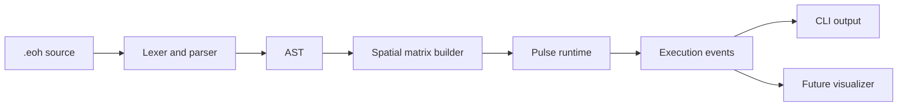

# Architecture

Eye of Horus is planned as a Rust toolchain with small, independently testable crates.

## Existing Implementation

- `eoh-core`: constants and geometry utility scaffold.
- `eoh-cli`: status-oriented CLI placeholder.

## Planned Implementation

- `eoh-parser`: lexer, parser, AST, and diagnostics.
- `eoh-runtime`: deterministic pulse simulation and event execution.
- `eoh-vm`: optional bytecode or IR execution layer if RFCs justify it.

## Research Ideas

- same-radius activation as deterministic batching;
- visual debugging of pulse fronts;
- spatial memory layouts for teaching cache and locality tradeoffs.
