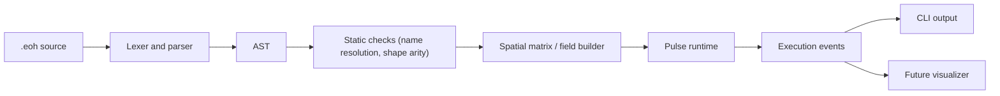

# Architecture

## Overview

Eye of Horus is designed as a Rust workspace composed of small, independently testable crates connected by a linear pipeline: source text flows in, an executable pulse simulation runs, and observable events flow out to a CLI today and, eventually, to a visualizer. Keeping each stage in its own crate is a deliberate application of [Design Principle 7](DESIGN_PRINCIPLES.md#7-small-independently-testable-units): every stage can be unit-tested, replaced, or extended without destabilizing the others.

```mermaid
flowchart LR
  A[".eoh source"] --> B["Lexer and parser"]
  B --> C["AST"]
  C --> D["Static checks (name resolution, shape arity)"]
  D --> E["Spatial matrix / field builder"]
  E --> F["Pulse runtime"]
  F --> G["Execution events"]
  G --> H["CLI output"]
  G --> I["Future visualizer"]
```

This diagram deliberately mirrors the pipeline described in the [white paper](whitepaper/eye-of-horus-whitepaper.md) and the formal semantics in [`spec/SEMANTICS.md`](spec/SEMANTICS.md); readers moving between this document and those two should find the stage names consistent.

## Existing Implementation

As of this writing, the workspace contains:

- **`eoh-core`** — geometry and constants scaffold. Provides validated coordinate construction (`Coord3D::new`, which enforces finiteness and the `MAX_COORD` bound described in [`spec/LANGUAGE_SPEC.md`](spec/LANGUAGE_SPEC.md) §4.4), the phi-pi address function, and supporting utility tests.
- **`eoh-cli`** — a status-oriented command-line entry point. It does not yet drive a full parse-through-execution pipeline for arbitrary `.eoh` files; its current role is to expose the core scaffold and report build/test status.

Anything beyond these two crates — a standalone `eoh-parser`, `eoh-runtime`, `eoh-compiler`, or `eoh-vm` crate — should be treated as **planned** unless the workspace manifest (`Cargo.toml`) and its own crate-level documentation say otherwise at the time of reading. This document is a design-level description, not a substitute for inspecting the workspace directly.

## Planned Implementation

- **`eoh-parser`** — lexer, recursive-descent (or, if an RFC justifies it, parser-combinator) parser, AST construction, and diagnostic reporting with source-span information. The target grammar is specified in [`spec/LANGUAGE_SPEC.md`](spec/LANGUAGE_SPEC.md) §3.
- **`eoh-runtime`** — deterministic pulse simulation and event execution, implementing the small-step semantics in [`spec/SEMANTICS.md`](spec/SEMANTICS.md). "Deterministic" here has a specific meaning: two runs of the same program on the same input must produce the same sequence of activation events, which constrains tie-breaking rules for simultaneous activation (see [`RUNTIME.md`](RUNTIME.md)).
- **`eoh-vm`** — an optional bytecode or intermediate-representation execution layer. The bytecode instruction set that this crate would dispatch is already specified, ahead of the crate's implementation, in [`spec/LANGUAGE_SPEC.md`](spec/LANGUAGE_SPEC.md) §6, following [Design Principle 2](DESIGN_PRINCIPLES.md#2-specification-before-stabilization) (specification before stabilization). Whether a separate VM crate is warranted, versus folding bytecode dispatch directly into `eoh-runtime`, is itself an open architectural question to be settled through an RFC once the language core is stable enough to justify the additional layer (see [`COMPILER.md`](COMPILER.md)).

## Crate Boundaries and Why They Exist

The pipeline is split at points where an independent Rust crate can be given a narrow, testable contract:

| Boundary | Contract | Rationale |
|---|---|---|
| Parser → AST | The parser never executes; it only produces a well-formed AST or a diagnostic. | Keeps parsing testable in isolation against a corpus of valid and invalid source files, without requiring a runtime. |
| AST → Static checks | Name resolution and shape-arity validation (see [`spec/LANGUAGE_SPEC.md`](spec/LANGUAGE_SPEC.md) §4) happen before any spatial or execution state exists. | Geometry and resolution errors should be reportable without running the program, matching ordinary compiler practice. |
| Static checks → Spatial field | The field builder is the only stage permitted to construct phi-pi addresses from vertex coordinates. | Centralizing address construction avoids duplicated, potentially inconsistent address logic across the runtime. |
| Spatial field → Pulse runtime | The runtime consumes an already-validated field; it does not re-validate coordinates. | Keeps the hot execution loop free of redundant validation, since [`eoh-core`](#existing-implementation)'s `Coord3D::new` boundary already guarantees validity at construction time. |
| Runtime → Output | Execution events are emitted as a structured, serializable stream, not as ad hoc printed text. | Lets the CLI, a future visualizer, and automated tests all consume the same event representation. |

## Research Ideas

These are explicitly research directions, not committed roadmap items:

- **Same-radius activation as deterministic batching.** When multiple pulses reach a given radius at the same simulated tick, treating that set as a single deterministic batch may simplify both the semantics and a future parallel implementation. This requires a tie-breaking rule that is currently an open problem (see [`spec/SEMANTICS.md`](spec/SEMANTICS.md) §5).
- **Visual debugging of pulse fronts.** Rendering the activation field as an expanding surface in a 3-D scene, and studying whether this measurably improves comprehension of program behavior relative to a conventional step-debugger, is a stated research goal in [`VISION.md`](VISION.md).
- **Spatial memory layouts for teaching cache and locality tradeoffs.** The phi-pi lattice is a plausible teaching object for cache-locality intuition, independent of whether it turns out to offer a measurable performance advantage in the reference implementation (see the explicit non-claims discussion in [`MEMORY_MODEL.md`](MEMORY_MODEL.md)).

## Relationship to Other Documents

This document describes the *shape* of the system. For the precise contract each stage must satisfy, see [`spec/LANGUAGE_SPEC.md`](spec/LANGUAGE_SPEC.md) (grammar and static semantics) and [`spec/SEMANTICS.md`](spec/SEMANTICS.md) (operational semantics). For the current implementation status of each stage in tabular form, see the status table in [`README.md`](README.md) and the phase breakdown in [`ROADMAP.md`](ROADMAP.md).
