# Eye of Horus: Complete Technical Reference

### A Geometry-Native Programming Language — Consolidated Wiki Edition

**Author:** Ciprian Stefan Plesca
**Affiliation:** Independent Researcher · Founder, LocalPulse
**Repository:** https://github.com/Ciprian-LocalPulse/Eye-of-Horus
**Edition:** Consolidated single-document release, compiled from the project's 20-page technical wiki
**Date:** 2026
**License:** Apache-2.0

---

> **A note on this document's status.** This is a consolidated edition of
> the Eye of Horus project wiki, assembled into a single continuous
> reference document for archival, offline reading, and academic citation
> purposes. It reproduces eighteen of the wiki's twenty pages — every page
> from **Language Concepts** through **Glossary** — preserving each page's
> original technical content, tables, formulas, and diagrams. The wiki's
> opening two pages, **Home** and **Getting Started**, are orientation and
> installation material specific to the interactive wiki format and are
> not reproduced here; readers installing the toolchain should consult
> those pages directly on the repository, or `README.md` and
> `docs/GETTING_STARTED.md` in the source tree.
>
> Every technical claim in this document is checkable against the
> open-source reference implementation. Where a claim is unproven,
> partial, or speculative, the relevant chapter says so explicitly — this
> discipline runs through the whole document, not only its opening
> chapters, and is stated once here rather than being repeated at the top
> of every chapter.

---

## Abstract

This document is the complete technical reference for **Eye of Horus**, a
research programming language in which three-dimensional spatial geometry
serves as the primary substrate of computation. It consolidates the
project's full wiki — language concepts, system architecture, formal
operational semantics, compiler internals (parser, AST, intermediate
representation, optimizer), the phi-pi addressing model, the Higgs-pulse
activation model, the type system, the standard library, repository
layout, engineering design principles, performance methodology,
contribution process, FAQ, and glossary — into a single, continuously
readable document.

Two ideas anchor the entire system. The **phi-pi addressing model** is a
deterministic quantization function mapping continuous three-dimensional
coordinates onto a discrete integer lattice, using a quantum derived from
the golden ratio and pi (`q = φ/π`); it is explicitly a spatial
organization mechanism, not a cryptographic one. The **Higgs-pulse
activation model** replaces the program counter with simulated expanding
wavefronts: a pulse originates at a point and activates any location its
growing radius reaches, with a formally proven monotonicity property
governing how that activation behaves over simulated time.

The reference implementation is a nine-crate Rust workspace — lexer,
AST, parser, compiler (resolver, type-checker, MIR lowering, optimizer,
bytecode emitter), virtual machine, standard library, language server
(scaffolded), and command-line tool — built under a strict
`#![deny(unsafe_code)]` and `#![deny(missing_docs)]` discipline, with 35
passing tests as of this writing. Every chapter in this document also
states, without exception, what remains unproven or unimplemented: most
significantly, control flow (`IF`/`LOOP`) currently parses but is not
lowered to executable bytecode, which means the question of the
executable core's Turing-completeness is presently open rather than
answered in either direction.

**Keywords:** programming language design, spatial computing, operational
semantics, virtual machines, compiler architecture, golden-ratio
quantization, unconventional computation.

---

## How this document is organized

This edition preserves the wiki's own chapter numbering (Chapters 3
through 20) so that cross-references between chapters — and to the
original wiki page names — remain unambiguous. Each chapter below
corresponds to exactly one original wiki page, reproduced in full,
with its internal heading levels demoted by one so they nest correctly
under this document's chapter headings. Internal cross-links between
pages (e.g. `[Pulse Engine](Pulse-Engine)`) are preserved in their
original wiki-link form; on GitHub, these resolve within the live wiki,
and within this document they should be read as pointers to the
correspondingly named chapter below.

## Table of Contents

1. [Chapter 3 — Language Concepts](#chapter-3--language-concepts)
2. [Chapter 4 — Project Architecture](#chapter-4--project-architecture)
3. [Chapter 5 — Spatial Execution Model](#chapter-5--spatial-execution-model)
4. [Chapter 6 — Compiler Architecture](#chapter-6--compiler-architecture)
5. [Chapter 7 — Parser Design](#chapter-7--parser-design)
6. [Chapter 8 — Abstract Spatial Syntax Tree](#chapter-8--abstract-spatial-syntax-tree)
7. [Chapter 9 — Intermediate Representation](#chapter-9--intermediate-representation)
8. [Chapter 10 — Pulse Engine](#chapter-10--pulse-engine)
9. [Chapter 11 — Memory Model](#chapter-11--memory-model)
10. [Chapter 12 — Coordinate System](#chapter-12--coordinate-system)
11. [Chapter 13 — Type System](#chapter-13--type-system)
12. [Chapter 14 — Standard Library](#chapter-14--standard-library)
13. [Chapter 15 — Repository Structure](#chapter-15--repository-structure)
14. [Chapter 16 — Design Principles](#chapter-16--design-principles)
15. [Chapter 17 — Performance](#chapter-17--performance)
16. [Chapter 18 — Contributing](#chapter-18--contributing)
17. [Chapter 19 — FAQ](#chapter-19--faq)
18. [Chapter 20 — Glossary](#chapter-20--glossary)

---


---

## Chapter 3 — Language Concepts

### 1. Purpose of this page

This page builds the conceptual vocabulary needed to read every other page
in this wiki. It introduces Eye of Horus's core abstractions — origin,
vertex, edge, shape, pulse, activation, and the spatial field — at the
level of "what is this and why does the language have it," deferring
formal definitions to the pages that specialize in each concept
([Coordinate System](Coordinate-System), [Pulse Engine](Pulse-Engine),
[Memory Model](Memory-Model), [Type System](Type-System)).

If [Getting Started](Getting-Started) taught you *how to run* a program,
this page teaches you *how to think about* what that program means.

### 2. The foundational shift: memory as geometry

In a conventional language, when you write:

```python
x = 5
y = x + 1
```

`x` is bound to a memory cell somewhere in a flat, linear address space you
don't normally think about. The *value* of `x` (5) and the *location* of
`x` (some byte offset) are conceptually unrelated — the location is an
implementation detail the language deliberately hides.

Eye of Horus inverts this relationship. Every value that participates in
spatial computation is associated with a literal point in three-dimensional
space, and that point is not hidden — it is the primary thing you declare:

```eoh
VERTEX A 1.0, 0.0, 0.0
```

Here, `A` is not "a variable that happens to be near coordinate (1,0,0)" —
`A` *is* the point `(1,0,0)`, given a name for reference. Internally, the
value associated with `A` is stored at a lattice address deterministically
derived from that exact position (see [Memory Model](Memory-Model) and
[Coordinate System](Coordinate-System) for the precise addressing
function). This is the foundational conceptual shift the rest of the
language builds on: **position is not incidental, it is the address.**

### 3. The core vocabulary

#### 3.1 Origin

```eoh
ORIGIN 0.0, 0.0, 0.0
```

`ORIGIN` establishes the coordinate reference point for a module. While the
current reference implementation treats this largely as a documentation and
future-extensibility anchor (see [Coordinate System](Coordinate-System) §4
for its planned role in multi-module coordinate-frame composition), it is
idiomatic to declare it explicitly at the top of every `.eoh` file, both for
readability and to reserve the semantic space for planned features
(non-zero-origin coordinate frames, module composition) without a breaking
grammar change.

#### 3.2 Vertex

```eoh
VERTEX <name> <x>, <y>, <z>
```

A vertex is a named point in space. It is the atomic unit of spatial
reference in Eye of Horus — shapes are built from vertices, pulses
originate at vertices, and edges connect them. Every vertex name must be
declared before use; there is no implicit vertex creation.

#### 3.3 Edge

```eoh
EDGE <from> -> <to>
```

An edge is a directed connection between two named vertices. In the current
reference implementation, edges are primarily **structural metadata** —
they inform shape composition and are available for visualization tooling —
rather than themselves triggering VM behavior. See
[Abstract Spatial Syntax Tree](Abstract-Spatial-Syntax-Tree) §4 for how
edges are represented, and [Pulse Engine](Pulse-Engine) §6 for the planned
(not yet implemented) extension where edges could constrain or guide pulse
propagation rather than only isotropic expansion.

#### 3.4 Shape

```eoh
SHAPE_TETRA <name> <v1>, <v2>, <v3>, <v4>
SHAPE_CUBE  <name> <anchor>, size=<expr>
SHAPE_ICOSA <name> <v1>, ..., <v12>
SHAPE_SPHERE <name> <center>, r=<expr>
```

A shape is a named geometric solid constructed from previously-declared
vertices (plus, for `CUBE` and `SPHERE`, a scalar parameter). Each shape
kind carries a **vertex-count constraint** enforced at type-check time:

| Shape kind | Required vertices | Additional parameter |
|---|---|---|
| `SHAPE_TETRA` | exactly 4 | — |
| `SHAPE_ICOSA` | exactly 12 | — |
| `SHAPE_CUBE` | 1 (anchor corner) | `size` (edge length) |
| `SHAPE_SPHERE` | 1 (center) | `r` (radius) |
| `SHAPE_POLY` | ≥ 3 | — |

Violating a vertex-count constraint is a compile-time geometry error, not a
runtime failure — see [Type System](Type-System) §3 for the full validation
rules and [Compiler Architecture](Compiler-Architecture) §4 for where this
check runs in the pipeline.

#### 3.5 Pulse

```eoh
PULSE_HIGGS <origin>, v=<velocity>
```

A pulse is the language's execution trigger: an expanding spherical
wavefront, originating at a named vertex, propagating at a configurable
velocity (spatial units per simulation tick). This is the concept that most
sharply distinguishes Eye of Horus from conventional languages, and it has
its own dedicated page — [Pulse Engine](Pulse-Engine) — covering the full
formal model, the monotonicity property, and worked timing examples.

#### 3.6 Activation

A point (and, by extension, any shape whose vertices include that point) is
**activated** at simulation tick `t` if some live pulse's wavefront has
reached it by that tick — formally, if the Euclidean distance from the
pulse's origin to the point is at most the wavefront's radius at `t`. See
[Spatial Execution Model](Spatial-Execution-Model) §3 for the formal
definition and its proven monotonicity property.

#### 3.7 The spatial field

Underlying all of the above is the **spatial field**: the VM's sole storage
mechanism, mapping quantized spatial addresses to values. There is no
separate "heap" and "stack" in the conventional sense — see
[Memory Model](Memory-Model) for the complete treatment.

### 4. A conceptual map of how these fit together

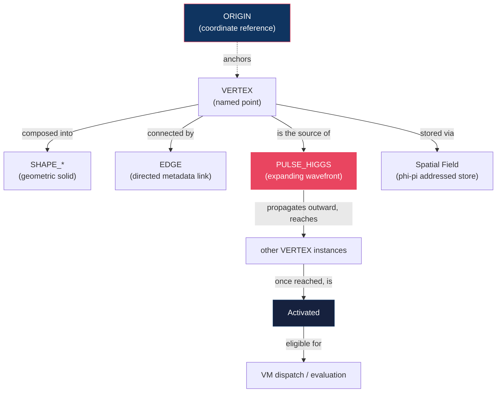

ASCII equivalent for plain-text contexts:

```text
   ORIGIN
     |
     v  (anchors)
  VERTEX --------> SHAPE (composed from vertices)
     |  \
     |   \--------> EDGE (directed metadata)
     |
     v  (source of)
  PULSE_HIGGS
     |
     v  (propagates, reaches other vertices)
  ACTIVATION  ---->  eligible for VM dispatch
```

### 5. Worked example, concept by concept

Consider this program, annotated line by line with the concept it invokes:

```eoh
ORIGIN 0.0, 0.0, 0.0              // §3.1 — coordinate reference

VERTEX A 1.0, 1.0, 1.0            // §3.2 — a named point
VERTEX B 1.0, -1.0, -1.0          // §3.2
VERTEX C -1.0, 1.0, -1.0          // §3.2
VERTEX D -1.0, -1.0, 1.0          // §3.2

EDGE A -> B                       // §3.3 — structural metadata
EDGE A -> C
EDGE A -> D

SHAPE_TETRA T1 A, B, C, D         // §3.4 — vertex-count-constrained solid

PULSE_HIGGS A, v=1.618            // §3.5 — activation trigger
```

Under the pulse-activation semantics ([Spatial Execution Model](Spatial-Execution-Model)),
this program declares a tetrahedron and emits a pulse from one of its
vertices. As simulation ticks advance, the pulse's wavefront radius grows;
once it exceeds the distance from `A` to `B`, `C`, and `D` respectively,
each becomes activated in turn — `B`, `C`, and `D` are equidistant from `A`
in this particular tetrahedron (each at distance `2√2`), so in this
specific example they activate simultaneously.

### 6. What Eye of Horus is *not* (common misconceptions)

It is worth being explicit about several things newcomers sometimes assume
incorrectly:

- **It is not a 3-D graphics or game-engine DSL.** There is no rendering
  pipeline, no camera, no frame loop. The "3-D" in Eye of Horus refers to
  the *addressing and execution model*, not to a visual output — though
  visualization tooling for pulse propagation is a planned feature (see
  [Vision](https://github.com/Ciprian-LocalPulse/Eye-of-Horus/blob/main/VISION.md)).
- **It is not a physics simulation engine.** "Higgs pulse" is a metaphor
  borrowed from particle physics for "a field that triggers other things on
  contact." Eye of Horus makes no claim of modeling real particle physics —
  see [Pulse Engine](Pulse-Engine) §1 for the explicit non-claim.
- **The phi-pi addressing scheme is not cryptographic.** It is a public,
  deterministic quantization function used purely to organize VM storage.
  See [Memory Model](Memory-Model) §5 and [Coordinate System](Coordinate-System) §3
  for the explicit security non-claims.
- **It is not (yet) proven Turing-complete.** Control flow (`IF`, `LOOP`)
  parses today but is not wired into VM dispatch. See
  [Type System](Type-System) §6 and [FAQ](FAQ) for the current, honest
  status of this open question.

### 7. Comparison with conventional and adjacent models

| Property | Conventional (von Neumann) languages | Cellular automata | Eye of Horus |
|---|---|---|---|
| Memory addressing | Flat, linear | Grid cell index | Continuous 3-D coordinate, quantized via phi-pi lattice |
| Execution driver | Program counter, sequential | Global synchronous update rule | Propagating pulse wavefront (asynchronous by distance) |
| Locality | Not inherent to the model | Inherent (neighborhood rules) | Inherent (distance-based activation) |
| Determinism | Deterministic (absent concurrency) | Deterministic | Deterministic (see [Spatial Execution Model](Spatial-Execution-Model) §5 for known rough edges) |
| Maturity | Decades of tooling, hardware co-design | Decades of theoretical study | Pre-alpha research implementation |

This table is illustrative, not a claim of equivalence or superiority in
any direction — see [Related Work discussion in the whitepaper](https://github.com/Ciprian-LocalPulse/Eye-of-Horus/blob/main/whitepaper/eye-of-horus-whitepaper.md#2-related-work)
for a fuller treatment of intellectual lineage.

### 8. Best Practices

- **Declare vertices before you need them geometrically**, even though the
  language does not require a particular file-level ordering beyond
  "declared before referenced" — grouping related vertex declarations
  together (e.g. all four corners of a shape) improves readability far more
  than the compiler requires.
- **Name vertices semantically**, not `V1`, `V2`, `V3` — a name like
  `PIVOT` or `LIGHT_SOURCE` communicates the vertex's *role* in your
  program's geometry, which matters more in this language than in most,
  since position and meaning are so tightly coupled.
- **Reason about pulse velocity in the same units as your coordinates.**
  Since `radius(t) = elapsed_ticks × velocity`, an easy way to build
  intuition is to pick simple round-number velocities (`1.0`) while
  learning, then experiment with named constants like `φ ≈ 1.618` once the
  timing model is familiar.
- **Treat `EDGE` declarations as documentation of intent** until the
  planned edge-guided-propagation feature ([Pulse Engine](Pulse-Engine) §6)
  lands — don't assume they currently affect activation timing.

### 9. Implementation Notes

- All six core declaration forms (`ORIGIN`, `VERTEX`, `EDGE`, `SHAPE_*`,
  `PULSE_HIGGS`, plus `LET`/`FN`/`IMPORT` for the computational subset) are
  parsed by dedicated methods in `eoh-parser`'s `Parser` struct — see
  [Parser Design](Parser-Design) §4 for the method-to-grammar-rule mapping.
- The AST node types for each concept in this page live in
  `eoh-ast::{OriginDecl, VertexDecl, EdgeDecl, ShapeDecl, PulseDecl}` — see
  [Abstract Spatial Syntax Tree](Abstract-Spatial-Syntax-Tree) for the full
  type definitions.
- Vertex-count validation (§3.4) is implemented as
  `Shape::validate_vertex_count` in `eoh-core::primitives`, and is unit
  tested directly (`tetrahedron_vertex_count_validated` in that module).

### 10. Future Improvements

- A `SHAPE_POLY` extension with planarity and convexity validation, beyond
  the current "at least 3 vertices" check, is planned — see
  [Type System](Type-System) §7.
- Multi-module `ORIGIN` composition (allowing a module to declare its
  coordinate frame relative to an imported module's origin) is a design
  space explored conceptually in [Coordinate System](Coordinate-System) §4
  but not yet specified as an RFC.
- Edge-guided (non-isotropic) pulse propagation, where a pulse could be
  constrained to travel along declared edges rather than expand freely
  through space, is noted as an open research direction in
  [Pulse Engine](Pulse-Engine) §6.

---

## Chapter 4 — Project Architecture

### 1. Purpose of this page

This page describes the system-level architecture of the Eye of Horus
reference implementation: how its nine Rust crates depend on one another,
what boundary each crate enforces, and why the pipeline is decomposed the
way it is. Where [Language Concepts](Language-Concepts) explained the
*language* from a user's perspective, this page explains the
*implementation* from a systems-engineering perspective — the audience is
contributors and researchers who need to know where a given piece of
behavior lives before they can change or extend it.

### 2. Design goals behind the architecture

Four goals shaped the crate decomposition, in priority order:

1. **Independent testability.** Every crate should be unit-testable in
   isolation, without needing to spin up the full pipeline. This is why
   `eoh-core` (geometry primitives) has no dependency on `eoh-lexer`, and
   `eoh-lexer` has no dependency on `eoh-parser` — each layer's correctness
   can be verified without its consumers existing yet.
2. **Layer separation matching compiler theory, not convenience.** The
   crate boundaries mirror the classical compiler pipeline (lexical
   analysis → syntax analysis → semantic analysis → IR lowering →
   optimization → code generation) rather than being organized around,
   say, "everything the CLI needs" as a single crate. This makes the
   codebase legible to anyone with general compiler-construction
   background, independent of Eye of Horus specifics.
3. **No `unsafe` code, anywhere.** Every crate declares
   `#![deny(unsafe_code)]`. This is an architectural constraint, not a
   style preference: it means memory-safety bugs in this codebase are, by
   construction, impossible without deliberately circumventing a compiler
   lint — see [Design Principles](Design-Principles) §3.
4. **Documentation is not optional.** Every crate declares
   `#![deny(missing_docs)]`. A public item without a doc comment is a
   compile error, not a linter warning. This architectural choice trades
   contributor friction (you cannot add an undocumented public field) for
   a codebase where `cargo doc` output is always complete, never a stub.

### 3. The nine-crate workspace

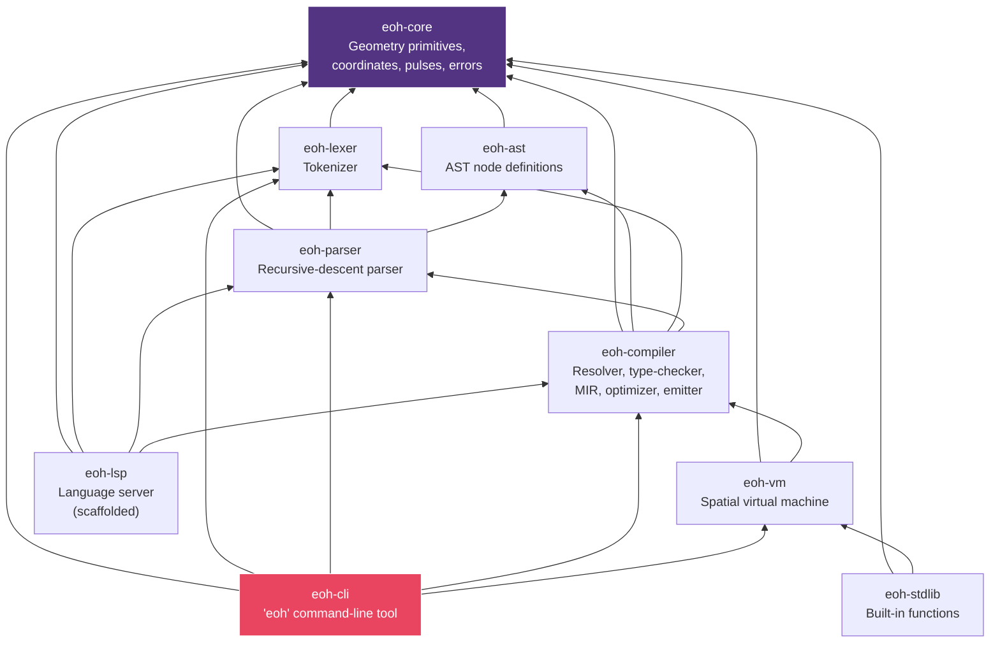

ASCII dependency summary (arrows read "depends on"):

```text
eoh-cli    --> eoh-core, eoh-lexer, eoh-parser, eoh-compiler, eoh-vm
eoh-lsp    --> eoh-core, eoh-lexer, eoh-parser, eoh-compiler
eoh-vm     --> eoh-core, eoh-compiler
eoh-stdlib --> eoh-core, eoh-vm
eoh-compiler --> eoh-core, eoh-ast, eoh-lexer, eoh-parser
eoh-parser --> eoh-core, eoh-lexer, eoh-ast
eoh-ast    --> eoh-core
eoh-lexer  --> eoh-core
eoh-core   --> (no internal dependencies — the foundation)
```

Note that `eoh-core` has **zero dependencies on any other crate in this
workspace**. This is deliberate: it is the shared vocabulary (coordinates,
errors, pulses, spatial fields) that every other layer builds on, and a
dependency cycle back into it from a higher layer would indicate a layering
violation.

### 4. Crate-by-crate responsibility

| Crate | Responsibility | Depends on | Detail page |
|---|---|---|---|
| `eoh-core` | `Coord3D`, `PhiPiAddress`, `Pulse`, `ActivationField`, `SpatialField<V>`, `EohError` | *(none)* | [Coordinate System](Coordinate-System), [Memory Model](Memory-Model), [Pulse Engine](Pulse-Engine) |
| `eoh-lexer` | Hand-written tokenizer; no parser-generator dependency | `eoh-core` | [Parser Design](Parser-Design) §2 |
| `eoh-ast` | `serde`-serializable AST node definitions | `eoh-core` | [Abstract Spatial Syntax Tree](Abstract-Spatial-Syntax-Tree) |
| `eoh-parser` | Recursive-descent parser, precedence-climbing expression parser | `eoh-core`, `eoh-lexer`, `eoh-ast` | [Parser Design](Parser-Design) |
| `eoh-compiler` | Resolver → type-checker → MIR lowering → optimizer → bytecode emitter | `eoh-core`, `eoh-ast`, `eoh-lexer`, `eoh-parser` | [Compiler Architecture](Compiler-Architecture), [Intermediate Representation](Intermediate-Representation) |
| `eoh-vm` | Stack-based bytecode interpreter over the spatial field | `eoh-core`, `eoh-compiler` | [Spatial Execution Model](Spatial-Execution-Model) |
| `eoh-stdlib` | Geometry, math, and spatial-query built-in functions | `eoh-core`, `eoh-vm` | [Standard Library](Standard-Library) |
| `eoh-lsp` | Language Server Protocol implementation (scaffolded) | `eoh-core`, `eoh-lexer`, `eoh-parser`, `eoh-compiler` | [Repository Structure](Repository-Structure) §5 |
| `eoh-cli` | The `eoh` command-line tool | all of the above except `eoh-lsp`'s event loop | [Getting Started](Getting-Started) §6 |

### 5. Why `eoh-vm` depends on `eoh-compiler` rather than the reverse

A design choice worth explaining explicitly: `eoh-vm` depends on
`eoh-compiler` (specifically, on `eoh_compiler::bytecode::{BytecodeImage,
Instruction}`), rather than the two crates sharing a bytecode-format crate
independent of both, or the compiler depending on the VM's instruction
definitions.

**Rationale:** the bytecode format is conceptually an *output artifact* of
compilation — it is the compiler's business to define its own target
format, and the VM's business to consume that format. This mirrors how,
e.g., an assembler defines an object-file format and a linker/loader
consumes it, rather than the reverse. The alternative (a third,
format-only crate) was considered and rejected for v0.1 as premature
abstraction — see [RFC 0001](https://github.com/Ciprian-LocalPulse/Eye-of-Horus/blob/main/rfcs/0001-phi-pi-addressing.md)
for the project's general stance on deferring abstraction until a second
concrete use case justifies it. If a second bytecode consumer emerges
(e.g., an ahead-of-time native-code backend), extracting a shared
`eoh-bytecode` crate becomes the natural refactor — tracked as a Future
Improvement below.

### 6. Data flow through the workspace, end to end

```mermaid
sequenceDiagram
    participant U as User (.eoh file)
    participant CLI as eoh-cli
    participant Lex as eoh-lexer
    participant Par as eoh-parser
    participant Comp as eoh-compiler
    participant VM as eoh-vm

    U->>CLI: eoh run program.eoh
    CLI->>Lex: lex(source, file_id)
    Lex-->>CLI: Vec<Token>
    CLI->>Par: parse(tokens, file_id)
    Par-->>CLI: Module (AST)
    CLI->>Comp: compile(source, file_id, opts)
    Comp->>Comp: resolve() -> Module
    Comp->>Comp: typeck::check()
    Comp->>Comp: lower() -> Mir
    Comp->>Comp: optimise::run()
    Comp->>Comp: emit() -> BytecodeImage
    Comp-->>CLI: CompileOutput
    CLI->>VM: run(bytecode, VmConfig)
    VM->>VM: execute() [dispatch loop]
    VM-->>CLI: VmState
    CLI-->>U: "✓ executed in N ticks, ..."
```

Note that `eoh-cli`'s `cmd_run` actually calls `eoh_compiler::compile`
directly (which internally performs lex + parse + resolve + typecheck +
lower + optimize + emit as a single pipeline call), rather than manually
orchestrating each library separately — the diagram above shows the
*logical* sequence of stages, which is spread across `compile()`'s
internal implementation as described in
[Compiler Architecture](Compiler-Architecture) §2.

### 7. Workspace-level engineering conventions

These conventions apply uniformly across all nine crates and are enforced
either by the Rust compiler directly or by workspace-level `Cargo.toml`
settings:

| Convention | Enforcement mechanism | Rationale |
|---|---|---|
| No `unsafe` code | `#![deny(unsafe_code)]` per crate | See §2.3 above |
| No undocumented public items | `#![deny(missing_docs)]` per crate | See §2.4 above |
| Shared dependency versions | `[workspace.dependencies]` in root `Cargo.toml` | Prevents version drift between crates (e.g. two different `serde` versions) |
| Consistent error handling | `EohError` (from `eoh-core`) used throughout, not ad hoc `String` errors or panics | Enables uniform diagnostic reporting in the CLI and future LSP |
| Release profile tuning | `lto = true`, `codegen-units = 1`, `strip = "symbols"` in `[profile.release]` | Optimized binary size/speed for the `eoh` CLI distribution, once performance work begins — see [Performance](Performance) |

### 8. Where the architecture is intentionally incomplete

In the spirit of the project's documentation discipline (see
[Design Principles](Design-Principles) §1), it is worth stating plainly
where this architecture has known gaps rather than presenting it as a
finished system:

- **No shared IR crate between `eoh-compiler`'s MIR and `eoh-vm`'s
  bytecode**, as discussed in §5 — currently the same crate owns both, which
  is adequate for a single backend target but would need revisiting for a
  second one.
- **`eoh-lsp` has no wired event loop** — the crate exists, with
  `capabilities`, `diagnostics`, and `handlers` modules scaffolded and
  unit-testable in isolation, but `LspServer::run()` currently calls
  `todo!()`. See [Repository Structure](Repository-Structure) §5 and the
  project roadmap, Phase 3.
- **No plugin or extension architecture** exists for adding new shape
  kinds or built-in functions without modifying `eoh-core` and
  `eoh-stdlib` directly. This is a deliberate simplicity choice for a
  pre-alpha language with a still-changing core grammar — see
  [Design Principles](Design-Principles) §5 on premature extensibility.

### 9. Best Practices

- **When adding a new crate-spanning feature, start from `eoh-core`.** If
  your feature needs a new fundamental type (e.g., a new geometric
  primitive), define it in `eoh-core` first, with its own unit tests, before
  touching any consuming crate — this keeps the dependency graph in §3
  acyclic by construction.
- **Never introduce a dependency arrow against the grain of §3's diagram.**
  If you find yourself wanting `eoh-core` to depend on `eoh-parser` (for
  example), that is a strong signal the functionality belongs in a
  different crate, or that the diagram itself needs an RFC-discussed
  revision.
- **Treat crate boundaries as API boundaries**, not just file-organization
  conveniences — public items in each crate should be designed as if an
  external consumer (e.g., a future third-party tool) might depend on them
  directly.

### 10. Implementation Notes

- The full crate dependency graph in §3 can be regenerated and verified
  directly via `cargo tree --workspace`, which will match the diagram
  above exactly — if it doesn't, the diagram is stale and should be
  treated as a documentation bug.
- Workspace-level dependency version pinning (§7) is defined once in the
  root `Cargo.toml`'s `[workspace.dependencies]` table and referenced via
  `{ workspace = true }` in every crate's own `Cargo.toml` — this is
  standard Cargo workspace practice, not an Eye-of-Horus-specific
  convention.

### 11. Future Improvements

- Extract a shared `eoh-bytecode` crate if/when a second bytecode consumer
  (e.g., a native-code backend) is added — see §5.
- Wire the `eoh-lsp` event loop and add it to the dependency graph as a
  fully realized consumer, per Roadmap Phase 3.
- Consider a `cargo-deny`-style CI check that fails the build if the
  dependency graph diverges from the documented architecture in this page,
  closing the loop between documentation and enforcement.

---

## Chapter 5 — Spatial Execution Model

### 1. Purpose of this page

This page gives the formal operational semantics of Eye of Horus's
execution model — the small-step reduction rules that define, precisely,
what a VM configuration is and how it evolves one instruction at a time.
This is the most theoretically dense page in the wiki; it assumes
familiarity with structured operational semantics (SOS) notation at the
level of an introductory programming-languages course, though the notation
is kept as lightweight as possible. Readers who want the conceptual,
non-formal version should read [Language Concepts](Language-Concepts) §3.6
first.

This page is a wiki-native elaboration of `spec/SEMANTICS.md` in the
repository; where the two differ, `spec/SEMANTICS.md` is authoritative, and
this page should be corrected to match.

### 2. Machine configuration

A VM configuration is a five-tuple:

```
Config ::= ⟨IP, Stack, Field, Pulses, tick⟩

where
  IP     ∈ ℕ                       (instruction pointer)
  Stack  ∈ Value*                  (operand stack)
  Field  : Addr ⇀ Value            (partial map — the spatial store)
  Pulses ⊆ Pulse                   (the live activation field)
  tick   ∈ ℕ                       (simulation tick counter)
```

with value and pulse domains:

```
Value ::= Float(f) | Bool(b) | Str(s) | Coord(c) | Unit
Pulse ::= ⟨origin: Coord, velocity: ℝ, birth: ℕ⟩
Addr  ∈ ℤ³                         (phi-pi lattice address — see Coordinate System)
```

This directly mirrors the reference implementation's `eoh_vm::vm::Vm`
struct fields (`ip`, `stack`, `field`, `activation`, `tick`), plus an
auxiliary `vertices : Name ⇀ Coord` table used to resolve vertex names to
positions — formalized separately in §6.

### 3. The activation predicate

Given a pulse `p = ⟨o, v, b⟩` and the current tick `t`, define the
wavefront radius:

```
radius(p, t) = max(0, t − b) · v
```

and the activation predicate:

```
activates(p, point, t)  ⟺  ‖o − point‖₂ ≤ radius(p, t)
```

The activation field as a whole activates a point if *any* live pulse does:

```
active(Pulses, point, t)  ⟺  ∃ p ∈ Pulses. activates(p, point, t)
```

#### 3.1 Monotonicity

**Proposition.** For fixed `p` and point `x`, if `activates(p, x, t)` holds
for some `t`, it holds for all `t' ≥ t`, provided `velocity ≥ 0`.

*Proof.* `radius(p, ·)` is an affine, non-decreasing function of
`max(0, t−b)`, which is itself non-decreasing in `t`. `activates` is a
fixed threshold test against this non-decreasing quantity, so once
satisfied, it remains satisfied for all larger `t`. ∎

This gives the system a **monotonic "unlocking" semantics**: once a pulse
reaches a point, that point stays reachable for the rest of the simulation
run under the current (v0.1) semantics. This is a deliberate simplification
— see [Pulse Engine](Pulse-Engine) §5 for discussion of bounded-duration
pulses as a future relaxation, and why that relaxation is *not* assumed by
default.

#### 3.2 Worked numeric example

Take the tetrahedron example from [Getting Started](Getting-Started) §5:
vertex `A` at `(1,1,1)`, vertex `B` at `(1,−1,−1)`, pulse velocity
`v = φ ≈ 1.618`, birth tick `b = 0`.

```
‖A − B‖₂ = √[(1−1)² + (1−(−1))² + (1−(−1))²] = √8 = 2√2 ≈ 2.828

radius(p, t) = t · 1.618

activates(p, B, t)  ⟺  2.828 ≤ 1.618 t  ⟺  t ≥ 1.748
```

So `B` (and by the tetrahedron's symmetry, `C` and `D` as well) becomes
activated starting at tick `⌈1.748⌉ = 2`, since ticks are discrete integers
in the reference VM.

### 4. Small-step reduction rules

We write `⟨IP, S, F, Φ, t⟩ → ⟨IP', S', F', Φ', t'⟩` for one VM step. Every
rule implicitly sets `t' = t+1` — the reference implementation advances the
tick counter once per *dispatched instruction*, which conflates "simulation
time" with "instruction count." This is flagged explicitly as a known
simplification in §7.

**PushFloat**
```
image[IP] = PushFloat(f)
────────────────────────────────────────────
⟨IP, S, F, Φ, t⟩ → ⟨IP+1, f::S, F, Φ, t+1⟩
```

**Arithmetic** (Add shown; Sub/Mul follow identically with `−`/`×`)
```
image[IP] = Add     S = a::b::S'
──────────────────────────────────────────────────
⟨IP, S, F, Φ, t⟩ → ⟨IP+1, (a+b)::S', F, Φ, t+1⟩
```

**Division** (partial — undefined, and hence a VM fault, at zero divisor)
```
image[IP] = Div     S = a::b::S'     b ≠ 0
──────────────────────────────────────────────────
⟨IP, S, F, Φ, t⟩ → ⟨IP+1, (a/b)::S', F, Φ, t+1⟩

image[IP] = Div     S = a::0::S'
──────────────────────────────────────────────────
⟨IP, S, F, Φ, t⟩ → 𝐟𝐚𝐮𝐥𝐭(DivisionByZero)
```

**DeclareVertex**
```
image[IP] = DeclareVertex(n)     S = x::y::z::S'     c = (x,y,z) valid
────────────────────────────────────────────────────────────────────────
⟨IP, S, F, Φ, t⟩ → ⟨IP+1, S', F[α(c) ↦ Unit], Φ, t+1⟩,   vertices[n] := c
```

where `α : Coord → Addr` is the phi-pi addressing function defined in
[Coordinate System](Coordinate-System) §2, and "valid" means the coordinate
passes the finiteness and magnitude checks in
[Type System](Type-System) §2.

**Store / Load**
```
image[IP] = Store(n)     S = v::S'     c = vertices.get(n, ORIGIN)
────────────────────────────────────────────────────────────────────
⟨IP, S, F, Φ, t⟩ → ⟨IP+1, S', F[α(c) ↦ v], Φ, t+1⟩

image[IP] = Load(n)     c = vertices.get(n, ORIGIN)     v = F(α(c), default=Unit)
────────────────────────────────────────────────────────────────────────────────
⟨IP, S, F, Φ, t⟩ → ⟨IP+1, v::S, F, Φ, t+1⟩
```

**EmitPulse**
```
image[IP] = EmitPulse{origin: n, velocity: v}     c = vertices.get(n, ORIGIN)
─────────────────────────────────────────────────────────────────────────
⟨IP, S, F, Φ, t⟩ → ⟨IP+1, S, F, Φ ∪ {⟨c, v, t⟩}, t+1⟩
```

**Halt**
```
image[IP] = Halt
────────────────────────────────────────────
⟨IP, S, F, Φ, t⟩ → ⟨HALT, S, F, Φ, t⟩     (terminal configuration)
```

### 5. Instruction dispatch, as a diagram

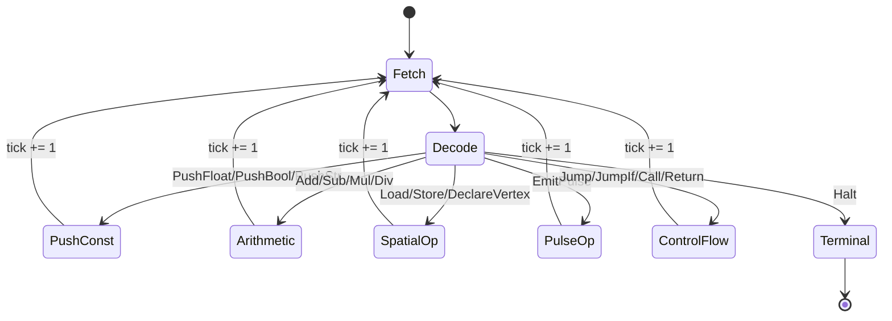

This maps directly to the `match instr { ... }` dispatch loop inside
`Vm::execute()` in `eoh-vm/src/vm.rs` — every instruction variant handled
in that `match` corresponds to exactly one transition in this diagram.

### 6. The auxiliary vertex table

The formal rules in §4 reference `vertices : Name ⇀ Coord`, an auxiliary
mapping maintained alongside the spatial field `F`. This corresponds
directly to the reference implementation's
`HashMap<String, Coord3D>` field on the `Vm` struct. It exists because
`Load`/`Store`/`EmitPulse` instructions refer to vertices *by name*
(`String`), while the spatial field `F` is addressed by *quantized
position* (`PhiPiAddress`) — the vertex table is the bridge between the two.

### 7. Known semantic gaps (stated explicitly)

Consistent with the project's documentation discipline
([Design Principles](Design-Principles) §1), the following rough edges are
named here rather than glossed over:

- **Unbound-name fallback to origin.** If `Load(n)` or `Store(n)` is
  executed for a name `n` not present in `vertices`, the reference VM
  currently resolves its address as `α(Coord::ORIGIN)` rather than raising
  a runtime fault. This is very likely *not* the semantics a mature
  language should have, since it means a typo'd or forgotten `LET` target
  silently aliases the origin cell instead of failing loudly. This is
  tracked as a Roadmap Phase 1 item: "strict unbound-name faulting."
- **Tick/instruction conflation.** As noted in §4, one VM step always
  advances `tick` by exactly one, meaning "simulation time" and "number of
  bytecode instructions executed" are currently the same quantity. A more
  physically motivated model would likely decouple these — e.g., letting
  pulse-radius time advance independently of instruction dispatch rate —
  but doing so is nontrivial and unexplored.
- **No confluence or termination proof.** Once `LOOP`/`JumpIf` are wired
  into dispatch (currently they parse but are largely inert — see
  [Type System](Type-System) §6), no formal guarantee is offered, or even
  conjectured, about termination or confluence of Eye of Horus programs.
  This is an explicit open problem, not a claimed result.

### 8. Best Practices

- **When implementing a new instruction, add its small-step rule to this
  page in the same pull request** that adds it to `Vm::execute()` — an
  implemented instruction without a corresponding formal rule is
  considered a documentation defect under this project's standards (see
  [Design Principles](Design-Principles) §1).
- **Reason about pulse timing using the closed-form `radius(p,t)` formula**
  (§3) rather than by mentally simulating tick-by-tick — the closed form is
  exact and avoids off-by-one errors that are easy to make when reasoning
  informally about discrete tick advancement.
- **Treat the monotonicity property (§3.1) as an invariant your test cases
  can rely on** — a shape, once activated, cannot become "un-activated"
  later in the same run under the current semantics. Tests that assume
  otherwise indicate either a misunderstanding of the model or a genuine
  bug worth reporting.

### 9. Implementation Notes

- The dispatch loop's instruction match arms are implemented in
  `eoh-vm/src/vm.rs::Vm::execute`, and each arm is covered by at least one
  unit test in the same file's `#[cfg(test)] mod tests` block (e.g.
  `push_and_add`, `division_by_zero_raises_error`,
  `pulse_emitted_and_activates`).
- `VmConfig::max_ticks` (default 1,000,000) provides a hard upper bound on
  execution length, guarding against non-terminating programs consuming
  unbounded resources — this is a pragmatic safety valve, not a
  theoretical termination guarantee (see §7).
- The operand stack has a configurable maximum depth
  (`VmConfig::stack_depth`, default 4096); exceeding it raises
  `EohError::Runtime("operand stack overflow")` rather than causing
  undefined behavior, consistent with the project's no-`unsafe` policy
  ([Project Architecture](Project-Architecture) §2.3).

### 10. Future Improvements

- Decouple simulation-time advancement from instruction-dispatch count
  (§7), giving pulse propagation a physically cleaner timing model
  independent of program structure.
- Formalize and implement strict unbound-name faulting (§7), removing the
  origin-fallback behavior, once a decision is made (via RFC) on the
  desired error-reporting semantics.
- Once control flow is wired into dispatch (Roadmap Phase 1), extend this
  page with small-step rules for `Jump`, `JumpIf`, `Call`, and `Return`,
  and begin formal investigation of the Turing-completeness question (see
  [FAQ](FAQ) and [Type System](Type-System) §6).

---

## Chapter 6 — Compiler Architecture

### 1. Purpose of this page

This page details the `eoh-compiler` crate: the middle-end and back-end of
the pipeline, responsible for turning a parsed AST into an executable
bytecode image. It covers each pipeline stage's internal design, the
rationale for their ordering, and the diagnostic workflow for tracing a
failure back to its originating stage. For the front-end stages (lexing,
parsing), see [Parser Design](Parser-Design). For the bytecode format
itself, see [Intermediate Representation](Intermediate-Representation).

### 2. The `compile` entry point

`eoh_compiler::compile(source, file_id, opts) -> EohResult<CompileOutput>`
is the single public entry point most consumers should use — the CLI's
`eoh check`, `eoh build`, and `eoh run` all call it, differing only in what
they do with the result and which `CompileOptions` they pass.

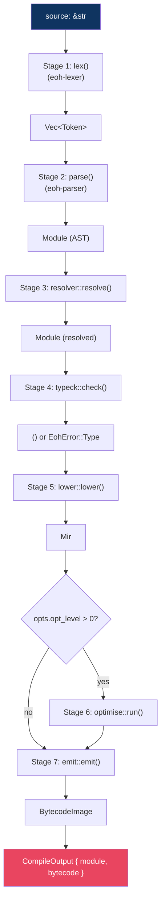

Each numbered stage below corresponds to a module in
`crates/eoh-compiler/src/`: `resolver.rs`, `typeck.rs`, `lower.rs`,
`optimise.rs`, `emit.rs`, plus the bytecode schema in `bytecode.rs`.

### 3. Stage 3 — Name resolution

`resolver::resolve(module: &Module) -> EohResult<Module>` walks every
top-level item and records declared names (`VERTEX`, `FN`, `LET`,
`SHAPE_*`) into a scope set. Its current implementation is intentionally
minimal — it validates that declarations are collected, and is the
designated extension point for future reference-checking (verifying that
every `Ident` expression resolves to a known declaration).

**Current scope:** module-level only. There is no nested lexical scoping
below function-body level yet — this is a named limitation, tracked as
Roadmap Phase 2, and documented so that contributors do not assume block
scoping exists.

### 4. Stage 4 — Type checking

`typeck::check(module: &Module) -> EohResult<()>` performs **structural**
validation rather than full type inference:

| Check | Rule | Failure mode |
|---|---|---|
| Pulse origin existence | Every `PULSE_HIGGS` origin must name a previously declared `VERTEX` | `EohError::Type("PULSE_HIGGS references undefined vertex '...'")` |
| Shape vertex counts | Enforced via `Shape::validate_vertex_count` (see [Language Concepts](Language-Concepts) §3.4) | `EohError::Geometry(...)` |

This is explicitly **not** a Hindley–Milner-style type system with
inference across function boundaries — see [Type System](Type-System) for
the full, honest account of what is and is not checked today, and why.

### 5. Stage 5 — MIR lowering

`lower::lower(module: &Module) -> EohResult<Mir>` walks the AST and emits a
flat sequence of `Instruction`s (the same enum used by the final bytecode —
see [Intermediate Representation](Intermediate-Representation) §2 for why
MIR and bytecode currently share a representation rather than being
distinct IRs).

Lowering is implemented as a recursive-descent walk with an accumulator
(`LowerCtx { out: Vec<Instruction> }`), handling:

- **Declarations** (`VERTEX` → push three coordinate values, then
  `DeclareVertex`; `PULSE_HIGGS` → `EmitPulse`; `LET` → evaluate then
  `Store`).
- **Expressions** (literals → `Push*`; identifiers → `Load`; binary
  operations → evaluate both operands, then the corresponding arithmetic
  instruction; unary negation → the `0.0 - x` desugaring described in §5.1
  below).
- **Statements inside function bodies** (`LET`, `RETURN`, bare
  expressions).

Items with no runtime effect (`ORIGIN`, `EDGE`, `SHAPE_*`, `IMPORT`) are
explicitly no-ops at this stage — see the inline commentary in
`lower.rs::LowerCtx::lower_item` for the rationale per item kind (e.g.,
shape declarations are structural metadata validated at type-check time,
not executable).

#### 5.1 Unary negation lowering

Because the lexer never produces a negative numeric literal token (`-1.0`
lexes as `Minus` followed by `Float(1.0)` — see
[Parser Design](Parser-Design) §3.1), the parser represents negation as
`UnOp(Neg, inner)`, and the lowering pass desugars this at MIR-generation
time:

```
lower(UnOp(Neg, e)) = PushFloat(0.0); lower(e); Sub
```

This keeps the instruction set free of a dedicated "negate" opcode, at the
cost of one extra instruction per negation — a trade-off resolved in favor
of instruction-set minimality, given that the optimizer (§6) collapses this
pattern back into a single constant when the operand is itself a constant.

### 6. Stage 6 — Optimization

`optimise::run(mir: &mut Mir, level: u8)` applies passes gated by
`opt_level`:

| Level | Pass | Implementation | Example |
|---|---|---|---|
| ≥ 1 | Constant folding | `constant_fold` — scans for `PushFloat(a), PushFloat(b), <op>` windows and collapses them | `PushFloat(0.0), PushFloat(1.0), Sub` becomes `PushFloat(-1.0)` |
| ≥ 2 | Dead-code elimination | `dead_code_elim` — truncates the instruction stream after the first unconditional `Halt`/`Return` | Instructions after an early `RETURN` are dropped |

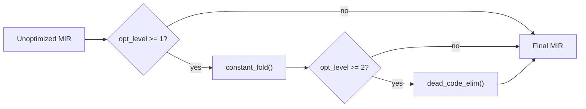

**Current limitations, stated explicitly:** constant folding only
recognizes the exact three-instruction window `PushFloat, PushFloat, <op>`
— it does not fold across `Load`/`Store` boundaries, does not perform
algebraic simplification (e.g. `x * 1.0 -> x`), and does not propagate
constants through variable bindings. These are natural, understood
extensions, not implemented because the current instruction set and test
corpus have not yet demanded them — see §11 Future Improvements.

### 7. Diagnosing pipeline failures

Each compiler stage raises errors through one specific `EohError` variant,
making it possible to identify the failing stage from the error type alone
without needing verbose logging:

| Stage | Error variant | Example message |
|---|---|---|
| Lexing | `EohError::Lex` | "lexer error at byte 42: unexpected character '#'" |
| Parsing | `EohError::Parse` | "parse error at 0:17: expected RParen, got Comma" |
| Type checking | `EohError::Type` | "PULSE_HIGGS references undefined vertex 'X'" |
| Geometry validation | `EohError::Geometry` | "TETRAHEDRON requires exactly 4 vertices, got 3" |
| MIR lowering | `EohError::NotImplemented` | "expression form not yet lowered" |
| Bytecode I/O | `EohError::Io` | (JSON serialization failures during `dump_mir`) |

This directly supports the debugging workflow described in
[Getting Started](Getting-Started) §7: running `eoh check`, then `eoh ast`,
then `eoh run -O0` in sequence isolates which of these stages a given
failure originates from.

### 8. The `CompileOptions` surface

```rust
pub struct CompileOptions {
    pub verbose: bool,            // emit log::debug! at each stage boundary
    pub opt_level: u8,            // 0, 1, or 2 -- see Section 6
    pub dump_mir: Option<String>, // write pretty-printed MIR JSON to this path
}
```

`dump_mir` is particularly useful when debugging the lowering stage (§5) in
isolation: it writes the MIR *before* optimization runs, letting a
contributor compare pre- and post-optimization instruction sequences
directly by diffing the `dump_mir` output against `eoh build`'s final
`.eohbc` output.

### 9. Best Practices

- **When adding a new AST node, update all three of resolver, type
  checker, and lowering pass in the same change**, even if one of them is
  initially a no-op for the new node — an AST node with lowering but no
  type-check coverage (or vice versa) is a common source of confusing
  "parses fine, fails mysteriously later" bugs.
- **Prefer extending `EohError` variants over introducing new ad hoc error
  types.** The uniform error taxonomy in §7 is what makes the CLI's error
  reporting and the planned LSP diagnostics (see
  [Repository Structure](Repository-Structure) §5) consistent — a new
  error type outside this taxonomy breaks that consistency.
- **Write constant-folding test cases as end-to-end `eoh ast`/bytecode
  comparisons**, not just unit tests on `optimise::run` in isolation — the
  folding logic's correctness depends on the exact instruction sequence
  `lower()` produces, which can silently change as lowering evolves.

### 10. Implementation Notes

- `compile()`'s seven stages execute unconditionally in sequence with no
  early-return fast path for, e.g., `eoh check` skipping codegen — instead,
  `eoh-cli::cmd_check` calls `compile()` with `opt_level: 0` and simply
  discards the `CompileOutput`. This trades a small amount of wasted work
  (bytecode is emitted even when unused) for pipeline-implementation
  simplicity; revisit if compilation performance becomes a bottleneck (see
  [Performance](Performance)).
- The resolver (§3) and type checker (§4) are separate passes rather than
  combined into one, even though their current implementations are both
  fairly small — this separation anticipates the resolver growing into full
  scope/import resolution (Roadmap Phase 2) without needing to be
  disentangled from type-checking logic at that point.

### 11. Future Improvements

- Extend constant folding to recognize `Load`/`Store` round-trips of
  constant values, and to perform basic algebraic identities (`x + 0.0`,
  `x * 1.0`, `x * 0.0`) — see §6.
- Implement full reference resolution in the resolver (§3): currently
  declared names are collected but not yet cross-checked against every
  `Ident` use site — this is a known, scoped gap, not an oversight.
- Add span-preserving error messages with source-line context (similar to
  `rustc` diagnostics) — currently `EohError` messages carry only byte
  offsets, which are correct but not maximally ergonomic.

---

## Chapter 7 — Parser Design

### 1. Purpose of this page

This page documents the front end of the Eye of Horus toolchain: the
`eoh-lexer` and `eoh-parser` crates. It covers the tokenization rules, the
recursive-descent grammar structure, the precedence-climbing algorithm used
for expressions, and the specific design decisions that shape how source
text becomes an AST. Readers extending the grammar (adding a new keyword or
expression form) should treat this page as the primary reference before
touching code.

### 2. Lexical analysis (`eoh-lexer`)

#### 2.1 Design choice: hand-written, not generated

The lexer is a hand-written `Lexer<'src>` struct walking a `CharIndices`
iterator, rather than being generated from a regex-based specification
(e.g. via `logos` or a similar crate). This choice trades a small amount of
implementation verbosity for two benefits: zero macro-generated code to
debug when something goes wrong, and complete control over error-recovery
behavior, which matters for a language whose diagnostic quality is a
first-class design goal (see [Design Principles](Design-Principles) §1).

#### 2.2 Token taxonomy

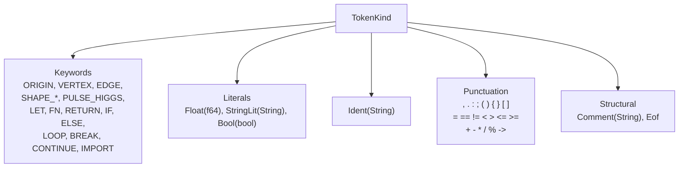

Every token carries a `Span` (`eoh_core::span::Span`) recording its exact
byte range and source-file id, used uniformly across the toolchain for
diagnostic reporting — see [Abstract Spatial Syntax Tree](Abstract-Spatial-Syntax-Tree)
§2 for how spans propagate into AST nodes.

#### 2.3 Negative numbers are not a lexical class

A specific, deliberate design decision: **the lexer never produces a
"negative float" token.** The character `-` always lexes as the `Minus`
punctuation token, regardless of what follows it. So `-1.0` lexes as two
tokens: `Minus`, then `Float(1.0)`.

**Rationale:** a context-sensitive lexer that decides "is this `-` a unary
negation prefix or a binary subtraction operator" based on surrounding
context conflates lexical and syntactic concerns, and is a well-known
source of subtle bugs in hand-written lexers (the lexer would need to track
"was the previous token an operand" state). By keeping `-` context-free at
the lexical level, all disambiguation is pushed to the parser, which has
the full grammatical context needed to do it correctly — see §3.3 and §4.1
below for how the parser handles this.

**Historical note:** an earlier internal version of the lexer attempted a
lookahead heuristic (checking whether the character following `-` was a
digit) to decide whether to lex a negative-number token directly. This
heuristic was buggy in practice (it mishandled certain byte-boundary cases)
and was removed in favor of the context-free design described above, which
is both simpler and strictly more correct.

#### 2.4 String and comment handling

String literals support the escape sequences `\n`, `\t`, `\\`, and `\"`;
any other escape sequence is a lex error. Comments begin with `//` and
extend to end of line; there is no block-comment syntax in the current
grammar (see [Glossary](Glossary) for planned syntax reserved for future
use).

### 3. The grammar, structurally

The full EBNF grammar lives in `spec/LANGUAGE_SPEC.md` and is authoritative;
this section explains the grammar's *shape* and design rationale rather
than restating it verbatim.

#### 3.1 Two-tier structure: items and expressions

The grammar has two clearly separated tiers:

```text
Module = { Item }

Item = OriginDecl | VertexDecl | EdgeDecl | ShapeDecl
     | PulseDecl | LetDecl | FnDecl | ImportDecl

Expr = comparison-precedence expression grammar
     (standard precedence climbing: cmp -> add -> mul -> unary -> primary)
```

Items are Eye-of-Horus-specific declarative forms (there is no generic
"statement" at module level — every top-level construct is one of the
eight `Item` variants). Expressions, by contrast, follow a fairly
conventional arithmetic-expression grammar, deliberately kept close to what
a reader from any C-family or Rust-like language would expect, since there
is no research value in inventing novel expression syntax for what is
fundamentally ordinary arithmetic.

#### 3.2 Precedence climbing for expressions

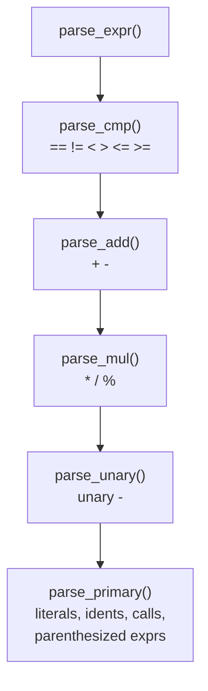

Each level calls the level below it and then loops, consuming
same-precedence operators left-associatively — the standard technique for
recursive-descent expression parsing. This gives the grammar in §3.1's
informal notation its precise, unambiguous meaning: `a + b * c` parses as
`a + (b * c)` because `parse_mul` is called from within `parse_add`'s loop
body, not the reverse.

#### 3.3 Where unary negation is resolved

Following from §2.3, the parser resolves the "is this `-` unary or binary"
question in exactly two places:

1. **`parse_unary()`** — if the next token is `Minus`, it is treated as a
   unary prefix, and `parse_primary()` is called for the operand.
2. **`parse_float_expr()`** — a specialized helper used specifically for
   coordinate components (`VERTEX name -1.0, 2.0, 3.0`), which also
   recognizes a leading `Minus` and wraps the result in `UnOp(Neg, ...)`.

Everywhere else in the grammar, `Minus` between two already-parsed operands
is unambiguously the binary subtraction operator, since `parse_add()`'s
loop only consumes `Minus` *after* successfully parsing a left-hand operand.

### 4. Item-specific parsing methods

Each `Item` variant has a dedicated parsing method, directly named after
the grammar rule it implements — this 1:1 naming convention
(`parse_origin`, `parse_vertex`, `parse_edge`, `parse_shape`, `parse_pulse`,
`parse_let`, `parse_fn`, `parse_import`) is a deliberate readability choice:
a contributor looking for "where is `PULSE_HIGGS` parsed" can find it by
name alone, without needing to trace dispatch logic.

#### 4.1 A representative example: `parse_shape`

The shape-parsing method illustrates a grammar subtlety worth calling out:
shapes accept a variable-length vertex list *followed optionally* by a
named scalar parameter (`size=expr` for cubes, `r=expr` for spheres). The
parser distinguishes "another vertex name" from "the start of a named
parameter" via one token of lookahead:

```text
SHAPE_CUBE box A, size=2.0
                ^^^^^^^^^^
                after consuming "A,", the parser peeks two tokens ahead:
                is the next token an Ident immediately followed by "="?
                if yes -> stop the vertex list, parse a named parameter
                if no  -> continue consuming vertex names
```

This is implemented via `self.tokens.get(self.cursor + 1)` — a direct
two-token lookahead rather than a full backtracking parse — which keeps the
parser's overall structure single-pass and backtrack-free (see §5).

### 5. Design constraint: no backtracking

The parser is deliberately built to require **at most one token of
lookahead** at any decision point (with the single documented exception in
§4.1, which uses two tokens of lookahead for a narrowly scoped case). There
is no general backtracking, no arbitrary lookahead, and no parser
combinator library providing implicit backtracking behavior.

**Rationale:** bounded lookahead keeps parsing behavior easy to reason
about and easy to extend without introducing accidental grammar ambiguity —
a common failure mode in hand-written parsers that "just try parsing it one
way, and if that fails, try another" is that error messages become
confusing (which attempt's failure should be reported?) and worst-case
parsing time can become non-linear in pathological grammars. Eye of
Horus's grammar is specifically designed to remain LL(1)-parseable (with
the one documented LL(2) exception) as new grammar rules are added — this
is a standing design constraint for any future grammar RFC, not merely an
implementation accident.

### 6. Error recovery: current status

The current parser is **not** error-recovering: on the first parse error,
`parse_module()` returns immediately with `Err(EohError::Parse{...})`
rather than attempting to skip the malformed construct and continue
collecting further errors. This means `eoh check` on a file with multiple
syntax errors reports only the first one per invocation.

This is a known, explicitly scoped limitation. Multi-error recovery
(commonly implemented via "panic mode" — skipping tokens until a
synchronization point like a statement boundary, then resuming) is
tracked as a Roadmap item once the core grammar stabilizes; it is
deliberately deferred because implementing recovery for a still-changing
grammar means repeatedly reimplementing synchronization logic as grammar
rules shift.

### 7. Testing strategy

Parser tests live in `eoh-parser/src/parser.rs`'s `#[cfg(test)] mod tests`
block and follow a consistent pattern: lex a source string, parse it, and
assert on the shape of the resulting AST via pattern matching (e.g.
`assert!(matches!(&m.items[0], Item::Vertex(v) if v.name == "A"))`). This
style is chosen over snapshot testing (comparing against a serialized
golden AST) because pattern-matching assertions remain readable and
intention-revealing even as the AST's `serde` representation evolves —
snapshot tests would require regeneration on every AST schema change,
obscuring what property is actually being tested.

### 8. Best Practices

- **When adding a new keyword, update three places together**: the
  `TokenKind` enum and its `Display` impl (`eoh-lexer/src/token.rs`), the
  `Lexer::keyword` match table (`eoh-lexer/src/lexer.rs`), and the
  corresponding `Item` variant plus `parse_*` method
  (`eoh-ast`/`eoh-parser`). Missing any one of these produces confusing
  "unknown identifier" errors instead of a clear grammar error.
- **Keep new grammar rules LL(1) wherever possible** (§5) — if a new
  construct seems to require more than one token of lookahead, treat that
  as a signal to reconsider the surface syntax via an RFC before
  implementing a lookahead workaround.
- **Add a parser unit test for every new grammar rule** in the same style
  as §7, asserting on AST shape rather than on serialized output.

### 9. Implementation Notes

- The `Parser` struct holds `tokens: Vec<Token>` and a `cursor: usize`
  rather than an iterator, allowing simple lookahead via direct indexing
  (`self.tokens.get(self.cursor + 1)`) — this is a pragmatic trade-off of
  a small amount of extra memory (the full token vector, materialized
  up front by the lexer) for parser-implementation simplicity.
- `Parser::expect()` compares tokens via `std::mem::discriminant`, matching
  on token *kind* while ignoring payload — this means `expect(&TokenKind::Ident(String::new()))`
  correctly matches any identifier regardless of its actual string value,
  which is the intended behavior for a generic "expect an identifier here"
  check.

### 10. Future Improvements

- Multi-error recovery via panic-mode synchronization, once the core
  grammar stabilizes (§6).
- Extend the grammar to support block-scoped `LET` bindings inside `IF`/
  `LOOP` bodies once those constructs are wired into execution — see
  [Type System](Type-System) §6 and [Compiler Architecture](Compiler-Architecture) §3.
- Consider a formal grammar-conformance test suite that checks the
  `spec/LANGUAGE_SPEC.md` EBNF grammar and the parser implementation stay
  in sync automatically, rather than relying on manual review.

---

## Chapter 8 — Abstract Spatial Syntax Tree

### 1. Purpose of this page

This page documents `eoh-ast`, the crate defining Eye of Horus's Abstract
Syntax Tree. The term "Abstract Spatial Syntax Tree" (rather than the more
generic "AST") reflects a genuine property of this tree, not just a
thematic naming choice: because every declaration in the language is
fundamentally about spatial position or spatial relationship, the tree's
node types are dominated by geometric vocabulary (vertices, shapes, edges,
pulses) rather than the generic statement/expression vocabulary that
dominates a conventional language's AST. This page explains the tree's
structure, why it is shaped this way, and how span information propagates
through it for diagnostics.

### 2. Design principles behind the AST

Three principles governed the AST's design:

1. **Every node carries a `Span`.** Without exception, every `Item`,
   `Expr`, `Stmt`, and `Block` node includes source-location information
   sufficient to point a diagnostic at the exact source text it came from.
   This is not optional metadata — it is a structural requirement enforced
   by the type definitions themselves (there is no AST node variant without
   a `span` field).
2. **The tree is `serde`-serializable.** Every node type derives
   `Serialize`/`Deserialize`. This is what makes `eoh ast file.eoh`
   (producing pretty-printed JSON) and `CompileOptions::dump_mir`-style
   debugging tooling possible without writing bespoke serialization code —
   see [Getting Started](Getting-Started) §7.
3. **The tree separates *declarative items* from *computational
   expressions* structurally**, mirroring the two-tier grammar described in
   [Parser Design](Parser-Design) §3.1. This is a deliberate acknowledgment
   that Eye of Horus is not (yet, and possibly not ever) a
   general-purpose expression-oriented language in the way Rust or ML-family
   languages are — its declarative core (geometry) and its computational
   core (arithmetic, functions) are kept as clearly distinguishable node
   families.

### 3. The top-level shape

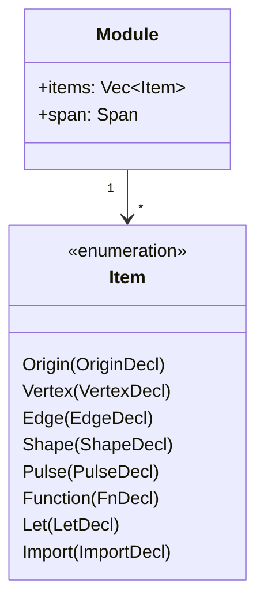

`Module` is the root of every parsed file: a flat `Vec<Item>` plus a span
covering the whole file. There is deliberately no nesting of modules within
modules at the AST level — multi-file composition (via `IMPORT`) is a
planned *linking* concern handled above the AST layer, not an AST-level
nesting concept. See [Repository Structure](Repository-Structure) §4 for
where module linking is expected to live once implemented.

### 4. Declaration node types

Each `Item` variant wraps a dedicated struct, one per declaration kind
introduced in [Language Concepts](Language-Concepts) §3:

| Item variant | Struct | Key fields |
|---|---|---|
| `Origin` | `OriginDecl` | `x, y, z: Expr` |
| `Vertex` | `VertexDecl` | `name: String`, `x, y, z: Expr` |
| `Edge` | `EdgeDecl` | `from: String`, `to: String` |
| `Shape` | `ShapeDecl` | `name: String`, `kind: ShapeKindAst`, `vertices: Vec<String>`, `param: Option<Expr>` |
| `Pulse` | `PulseDecl` | `origin: String`, `velocity: Option<Expr>` |
| `Function` | `FnDecl` | `name: String`, `params: Vec<Param>`, `return_type: Option<TypeAnnotation>`, `body: Block` |
| `Let` | `LetDecl` | `name: String`, `ty: Option<TypeAnnotation>`, `value: Expr` |
| `Import` | `ImportDecl` | `path: String` |

A design detail worth noting: `VertexDecl`'s `x, y, z` fields are typed as
`Expr`, not `f64`, even though the overwhelming majority of vertex
declarations in practice use literal numeric coordinates. This is
deliberate future-proofing: it allows a vertex position to eventually be
computed (`VERTEX A scale * 2.0, 0.0, 0.0`) without a grammar or AST schema
change — the computation is simply not yet exercised by the type checker
or lowering pass for anything beyond literals and simple arithmetic (see
[Compiler Architecture](Compiler-Architecture) §5).

### 5. Expression and statement node types

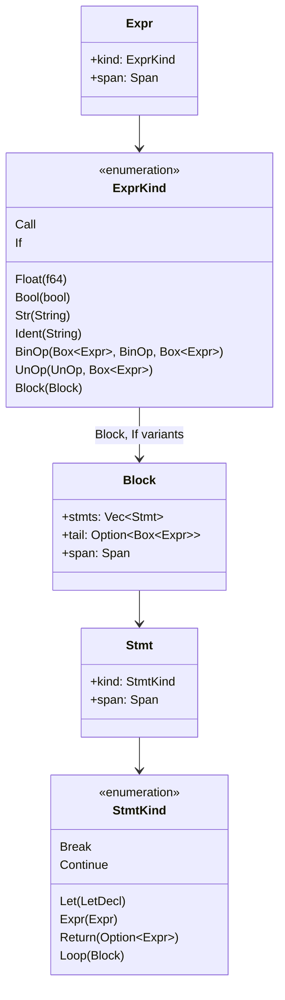

`ExprKind::Call { callee: Box<Expr>, args: Vec<Expr> }` uses a boxed
`Expr` for the callee, rather than a plain `String` function name, to keep
the door open for higher-order or computed-callee expressions in the
future — though the current parser only ever constructs `callee` as a bare
`Ident` (see [Parser Design](Parser-Design) §3.2's `parse_primary`). This
mirrors the `VertexDecl` coordinate-typing decision in §4: the AST schema
anticipates generality the current front end does not yet exercise, rather
than the reverse (front end anticipating an AST that does not yet exist).

### 6. Span propagation and the "smallest covering span" rule

Every AST node's span is computed by one of two rules:

1. **Leaf nodes** (literals, identifiers) take the span of their originating
   token directly.
2. **Composite nodes** take the smallest span that covers all of their
   children, computed via `Span::merge` (see
   [Spatial Execution Model](Spatial-Execution-Model) — actually defined in
   `eoh-core::span::Span`, used throughout the toolchain): `Span::merge`
   takes the min of two spans' start offsets and the max of their end
   offsets, provided both spans share the same `file_id`.

This "smallest covering span" discipline is what lets a diagnostic for,
say, a malformed binary expression underline exactly the expression's
extent in source — no more, no less — regardless of how deeply nested the
expression is.

### 7. A worked example: AST for a vertex declaration

Given the source:

```eoh
VERTEX A -1.0, 2.0, 3.0
```

The parser produces (shown as simplified pseudo-JSON, matching the actual
shape of `eoh ast`'s output):

```json
{
  "Vertex": {
    "name": "A",
    "x": { "kind": { "UnOp": ["Neg", { "kind": { "Float": 1.0 }, "span": {...} }] }, "span": {...} },
    "y": { "kind": { "Float": 2.0 }, "span": {...} },
    "z": { "kind": { "Float": 3.0 }, "span": {...} },
    "span": {...}
  }
}
```

Note the `UnOp: Neg` wrapper around the `x` field's value — this is the
direct AST-level consequence of the lexer's context-free treatment of `-`
described in [Parser Design](Parser-Design) §2.3: the AST never contains a
literal negative float, only positive floats optionally wrapped in
`UnOp(Neg, ...)`. Any code walking the AST (the type checker, the lowering
pass, a future static analyzer) must account for this representation rather
than assuming `Float(f64)` can hold a negative value directly — though
nothing prevents it structurally, by construction the parser never
produces one.

### 8. Consumers of the AST

| Consumer | What it does with the AST | Detail page |
|---|---|---|
| `eoh-compiler::resolver` | Walks `Item`s, collects declared names | [Compiler Architecture](Compiler-Architecture) §3 |
| `eoh-compiler::typeck` | Walks `Item`s, validates structural constraints | [Compiler Architecture](Compiler-Architecture) §4 |
| `eoh-compiler::lower` | Recursively lowers `Item`/`Expr`/`Stmt` into MIR instructions | [Compiler Architecture](Compiler-Architecture) §5 |
| `eoh-cli::cmd_ast` | Serializes the whole `Module` to JSON (or Rust debug format) for inspection | [Getting Started](Getting-Started) §6 |
| `eoh-lsp` (planned) | Will walk the AST to provide hover/completion/diagnostics | [Repository Structure](Repository-Structure) §5 |

### 9. Best Practices

- **When adding a new AST node, give it a `span` field even if you cannot
  imagine needing it yet.** Retrofitting span tracking onto a node that was
  designed without it is significantly more disruptive than including it
  from the start — every consumer that pattern-matches on the node type
  needs updating.
- **Prefer boxed recursive fields (`Box<Expr>`) over introducing an
  auxiliary node-index/arena scheme** unless profiling demonstrates the
  tree is a performance bottleneck (see [Performance](Performance)) — the
  current AST's size and program complexity do not justify the added
  implementation complexity of an arena-based representation.
- **When serializing the AST for tooling, prefer the existing `serde`
  derive over hand-written serialization** — consistency with the rest of
  the toolchain's debugging output (`dump_mir`, bytecode JSON) matters more
  than any marginal format customization a hand-written serializer might
  offer.

### 10. Implementation Notes

- `TypeAnnotation` is currently just a wrapped `String` (the type name) —
  there is no structured representation of, e.g., generic type parameters
  or compound types, because the current type system
  ([Type System](Type-System)) does not yet support them. Extending
  `TypeAnnotation` into a richer enum is anticipated as part of Roadmap
  Phase 2's full type-inference work.
- `ShapeKindAst` (in `eoh-ast`) is a distinct enum from `ShapeKind` (in
  `eoh-core::primitives`) — the AST-level enum tracks what the *parser*
  recognized syntactically, while the core-level enum is what the
  *runtime/geometry* layer operates on. They are kept separate
  deliberately so that a future syntax change (e.g., renaming
  `SHAPE_TETRA` to something else) would not require touching
  `eoh-core`'s geometry logic at all.

### 11. Future Improvements

- Introduce an arena-based AST representation if profiling
  ([Performance](Performance)) demonstrates that `Box`-per-node allocation
  overhead matters for realistically sized programs — not undertaken
  preemptively, per the project's general stance against premature
  optimization (see [Design Principles](Design-Principles) §4).
- Extend `TypeAnnotation` into a structured type-expression AST once
  full type inference work begins (Roadmap Phase 2).
- Add AST visitor/fold traits to reduce the amount of manual recursive
  pattern-matching duplicated across the resolver, type checker, and
  lowering pass — currently each of these three consumers independently
  implements its own tree walk.

---

## Chapter 9 — Intermediate Representation

### 1. Purpose of this page

This page documents Eye of Horus's Mid-level Intermediate Representation
(MIR) and its final serialized form, the bytecode image. It explains why
the project currently uses a single flat instruction set for both purposes
rather than distinct MIR and bytecode formats, walks through every
instruction's semantics, and documents the bytecode's schema-versioning
policy for forward compatibility.

### 2. Why MIR and bytecode currently share a representation

A conventional compiler pipeline often distinguishes a mid-level IR
(tree-like or SSA-form, convenient for optimization passes) from a final
bytecode format (flat, convenient for interpretation). Eye of Horus's
reference implementation currently uses **the same flat instruction
sequence, `Instruction`, for both** — `Mir { instructions: Vec<Instruction>, .. }`
in `eoh-compiler::lower` and `BytecodeImage { instructions: Vec<Instruction>, .. }`
in `eoh-compiler::bytecode` differ only in their surrounding metadata (a
source path, a string pool, a version number), not in the instruction type
itself.

**This is a deliberate, acknowledged simplification, not an oversight.**
It is adequate for the current instruction set's complexity and the
current optimizer's scope (constant folding and dead-code elimination,
both of which operate naturally on a flat sequence — see
[Compiler Architecture](Compiler-Architecture) §6). It becomes a genuine
limitation once optimization passes that benefit from a graph-structured
IR (e.g. common-subexpression elimination, more sophisticated data-flow
analysis) are needed — at that point, splitting MIR and bytecode into
distinct representations, connected by a final lowering pass, is the
anticipated refactor. See §8 Future Improvements.

### 3. The instruction set

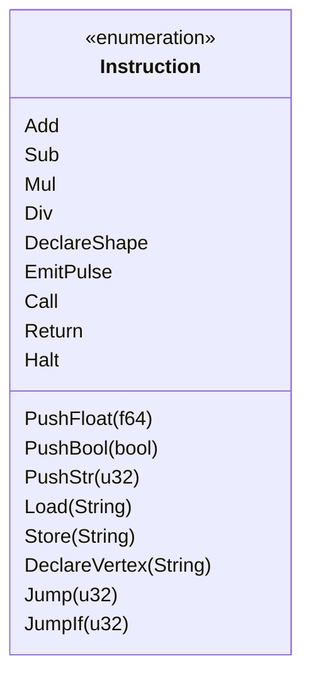

| Instruction | Stack effect | Semantics |
|---|---|---|
| `PushFloat(f)` | `-> f` | Push a float constant |
| `PushBool(b)` | `-> b` | Push a bool constant |
| `PushStr(i)` | `-> s` | Push the interned string at pool index `i` |
| `Load(name)` | `-> v` | Load the value bound to `name` from the spatial field, via the vertex table (see [Spatial Execution Model](Spatial-Execution-Model) §6) |
| `Store(name)` | `v ->` | Store the top-of-stack value into the spatial field at `name`'s address |
| `Add` / `Sub` / `Mul` / `Div` | `a b -> r` | Arithmetic; `Div` faults on a zero divisor |
| `DeclareVertex(name)` | `x y z ->` | Bind `name` to coordinate `(x,y,z)` in the vertex table, and initialize its field cell |
| `DeclareShape { name, kind, vertex_count }` | — | Register shape metadata; no field-level effect |
| `EmitPulse { origin, velocity }` | — | Create and register a Higgs pulse (see [Pulse Engine](Pulse-Engine)) |
| `Call { name, argc }` | `a1..aN ->` | Invoke a built-in or user function |
| `Return` | — | Halt the current call frame |
| `Jump(target)` | — | Unconditional jump to instruction index `target` |
| `JumpIf(target)` | `b ->` | Conditional jump; pops a bool, jumps if true |
| `Halt` | — | Stop VM execution entirely |

Every emitted bytecode image is terminated with an implicit `Halt`,
appended by `emit::emit()` regardless of whether the source program ended
with an explicit `RETURN` — this guarantees the VM's dispatch loop always
has a well-defined termination instruction to reach, rather than running
off the end of the instruction vector (which the VM also handles
gracefully — see [Spatial Execution Model](Spatial-Execution-Model) §4 —
but the explicit `Halt` is the intended, documented termination path).

### 4. The bytecode envelope

```rust
pub struct BytecodeImage {
    pub instructions: Vec<Instruction>,
    pub strings: Vec<String>,      // string constant pool
    pub source_path: String,       // for diagnostics
    pub version: u32,               // schema version
}
```

The **string constant pool** deduplicates string literals: `intern()`
checks whether a string is already present before appending, returning the
existing index if so. This is a standard bytecode-format technique,
included here even though the current language surface makes only light
use of string values — anticipating heavier string usage once the standard
library ([Standard Library](Standard-Library)) grows.

### 5. Emission

`emit::emit(mir: &Mir) -> EohResult<BytecodeImage>` is currently a thin
pass: it constructs a fresh `BytecodeImage`, copies every MIR instruction
into it in order, and appends the terminating `Halt`. Given §2's
architecture (MIR and bytecode sharing a representation), there is
currently no instruction-level transformation happening during emission —
the "emission" step's real job today is constructing the envelope
(string pool, source path, version stamp) around an already-finalized
instruction sequence. This will change if/when MIR and bytecode diverge
into distinct representations (§2, §8).

### 6. Schema versioning policy

`BytecodeImage::CURRENT_VERSION` is `1` as of this writing. The policy,
stated explicitly for any future toolchain component that consumes
`.eohbc` files:

> **Any change to the `Instruction` enum's variants, field types, or
> serialized shape that would break deserialization of an existing
> `.eohbc` file must be accompanied by an increment of
> `CURRENT_VERSION`.** Tooling reading a `BytecodeImage` should check the
> `version` field and reject images with an unrecognized version rather
> than attempt best-effort deserialization — silent misinterpretation of a
> stale bytecode format is a worse failure mode than a clear "unsupported
> version" error.

This policy is currently **advisory** — no toolchain component yet
enforces version rejection at load time, since `eoh-vm::run` accepts any
successfully-deserialized `BytecodeImage` regardless of its `version`
field. Enforcing this check is tracked as a near-term hardening item (see
§8).

### 7. A worked example: from source to bytecode

Given the source:

```eoh
VERTEX A -1.0, 2.0, 3.0
```

MIR lowering (see [Compiler Architecture](Compiler-Architecture) §5.1)
produces, before optimization:

```text
PushFloat(0.0)
PushFloat(1.0)
Sub
PushFloat(2.0)
PushFloat(3.0)
DeclareVertex("A")
```

After constant folding (`-O1`), the first three instructions collapse:

```text
PushFloat(-1.0)
PushFloat(2.0)
PushFloat(3.0)
DeclareVertex("A")
```

This exact transformation is verified empirically against the reference
implementation and cited in the project whitepaper, §7 — it is a concrete,
checkable example of the optimizer described in
[Compiler Architecture](Compiler-Architecture) §6 operating correctly on a
representative program fragment.

### 8. Best Practices

- **When adding a new instruction, update the small-step semantics page
  ([Spatial Execution Model](Spatial-Execution-Model) §4) in the same
  change.** An instruction implemented in `Vm::execute` without a
  corresponding formal rule is treated as a documentation defect under this
  project's standards.
- **Bump `CURRENT_VERSION` for any breaking bytecode-schema change**, per
  §6's policy, even though enforcement is not yet automated — the
  discipline of bumping the version number is what makes automating
  enforcement possible later without an audit of undocumented breaking
  changes.
- **Prefer adding new instruction variants over overloading existing
  ones** with new meanings based on argument patterns — the instruction
  set's clarity (one variant, one unambiguous meaning) is worth more than
  the marginal compactness of overloading.

### 9. Implementation Notes

- `BytecodeImage::intern()` performs a linear scan (`position()`) over the
  existing string pool to check for duplicates before appending — this is
  `O(n)` per intern call, acceptable for the current scale of string usage
  in typical Eye of Horus programs, but a candidate for a `HashMap`-backed
  reverse index if string-heavy programs become common (see
  [Performance](Performance)).
- Bytecode images are serialized as pretty-printed JSON (via `serde_json`)
  rather than a compact binary format — this is a deliberate debuggability
  choice for the current pre-alpha stage: `.eohbc` files are meant to be
  directly human-inspectable (`cat file.eohbc`) during development. A more
  compact binary encoding is a natural future optimization once the format
  stabilizes (see §10).

### 10. Future Improvements

- Split MIR and bytecode into genuinely distinct representations once
  optimization passes beyond constant-folding/DCE are added (§2) —
  tracked pending a concrete optimization pass that demonstrates the need
  for a graph-structured intermediate form.
- Enforce `BytecodeImage::version` checking at load time in `eoh-vm::run`
  and `eoh-cli`, rejecting unrecognized versions with a clear error rather
  than best-effort deserialization (§6).
- Consider a compact binary bytecode encoding (e.g. via `bincode`) as an
  alternative to JSON for release builds, while retaining JSON as a
  `--debug-format` option for development — balancing the debuggability
  benefit described in §9 against eventual performance needs
  ([Performance](Performance)).
- Add a `HashMap`-backed reverse index to `BytecodeImage::intern()` if
  profiling shows the current linear scan matters in practice (§9).

---

## Chapter 10 — Pulse Engine

### 1. Purpose of this page, and an explicit non-claim

This page is the canonical reference for the Higgs-pulse activation model —
the mechanism that most distinguishes Eye of Horus from conventional
languages. Before anything else, one clarification the project considers
important enough to repeat on this specific page rather than trust readers
to have absorbed from elsewhere:

> **"Higgs pulse" is a naming metaphor, not a physics claim.** The name is
> borrowed from the Higgs field of the Standard Model of particle physics
> — a field that permeates space and with which other particles interact
> to acquire mass — because it is an evocative, memorable image for "a
> field that activates other things on contact." Eye of Horus's pulse
> model is a simulated, purely computational construct implemented in
> ordinary Rust code (`eoh_core::pulse`). It does not model, approximate,
> or have any bearing on the physical Higgs mechanism. Any resemblance
> begins and ends at the metaphor.

With that stated plainly, the remainder of this page describes the actual
computational model in full technical detail.

### 2. What a pulse is, structurally

```rust
pub struct Pulse {
    pub origin: Coord3D,        // where the pulse originates
    pub velocity: f64,          // spatial units per simulation tick
    pub direction: PulseVector, // zero vector = isotropic (see Section 6)
    pub birth_tick: u64,        // simulation tick at which the pulse was created
}
```

A pulse is created by the `PULSE_HIGGS origin, v=velocity` declaration
(see [Language Concepts](Language-Concepts) §3.5), compiled to a single
`EmitPulse { origin, velocity }` bytecode instruction (see
[Intermediate Representation](Intermediate-Representation) §3), and
registered into the VM's `ActivationField` — a simple `Vec<Pulse>` — at
execution time.

### 3. The radius and activation functions

Given a pulse `p` with `birth_tick = b` and `velocity = v`, its wavefront
radius at simulation tick `t` is:

```
radius(p, t) = max(0, t − b) · v
```

A spatial point `x` is **activated** by `p` at tick `t` if:

```
activates(p, x, t)  ⟺  ‖p.origin − x‖₂ ≤ radius(p, t)
```

This is restated here for self-containedness; the fully formal treatment,
including the proof of the monotonicity property below, lives in
[Spatial Execution Model](Spatial-Execution-Model) §3.

### 4. Visualizing wavefront expansion

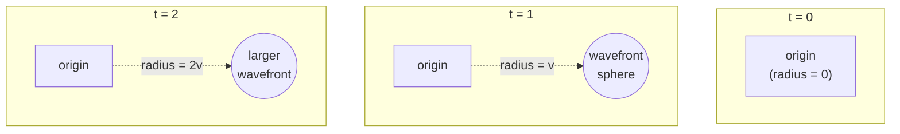

ASCII cross-section, showing the wavefront's 2-D cross-section growing
outward over three ticks (velocity = 1 unit/tick), with a target vertex `B`
at distance 2.5 from the origin:

```text
t=0:        t=1:            t=2:                t=3:
  .           .                .                    .
  O           O   *r=1*        O    *r=2*            O      *r=3*
              (B not yet       (B not yet         B*  (B now
               reached)          reached)              activated:
                                                        2.5 <= 3)
```

`B`, at distance 2.5, becomes activated at `t = 3` (the smallest integer
tick where `radius(p,t) = t · 1.0 ≥ 2.5`), consistent with the discrete-tick
model described in [Spatial Execution Model](Spatial-Execution-Model) §4.

### 5. The monotonicity property, and what it means practically

**Proposition** (restated from [Spatial Execution Model](Spatial-Execution-Model) §3.1):
for a fixed pulse and point, once activated, always activated — for all
later ticks, provided `velocity ≥ 0`.

**Practical consequence:** Eye of Horus's activation semantics are
currently "sticky" or "monotonic": there is no way, in the current
language, to express a pulse whose effect *wanes* — a shape reached by a
wavefront stays reachable (in the activation sense) for the remainder of
the simulation run. This is analogous to a one-way latch, not a
transient trigger.

**Why this matters for program design:** if you are modeling a scenario
where you conceptually want "only briefly activated" behavior (e.g., a
pulse that should trigger something and then have that trigger "expire"),
the current pulse model cannot express this directly — you would need to
build such behavior on top of the activation primitive (e.g., checking a
separately-tracked tick count against the activation event), rather than
relying on any built-in pulse decay.

### 6. Isotropic vs. directional pulses

`PulseVector` has a `dx, dy, dz` representation, with a designated
`ISOTROPIC` constant (`{0,0,0}`), and supports `magnitude()` and
`normalised()` operations. **However, the current VM only ever constructs
isotropic pulses** — `Vm::execute`'s `EmitPulse` handler always sets
`direction: PulseVector::ISOTROPIC` regardless of any richer directional
information that might, in principle, be attached.

This means the `PulseVector` type is, as of this writing, **partially
speculative infrastructure**: it is fully implemented and unit-tested at
the `eoh-core` level (magnitude, normalization), but not yet load-bearing
in the language's actual pulse-emission semantics. This is stated
explicitly here so that a reader inspecting `eoh-core::pulse::PulseVector`
does not conclude directional pulses are a usable language feature today.

**Planned extension (not yet an RFC):** a future `PULSE_HIGGS origin,
v=velocity, dir=(dx,dy,dz)` syntax could specialize the activation
predicate to a cone or half-space rather than a full sphere, using the
already-implemented `normalised()` direction vector. This would be a
grammar change requiring an RFC per the process in
[Contributing](Contributing) §3, and is listed here as a documented
research direction, not a committed roadmap item.

### 7. Multiple simultaneous pulses: the activation field

```rust
pub struct ActivationField {
    pub pulses: Vec<Pulse>,
}

impl ActivationField {
    pub fn is_active(&self, point: &Coord3D, tick: u64) -> bool {
        self.pulses.iter().any(|p| p.activates(point, tick))
    }
}
```

The activation field's semantics are a **logical union**: a point is active
if *any* pulse in the field activates it. There is no interference,
cancellation, or superposition modeling between multiple pulses — this is
a deliberate simplification distinct from the physical wave phenomena the
"pulse" metaphor might suggest (see §1's explicit non-claim). Two pulses
emitted from different origins simply each independently contribute
activation coverage to the union; they do not combine, cancel, or interact
with each other in any way.

### 8. Worked timing table

For the canonical tetrahedron example (see
[Getting Started](Getting-Started) §5, [Spatial Execution Model](Spatial-Execution-Model) §3.2):
vertex `A` at `(1,1,1)`, target vertices `B`, `C`, `D` each at distance
`2√2 ≈ 2.828` from `A`, pulse velocity `v = φ ≈ 1.618`.

| Tick `t` | `radius(p,t)` | `B`, `C`, `D` activated? |
|---|---|---|
| 0 | 0.000 | No |
| 1 | 1.618 | No (2.828 > 1.618) |
| 2 | 3.236 | **Yes** (2.828 ≤ 3.236) |
| 3+ | ≥ 4.854 | Yes (monotonicity, §5) |

This table is directly checkable by running
`eoh run examples/01_tetrahedron.eoh` and inspecting the VM's reported tick
count against this computation.

### 9. Best Practices

- **Choose pulse velocities deliberately, not arbitrarily.** Since
  activation timing is entirely determined by `distance / velocity`, a
  program's observable behavior (which shapes activate when) is a direct
  function of your velocity choice — treat it as a meaningful parameter,
  not a cosmetic one.
- **Do not assume pulses can be "cancelled" or "shrunk."** Given §5's
  monotonicity property, any program logic that depends on an activation
  later becoming inactive needs to be built explicitly (e.g., via
  separate tick-based bookkeeping), not assumed as built-in pulse
  behavior.
- **Treat `PulseVector`'s directional fields as not-yet-usable** (§6) when
  reading `eoh-core` source code — their presence in the struct does not
  imply directional pulse emission is a working language feature.

### 10. Implementation Notes

- `Pulse::radius_at` uses `saturating_sub` for `tick.saturating_sub(self.birth_tick)`,
  guarding against a hypothetical (currently unreachable in practice, given
  monotonic tick advancement) case where `tick < birth_tick` — this
  produces a radius of `0.0` rather than panicking on integer underflow,
  consistent with the project's no-`unsafe`, no-panic-in-library-code
  discipline (see [Project Architecture](Project-Architecture) §2.3).
- `ActivationField::is_active` is `O(pulses)` per query — for the current
  scale of typical Eye of Horus programs (a handful of pulses per module)
  this is not a performance concern; see
  [Performance](Performance) for the project's general stance on
  benchmarking before optimizing.

### 11. Future Improvements

- Specify and implement directional/conical pulse activation, exercising
  the already-built `PulseVector::normalised()` machinery (§6), pending an
  RFC.
- Investigate bounded-duration ("decaying") pulses as a relaxation of the
  monotonicity property (§5) — this is explicitly framed as a *relaxation*
  requiring careful semantic redesign, not a straightforward addition,
  since it would change the fundamental "once activated, always activated"
  invariant that current and future language reasoning may come to rely
  on.
- Explore pulse interference/cancellation models (§7) as a research
  question, situating Eye of Horus's activation field closer to an actual
  wave-superposition model — noted explicitly as speculative and
  unscheduled.

---

## Chapter 11 — Memory Model

### 1. Purpose of this page, and an explicit non-claim

This page documents how Eye of Horus stores program state — the
**spatial field** — and the addressing scheme underneath it. As with
[Pulse Engine](Pulse-Engine) §1, this page opens with a clarification the
project considers important enough to state directly:

> **The phi-pi addressing scheme has no cryptographic or security
> properties whatsoever.** It is a public, deterministic quantization
> function — mathematically no different in kind from choosing a hash
> function for a `HashMap` — used purely to organize the virtual machine's
> storage layout. It provides no confidentiality, no collision resistance
> suitable for any security purpose, and no relationship to established
> cryptographic primitives. See [Coordinate System](Coordinate-System) §3
> for the full non-claims statement and §5 of this page for why this
> matters practically.

### 2. Why there is no separate heap and stack

Conventional languages distinguish a **stack** (fast, LIFO-ordered,
holding function-local data with statically-known lifetimes) from a
**heap** (slower, arbitrarily-ordered, holding data with dynamic
lifetimes). Eye of Horus's reference VM has no such distinction for
program state: there is exactly one long-lived storage mechanism, the
**spatial field**, plus a short-lived **operand stack** used only for
evaluating expressions mid-instruction (not for storing named bindings).

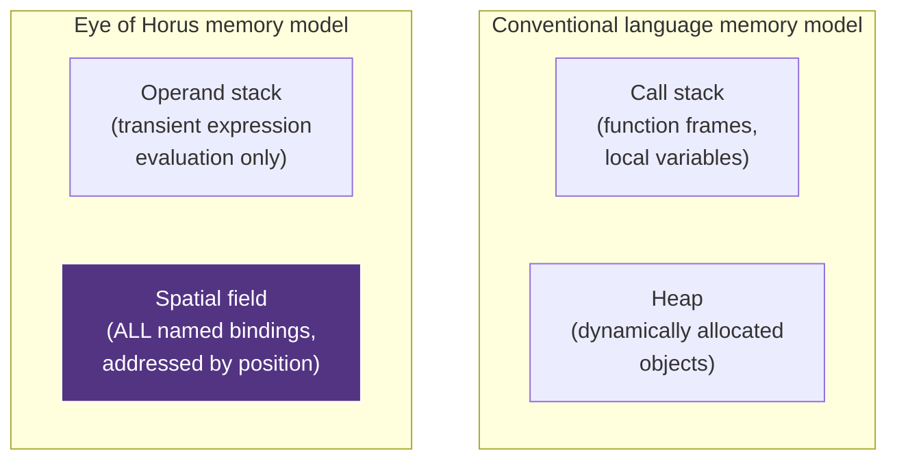

Every `LET` binding, every vertex's associated value, and every value a
`FN` body computes and stores is written to the spatial field, addressed by
the phi-pi lattice cell corresponding to some spatial position — never to
an anonymous stack slot or heap allocation in the conventional sense. This
is the direct, load-bearing consequence of the "space is memory" principle
introduced in [Language Concepts](Language-Concepts) §2.

### 3. The `SpatialField<V>` data structure

```rust
pub struct SpatialField<V> {
    cells: HashMap<PhiPiAddress, V>,
}

impl<V: Clone> SpatialField<V> {
    pub fn write(&mut self, addr: PhiPiAddress, value: V);
    pub fn read(&self, addr: &PhiPiAddress) -> Option<&V>;
    pub fn consume(&mut self, addr: &PhiPiAddress) -> Option<V>;
    pub fn occupied(&self) -> usize;
    pub fn iter(&self) -> impl Iterator<Item = (&PhiPiAddress, &V)>;
}
```

Structurally, `SpatialField<V>` is a thin, generic wrapper around
`HashMap<PhiPiAddress, V>` — there is no custom hashing, probing, or cache
optimization beyond what Rust's standard `HashMap` provides by default.
This is a deliberate "simplest thing that could possibly work" choice for
the current pre-alpha stage: any locality benefit the phi-pi addressing
scheme's mathematical structure might offer (see
[Coordinate System](Coordinate-System) §5) is not currently exploited by a
specialized data structure — it is, as of this writing, an **unverified
hypothesis**, not an implemented optimization. See §7 for the honest
status of this open question.

### 4. How names become addresses

Eye of Horus's `Load`/`Store`/`DeclareVertex` bytecode instructions
(see [Intermediate Representation](Intermediate-Representation) §3) refer
to values *by name* (a `String`, e.g. `"A"` or `"scale"`), while the
spatial field is addressed *by quantized position*
(`PhiPiAddress`). The bridge between these two is the VM's auxiliary
**vertex table**, `HashMap<String, Coord3D>`:

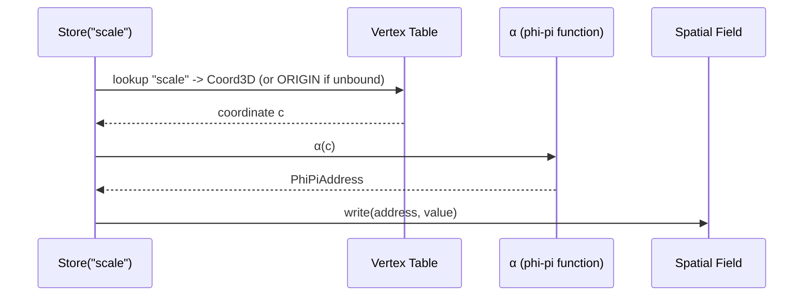

This two-step resolution (name → coordinate → address) is why every
`LET`-bound value is, underneath the language's surface syntax, still
fundamentally addressed spatially — even a value with no obvious
"geometric" meaning (like a scalar `scale` factor) is stored at *some*
lattice cell, determined by whatever coordinate its binding resolves to.

### 5. The unbound-name fallback, and why it matters

**Current behavior:** if `Load`/`Store` is executed for a name not present
in the vertex table, the VM resolves its address as `α(Coord::ORIGIN)`
rather than raising an error.

**Why this is flagged prominently:** this means a `LET` binding whose name
was never associated with an explicit vertex — which, in the current
grammar, is *every* `LET` binding, since `LET` does not itself declare a
position — silently defaults to sharing the origin's storage cell with
every other unbound name. In practice, this means multiple `LET` bindings
in the same program can currently **alias each other's storage** at the
origin address, silently overwriting one another, unless each binding
happens to be associated with a distinct vertex through some other
mechanism.

This is documented as a **known semantic gap**, not a subtle feature — see
[Spatial Execution Model](Spatial-Execution-Model) §7 for the same issue
discussed at the operational-semantics level, and the project roadmap's
Phase 1 item "strict unbound-name faulting" for the planned fix (raising
`EohError::Runtime` for unbound names rather than silently defaulting).
Any program relying on multiple simultaneous `LET` bindings today should
be aware of this aliasing risk until that fix lands.

### 6. Field cell lifecycle

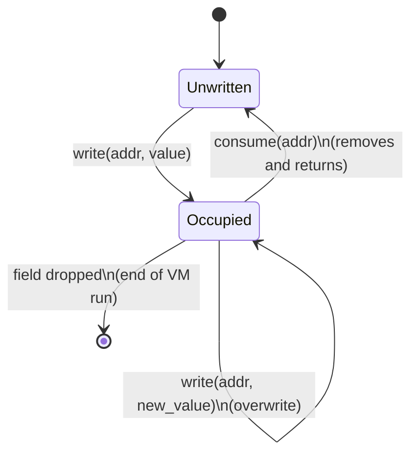

`read()` on an unwritten cell returns `None`, which the VM's `Load`
instruction interprets as `Value::Unit` (see
[Spatial Execution Model](Spatial-Execution-Model) §4's `Load` rule) —
there is no distinction in the current model between "this address was
never written" and "this address was written with an explicit unit/void
value." This is a minor imprecision inherited from using `Option::None`
for both cases, noted here for completeness rather than as an urgent
concern.

### 7. The locality hypothesis: honestly unverified

The phi-pi addressing function (fully specified in
[Coordinate System](Coordinate-System) §2) uses the golden ratio φ as part
of its quantization constant, motivated in part by φ's well-studied
equidistribution properties in one-dimensional quasi-periodic sequences
(its continued-fraction expansion `[1;1,1,1,...]` makes it the "most
irrational" number in a precise sense relevant to those properties).

**The open question:** does this equidistribution property translate into
any measurable benefit — cache locality, reduced hash collision clustering,
or anything else — for `SpatialField<V>`'s actual storage and lookup
performance, on realistic Eye of Horus programs? **As of this writing, this
has not been benchmarked.** The choice of φ/π as the quantization constant
is currently justified by mathematical elegance and thematic consistency
with the project's broader golden-ratio motifs (see
[RFC 0001](https://github.com/Ciprian-LocalPulse/Eye-of-Horus/blob/main/rfcs/0001-phi-pi-addressing.md)),
not by a proven or even measured performance advantage. See
[Performance](Performance) §6 for the benchmark this claim awaits, and
[FAQ](FAQ) for how this question is answered when asked directly.

### 8. Best Practices

- **Do not assume `LET` bindings are isolated from each other** until
  §5's unbound-name fallback issue is resolved — if you need genuinely
  independent storage for multiple values in the current implementation,
  associate each with a distinct, explicitly declared vertex.
- **Treat `PhiPiAddress` equality, not `Coord3D` equality, as the
  relevant notion of "same storage location."** Two coordinates that are
  close but not identical may quantize to the same address (by design —
  see [Coordinate System](Coordinate-System) §4) or to different adjacent
  addresses, depending on which side of a lattice-cell boundary they fall.
- **Do not rely on any assumed locality benefit from the phi-pi scheme**
  in performance-sensitive code until §7's benchmark exists — write code
  that would be correct and reasonably efficient under a naive
  addressing scheme too.

### 9. Implementation Notes

- `SpatialField<V>` requires `V: Clone` on its impl block, even though
  most of its methods do not use cloning directly — this is a
  forward-looking bound anticipated for planned copy-on-snapshot debugging
  tooling (allowing a field's state to be captured mid-execution without
  moving it), not currently exercised by any implemented feature.
- The VM's vertex table and spatial field are two separate `HashMap`
  instances rather than a single combined structure — this separation
  exists because the vertex table's key type (`String`, a name) and the
  spatial field's key type (`PhiPiAddress`, a quantized position) serve
  genuinely different lookup purposes, and combining them would obscure
  the name-to-address resolution step described in §4.

### 10. Future Improvements

- Implement strict unbound-name faulting (§5), replacing the current
  origin-fallback default — tracked as Roadmap Phase 1, pending an RFC on
  the precise error-reporting semantics desired.
- Conduct the locality benchmark described in §7, comparing
  `SpatialField<V>`'s phi-pi-addressed `HashMap` against a naive
  coordinate-tuple-keyed baseline on representative program workloads —
  see [Performance](Performance) §6.
- Consider a specialized spatial-indexing backend (e.g., an octree or
  k-d tree) as an alternative `SpatialField` implementation if the
  benchmark in §7 demonstrates a need — explicitly deferred until such
  evidence exists, per [Design Principles](Design-Principles) §4's stance
  against premature optimization.

---

## Chapter 12 — Coordinate System

### 1. Purpose of this page

This page is the authoritative reference for `Coord3D`, the phi-pi
addressing function `α`, and the `PhiPiAddress` lattice type — the
mathematical foundation underneath [Memory Model](Memory-Model)'s storage
scheme. Where that page explains *how the spatial field uses* addresses,
this page explains *what an address is* and the precise mathematics of how
one is computed from a coordinate.

### 2. `Coord3D`: validated continuous coordinates

```rust
pub struct Coord3D { pub x: f64, pub y: f64, pub z: f64 }

impl Coord3D {
    pub fn new(x: f64, y: f64, z: f64) -> EohResult<Self> {
        // rejects NaN, infinite, or |component| > MAX_COORD
    }
}
```

`Coord3D` is never constructed except through `Coord3D::new`, which
validates every component against two rules:

| Rule | Rejected values | Rationale |
|---|---|---|
| Finiteness | `NaN`, `+Inf`, `-Inf` | A non-finite coordinate cannot be meaningfully quantized or measured against — every downstream geometric operation (distance, midpoint, addressing) assumes finiteness |
| Magnitude bound | `\|component\| > MAX_COORD` (1,000,000.0) | Guards against unbounded coordinate values that could cause numeric instability or unreasonable memory/address-space usage in pathological programs |

This is a "parse, don't validate" discipline: because `Coord3D`'s fields
are only ever set via the validating constructor (there is no `pub`
struct-literal construction path exposed outside the crate in idiomatic
use), an invalid `Coord3D` is **unrepresentable** anywhere downstream of
construction — the type system itself, combined with constructor
discipline, rules out an entire class of runtime bugs (NaN propagation
through geometric calculations) that a validate-after-construction
approach would only catch reactively.

### 3. Explicit non-claims about the phi-pi model

Repeated here, in the specific technical form this page's audience needs,
from the summary given in [Memory Model](Memory-Model) §1:

- **No confidentiality.** Given the formula in §4 below (which is fully
  public, printed in this wiki and in the source code), any observer can
  compute the address for any coordinate, or enumerate coordinates mapping
  to a given address, trivially.
- **No collision resistance suitable for security purposes.** Collisions
  (multiple coordinates mapping to the same address) are not just possible
  but *intentional and frequent by design* — that is the entire point of
  quantization (§5). A security-relevant hash function needs the opposite
  property.
- **No relationship to established cryptographic primitives.** The
  function does not derive from, resemble, or provide guarantees
  comparable to any hash function used in cryptographic contexts (e.g.
  SHA-family, BLAKE-family). It is a spatial quantization function, full
  stop — comparable in kind to the bucketing function of a spatial hash
  grid in a physics engine or the cell-indexing scheme of a
  computer-graphics acceleration structure.

### 4. The addressing function, precisely

```
q = φ / π  ≈ 0.515036...

α(x, y, z) = ( round(x / q), round(y / q), round(z / q) )
```

where `φ = (1+√5)/2 ≈ 1.618033988749895` (the golden ratio) and
`π ≈ 3.14159265358979` (the usual circle constant), both to full `f64`
precision as defined in `eoh_core::constants`.

```rust
pub struct PhiPiAddress { pub ix: i64, pub iy: i64, pub iz: i64 }

impl PhiPiAddress {
    pub fn from_coord(c: &Coord3D) -> Self { /* implements α above */ }
    pub fn to_coord(&self) -> Coord3D { /* recovers lattice-cell center */ }
}
```

`PhiPiAddress` stores three `i64` lattice indices — an exact integer
representation, chosen specifically so that address equality is exact
integer comparison (`derive(PartialEq, Eq, Hash)`), avoiding the
floating-point-equality pitfalls that would arise from using `Coord3D`
itself as a hash-map key (see [Memory Model](Memory-Model) §3 for how this
is used).

### 5. Quantization is lossy, by design

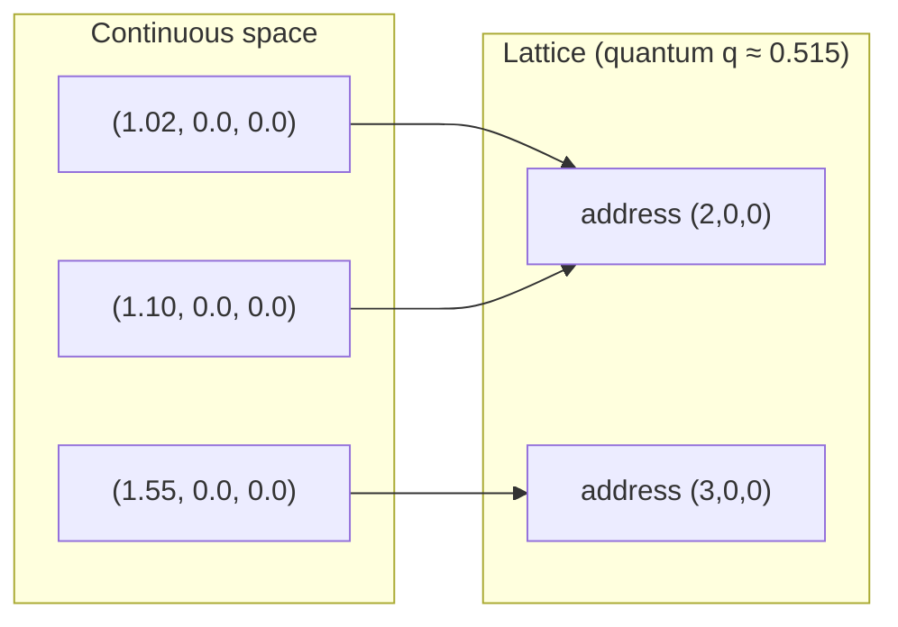

Because `α` rounds to the nearest multiple of `q`, multiple distinct
coordinates map to the same address whenever they fall within the same
lattice cell (a cube of side `q` centered on the lattice point, to a first
approximation — strictly, `round()` per-axis produces an axis-aligned cube
region, not a rounded/spherical one). This is **intentional**: it is what
makes the spatial field usable as a finite-cardinality storage key space
at all, given that `ℝ³` itself is uncountable. Two nearby vertices
sharing a field cell is a feature (spatial proximity implying storage
proximity) precisely as often as it is a footgun (unexpected aliasing
between vertices the programmer intended to keep distinct) — see
[Memory Model](Memory-Model) §5 for a concrete case where this lossiness
interacts badly with the current unbound-name fallback behavior.

#### 5.1 Round-trip bound

`PhiPiAddress::to_coord()` recovers the **lattice cell's center**, not the
original coordinate. The maximum possible displacement between an original
coordinate and its address's recovered center is half the lattice cell's
space diagonal:

```
max round-trip error = (q · √3) / 2 ≈ 0.446
```

This bound is directly exercised by the unit test
`phi_pi_roundtrip_within_one_quantum` in `eoh-core::coordinates`, which
asserts the round-trip distance stays below `q` (a looser, easily-verified
bound implying the tighter one above).

### 6. Why φ/π specifically — and what remains unproven

As detailed in [RFC 0001](https://github.com/Ciprian-LocalPulse/Eye-of-Horus/blob/main/rfcs/0001-phi-pi-addressing.md),
the choice of `q = φ/π` rather than, say, `q = 0.5` or `q = 1.0`, rests on
two stated rationales:

1. **Thematic consistency** with the project's broader golden-ratio motifs
   (e.g. `eoh_stdlib::math::fibonacci_sphere`, `golden_angle` — see
   [Standard Library](Standard-Library) §4).
2. **A speculative locality hypothesis**: φ's continued-fraction expansion
   `[1;1,1,1,...]` gives it well-studied equidistribution properties in
   *one-dimensional* quasi-periodic sequences (e.g. the Fibonacci word,
   the three-distance theorem for irrational rotations). Whether this
   translates into any measurable three-dimensional storage-locality
   benefit for `SpatialField<V>` is **explicitly unverified** — see
   [Memory Model](Memory-Model) §7 and [Performance](Performance) §6 for
   the benchmark this hypothesis awaits.

No claim stronger than "mathematically elegant and thematically motivated,
with an unverified but plausible locality hypothesis" should be attributed
to this design choice.

### 7. Coordinate operations

| Operation | Signature | Notes |
|---|---|---|
| `distance` | `Coord3D::distance(&self, other: &Coord3D) -> f64` | Standard Euclidean distance; used directly by the pulse activation predicate ([Pulse Engine](Pulse-Engine) §3) |
| `midpoint` | `Coord3D::midpoint(&self, other: &Coord3D) -> Coord3D` | Arithmetic mean of two coordinates |
| `ORIGIN` | `Coord3D::ORIGIN: Coord3D` (associated constant) | The point `(0,0,0)`; used as the unbound-name fallback (see [Memory Model](Memory-Model) §5) |

`Coord3D` also derives `Hash` via a manual implementation wrapping each
component in `ordered_float::OrderedFloat` — necessary because `f64` does
not implement `Hash`/`Eq` directly (due to `NaN`'s non-reflexive equality),
and `Coord3D::new`'s validation already rules out `NaN` by construction,
making the `OrderedFloat` wrapping safe and total in practice.

### 8. Best Practices

- **Never construct `Coord3D` via a struct literal in new code** — always
  go through `Coord3D::new` and propagate its `EohResult`, even in test
  code, to keep the "parse, don't validate" invariant from §2 intact
  throughout the codebase.
- **Reason about address collisions explicitly when writing tests that
  involve multiple nearby vertices** — if two vertices' positions round to
  the same `PhiPiAddress`, they will share a spatial-field cell (§5),
  which may or may not be the test's intent.
- **Do not use `PhiPiAddress::to_coord()` expecting to recover an original
  input coordinate exactly** — it recovers the lattice-cell center, per
  §5.1's round-trip bound, not the original point.

### 9. Implementation Notes

- `MAX_COORD` (1,000,000.0) is defined in `eoh_core::constants` and
  enforced uniformly in `Coord3D::new` — there is currently no mechanism
  to configure this bound per-program; it is a fixed toolchain constant.
- The `q = φ/π` quantum is computed once as a compile-time-evaluable
  expression each time `from_coord`/`to_coord` is called, rather than
  cached as a `const` — this is a negligible performance concern at
  current usage scale (see [Performance](Performance)) but is noted as a
  micro-optimization candidate if profiling ever suggests otherwise.

### 10. Future Improvements

- Conduct the empirical locality study referenced in §6 and
  [Memory Model](Memory-Model) §7 to either substantiate or retire the
  speculative locality hypothesis behind the φ/π quantum choice.
- Investigate configurable quantum granularity (e.g., a hypothetical
  `PRECISION` module directive) as a language feature, allowing programs
  with different spatial-scale requirements to tune addressing resolution
  — noted as an open design question in RFC 0001, not yet drafted as its
  own RFC.
- Consider exposing `Coord3D`'s validation bounds (`MAX_COORD`) as a
  configurable `VmConfig`/`CompileOptions` parameter rather than a fixed
  constant, if use cases requiring larger coordinate ranges emerge.

---

## Chapter 13 — Type System

### 1. Purpose of this page, and a direct statement of scope

This page documents what Eye of Horus's type system currently checks,
what it does not check, and the open theoretical question — Turing
completeness of the executable core — that the language's future type and
control-flow design bears directly on. Readers expecting a
Hindley–Milner-style account of let-polymorphism, unification, and
principal types will not find one here, because the current implementation
does not have one yet. This page describes the real, current, and
honestly smaller system, and clearly separates it from the aspirational
design discussed in the roadmap.

### 2. What "type checking" currently means in Eye of Horus

`eoh_compiler::typeck::check(module: &Module) -> EohResult<()>`
(introduced in [Compiler Architecture](Compiler-Architecture) §4) performs
**structural validation**, not type inference or unification. Concretely,
it checks exactly two families of constraints:

| Check | Enforced by | Failure |
|---|---|---|
| Every `PULSE_HIGGS` origin names a previously declared `VERTEX` | `typeck::check` | `EohError::Type` |
| Every `SHAPE_*` declaration has the vertex count its kind requires | `Shape::validate_vertex_count` (`eoh-core`) | `EohError::Geometry` |

There is currently **no** checking of:

- Expression type compatibility (e.g., whether `1.0 + "hello"` is
  rejected) — the lowering pass (§6) will attempt to lower such an
  expression and either produce nonsensical bytecode or fail at the
  MIR-lowering stage with `EohError::NotImplemented`, not at a dedicated
  type-checking stage with a clear type-mismatch diagnostic.
- Function parameter/argument type matching.
- Return-type conformance between a `FN`'s declared return type and its
  body's actual value.

This is stated plainly because it is easy, from the presence of type
*annotations* in the grammar (`LET x: Float = ...`, `FN f(a: Float) ->
Float`), to assume a fuller type system exists than actually does. The
annotations are parsed and stored in the AST (see
[Abstract Spatial Syntax Tree](Abstract-Spatial-Syntax-Tree) §4's
`TypeAnnotation`), but are **not yet consulted** by any checking pass.

### 3. Value domain

The types that do exist at the value level (as opposed to the
annotation/syntax level) are the five `Value` variants used by the VM (see
[Spatial Execution Model](Spatial-Execution-Model) §2):

```
Value ::= Float(f64) | Bool(bool) | Str(String) | Coord(Coord3D) | Unit
```

Plus two implicit "declarative" types that exist only at the AST/type-check
level, not as runtime `Value`s: **Vertex** (the implicit type of a
`VERTEX` declaration) and **Shape** (the implicit type of a `SHAPE_*`
declaration). Neither of these currently participates in any expression
context — you cannot, for instance, write an expression that evaluates to
a `Shape` and pass it as a function argument. They exist purely as
declaration-level concepts.

### 4. Coordinate domain validation as a de facto type constraint

Although not framed as "type checking" in the codebase, `Coord3D::new`'s
finiteness and magnitude validation (see
[Coordinate System](Coordinate-System) §2) functions as a de facto
refinement type: every `Coord3D` value in the system is guaranteed, by
construction, to satisfy `is_finite() && |component| <= MAX_COORD`. This
is arguably the single strongest type-level guarantee the current system
provides — stronger, in a formal sense, than the structural checks in §2,
because it is enforced by the type's only constructor rather than by a
separate, skippable checking pass.

### 5. Shape vertex-count constraints as dependent-count typing

The vertex-count rules in §2's second row (exactly 4 for `SHAPE_TETRA`,
exactly 12 for `SHAPE_ICOSA`, at least 3 for `SHAPE_POLY`) are, informally,
a lightweight form of dependent typing — the validity of a `Shape` value
depends on a runtime-computed property (the length of its `vertices`
vector) rather than being fully determined by its syntactic type alone.
The current implementation checks this dynamically (at type-check time,
which for this project's pipeline occurs before code generation, so it is
still a compile-time check in the relevant sense — see
[Compiler Architecture](Compiler-Architecture) §4), rather than through any
static, arity-indexed type-level mechanism (e.g., const generics encoding
vertex count in the type itself). This is an intentional simplicity choice
for the current stage, not a limitation the project is unaware of.

### 6. Control flow: parses, but is not (yet) executable — and why this matters for Turing-completeness

This is the most consequential open item on this page.

**Status:** `IF`/`ELSE`, `LOOP`, `BREAK`, and `CONTINUE` are fully present
in the grammar and parse into well-formed AST nodes
(`ExprKind::If`, `StmtKind::Loop`, `StmtKind::Break`, `StmtKind::Continue`
— see [Abstract Spatial Syntax Tree](Abstract-Spatial-Syntax-Tree) §5).
**However, `eoh-compiler::lower` does not yet lower these constructs into
executable bytecode** — the lowering pass's expression-lowering function
returns `EohError::NotImplemented("expression form not yet lowered")` for
`ExprKind::If`, and loop-related statement kinds are currently silent
no-ops in the statement-lowering function, not translated into the
`Jump`/`JumpIf` bytecode instructions that exist and are implemented at
the VM level (see [Spatial Execution Model](Spatial-Execution-Model) §4).

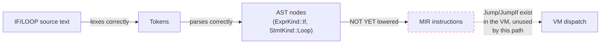

**Direct consequence for the Turing-completeness question:** because the
executable subset of the language currently has no conditional branching
or iteration reachable from source code, the current executable core is
closer in expressive power to a straight-line arithmetic and declaration
DSL than to a general-purpose language. **This project makes no claim,
in either direction, about Turing-completeness of the current executable
core** — the honest answer is that the question does not yet have a
well-formed executable subject to evaluate, since the constructs that
would typically be load-bearing for such an analysis (unbounded iteration,
conditional branching) are not yet wired into execution. Once control flow
is lowered (Roadmap Phase 1), establishing (or refuting) Turing-completeness
becomes a well-posed question the project intends to investigate formally
rather than assume. See [FAQ](FAQ) for how this is communicated to
newcomers who ask directly.

### 7. Comparison: current system vs. a conventional statically-typed language

| Property | Conventional statically-typed language (e.g. Rust, ML) | Eye of Horus (current) |
|---|---|---|
| Expression type checking | Full inference/unification | Not implemented |
| Function signature checking | Enforced at call sites | Not implemented |
| Refinement/validated types | Sometimes, via smart constructors | Yes, for `Coord3D` (§4) |
| Dependent/arity-indexed types | Rare, usually via advanced type-level features | Informal, dynamic (§5) |
| Soundness proof | Common for mature languages | Not attempted; premature given §2's scope |
| Turing-completeness | Established, well-known | Open question, not yet well-posed (§6) |

### 8. Best Practices

- **Do not write Eye of Horus code assuming expression-level type errors
  will be caught before execution.** Passing a `Str` where a `Float` is
  expected, for instance, will not currently be rejected by the type
  checker — it will surface as a runtime failure or unexpected VM
  behavior. Treat this as a currently-real constraint on what "type-safe"
  means for this language today.
- **Treat `LET x: Float = ...` type annotations as documentation, not
  enforcement**, until §2's checking is extended to consult them — writing
  an annotation that does not match the actual value's runtime type will
  not currently be caught.
- **Do not attempt to use `IF`/`LOOP` for anything beyond exploring the
  parser/AST** — since they are not lowered to executable bytecode (§6),
  any program relying on them for actual control flow will silently
  produce different behavior than the source text suggests (the branches/
  loop bodies are effectively skipped, not executed conditionally).

### 9. Implementation Notes

- The precise `EohError::NotImplemented` message for unlowerable
  expression forms is a single generic string
  ("expression form not yet lowered"), not differentiated per construct —
  a contributor debugging a lowering failure should cross-reference the
  AST (`eoh ast`) to determine which specific construct triggered it,
  since the error message alone does not disambiguate.
- `resolver::resolve` (§3 of [Compiler Architecture](Compiler-Architecture))
  and `typeck::check` are separate passes specifically so that full
  reference resolution and full type inference can be developed
  independently in future phases without needing to be
  simultaneously overhauled.

### 10. Future Improvements

- Lower `IF`/`ELSE` into `JumpIf`-based branching MIR, and `LOOP`/`BREAK`/
  `CONTINUE` into `Jump`-based loop MIR — Roadmap Phase 1, the single
  highest-priority item for unblocking the Turing-completeness
  investigation in §6.
- Extend `typeck::check` to perform actual expression-level type checking
  against `TypeAnnotation`s, moving toward genuine static typing rather
  than the current purely structural checks — Roadmap Phase 2.
- Once control flow lands, formally investigate (and publish, whichever
  direction the answer goes) whether the resulting executable core is
  Turing-complete, partially recursive, or strictly weaker — tracked as an
  explicit open research deliverable, not an assumed conclusion.
- Consider whether `Vertex` and `Shape` should become genuine
  expression-level types (participating in function signatures, being
  passed as values) as part of the Phase 2 type-system overhaul.

---

## Chapter 14 — Standard Library

### 1. Purpose of this page

This page documents `eoh-stdlib`, the crate providing built-in geometric,
mathematical, and spatial-query functions. It also states plainly how
these functions relate to the *language* — an important distinction
covered in §2, since the current standard library is a **Rust-level
utility crate**, not yet wired into the `.eoh` language as callable
built-in functions from source programs.

### 2. Current integration status: library-level, not language-level

`eoh-stdlib` is fully implemented and unit-tested at the Rust level — every
function described below has passing tests. However, **no `.eoh` source
program can currently call these functions by name** (e.g., there is no
working `centroid(A, B, C)` call resolvable from Eye of Horus source
text). The VM's `Call` instruction (see
[Intermediate Representation](Intermediate-Representation) §3) currently
recognizes exactly one built-in name, `"print"` (see
[Spatial Execution Model](Spatial-Execution-Model) §4's `Call` handler) —
`eoh-stdlib`'s functions are not yet registered into that dispatch table.

This means `eoh-stdlib` today serves two purposes: (a) it is directly
usable by Rust code that embeds or extends the toolchain (e.g., a future
visualization tool wanting to compute a shape's centroid), and (b) it is
the designed *target* for the eventual language-level built-in function
registry once that wiring is implemented. Both purposes are legitimate and
intentional; neither should be confused with "these functions are
currently callable from `.eoh` programs," which they are not.

### 3. Module organization

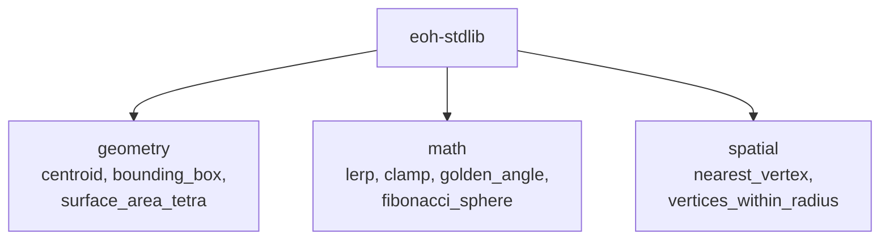

### 4. `geometry` module

| Function | Signature | Behavior |
|---|---|---|
| `centroid` | `fn(&[Coord3D]) -> Option<Coord3D>` | Arithmetic mean position; `None` for an empty slice |
| `bounding_box` | `fn(&[Coord3D]) -> Option<(Coord3D, Coord3D)>` | Axis-aligned min/max corners; `None` for an empty slice |
| `surface_area_tetra` | `fn(&Coord3D, &Coord3D, &Coord3D, &Coord3D) -> f64` | Sum of four triangular face areas via the cross-product formula |

`surface_area_tetra`'s implementation computes each face's area as half
the magnitude of the cross product of two edge vectors — a standard
computational-geometry technique, implemented directly rather than via an
external geometry crate, consistent with the project's minimal-dependency
philosophy for `eoh-core`-adjacent code (see
[Design Principles](Design-Principles) §2).

### 5. `math` module

| Function | Signature | Behavior |
|---|---|---|
| `lerp` | `fn(f64, f64, f64) -> f64` | Linear interpolation: `a + t*(b-a)` |
| `clamp` | `fn(f64, f64, f64) -> f64` | Clamps a value to `[lo, hi]` |
| `golden_angle` | `fn() -> f64` | Returns `2π(2-φ)` radians — the angle used for optimal spiral point distributions |
| `fibonacci_sphere` | `fn(u32, u32) -> (f64, f64, f64)` | Maps index `n` of `total` points to a unit-sphere position via the Fibonacci lattice construction |

`fibonacci_sphere` is directly unit-tested for the invariant that its
output always lies on the unit sphere (`x²+y²+z² = 1`, within floating-point
tolerance) — this is the same golden-angle spiral construction commonly
used in computer graphics for even point distribution on a sphere (e.g.,
sunflower-seed-pattern sampling), included here as a reusable primitive
for any future Eye of Horus program or tool needing evenly distributed
sphere points (such as generating `SHAPE_ICOSA`-adjacent test geometry).

### 6. `spatial` module

| Function | Signature | Behavior |
|---|---|---|
| `nearest_vertex` | `fn(&Coord3D, &[Coord3D]) -> Option<&Coord3D>` | Linear-scan nearest-neighbor search |
| `vertices_within_radius` | `fn(&Coord3D, &[Coord3D], f64) -> Vec<&Coord3D>` | Linear-scan radius query |

Both functions are implemented as straightforward `O(n)` linear scans over
a candidate slice — there is no spatial-indexing acceleration structure
(k-d tree, octree, or similar) backing these queries. This is an
intentional simplicity choice for the current scale of typical Eye of
Horus programs; see [Performance](Performance) §5 for when this would
become a genuine bottleneck and what the natural upgrade path looks like.

### 7. Relationship to `eoh-core`'s own geometric methods

A natural question: why do `Coord3D::distance` and `Coord3D::midpoint`
live in `eoh-core` (see [Coordinate System](Coordinate-System) §7) while
`centroid` and `bounding_box` live in `eoh-stdlib`? The dividing line is
deliberate:

> **`eoh-core` contains only operations needed by the core language
> pipeline itself** (the VM's pulse-activation distance check needs
> `distance`; nothing in the compiler/VM pipeline needs `centroid`).
> **`eoh-stdlib` contains everything else** — useful geometric and
> mathematical operations that a program or tool *might* want, but that
> the language's own execution semantics do not depend on.

This mirrors the layering rationale in
[Project Architecture](Project-Architecture) §2.1 (independent
testability) and keeps `eoh-core`'s dependency-free status (§3 of that
page) intact — `eoh-stdlib` is free to grow richer geometric utilities
without ever risking a dependency cycle back into the pipeline's
foundational crate.

### 8. Best Practices

- **Do not write `.eoh` example programs assuming stdlib functions are
  callable by name** (§2) — any example intending to demonstrate
  `centroid` or similar functionality should currently do so at the Rust
  level (e.g., in a test or embedding scenario), not as `.eoh` source text,
  until the language-level registry (§9) is implemented.
- **When adding a new stdlib function, ask whether it belongs in
  `eoh-core` or `eoh-stdlib`** using the dividing line in §7 — "does the
  VM's own execution semantics need this" is the deciding question, not
  "is this geometry-related."
- **Keep stdlib functions pure and allocation-light** where practical
  (returning references or `Option`/`Vec` of references rather than owned
  clones, as `nearest_vertex` and `vertices_within_radius` already do) —
  this keeps the library usable in performance-sensitive embedding
  contexts even before the language-level call path exists.

### 9. Implementation Notes

- `eoh-stdlib` depends on both `eoh-core` and `eoh-vm` (see
  [Project Architecture](Project-Architecture) §3's dependency diagram) —
  the `eoh-vm` dependency exists in anticipation of the eventual built-in
  function registry needing to interoperate with `Vm`'s `Value` type and
  `Call` dispatch mechanism, even though that wiring does not exist yet.
- All three modules (`geometry`, `math`, `spatial`) are re-exported at the
  crate root (`pub use geometry::{...}`, etc.) for ergonomic access from
  Rust consumers — a `.eoh`-level built-in registry, once implemented,
  would most naturally consume these same re-exported paths.

### 10. Future Improvements

- Implement a built-in function registry connecting `.eoh` source-level
  `Call` expressions to `eoh-stdlib` functions by name — this is the
  single most impactful pending item on this page, since it is what would
  make the entire crate actually usable from the language rather than only
  from Rust. Tracked informally; not yet a numbered roadmap phase item, and
  worth an RFC given it touches the `Call` instruction's dispatch
  semantics (see [Intermediate Representation](Intermediate-Representation) §3).
- Add spatial-indexing acceleration (k-d tree or octree) as an alternative
  backend for `nearest_vertex`/`vertices_within_radius` once profiling
  ([Performance](Performance)) demonstrates the current linear scan is a
  bottleneck for realistic program sizes.
- Expand the `math` module with additional geometric-distribution
  primitives (e.g., Poisson-disk sampling) if future shape-generation use
  cases demand them — noted as a plausible extension, not a committed one.

---

## Chapter 15 — Repository Structure

### 1. Purpose of this page

This page is a directory-by-directory map of the repository, intended as
the first stop for anyone orienting themselves in the codebase — "where
do I make this change" answered concretely, cross-referenced to the wiki
pages that go deeper on each area's internal design.

### 2. Top-level layout

```text
Eye-of-Horus/
├── crates/                 Rust workspace -- the reference implementation
├── spec/                   Formal grammar (EBNF) + operational semantics
├── whitepaper/              Academic research paper
├── rfcs/                    Design-decision records (RFC process)
├── book/                    Long-form tutorial ("The Eye of Horus Book")
├── examples/                Runnable .eoh programs
├── editors/vscode/          Syntax-highlighting extension
├── website/                 Documentation site scaffold
├── .github/                 Issue templates, CI workflow
├── README.md, VISION.md, MANIFESTO.md, ...   Root-level narrative docs
└── Cargo.toml               Workspace manifest
```

### 3. `crates/` — the nine-crate workspace

Full architectural treatment is in
[Project Architecture](Project-Architecture); this table is a quick-lookup
index:

| Crate | One-line purpose | Primary source files to know |
|---|---|---|
| `eoh-core` | Geometry primitives, coordinates, pulses, errors | `coordinates.rs`, `pulse.rs`, `field.rs`, `error.rs` |
| `eoh-lexer` | Tokenizer | `lexer.rs`, `token.rs` |
| `eoh-ast` | AST node definitions | `lib.rs` (single-file crate) |
| `eoh-parser` | Recursive-descent parser | `parser.rs` |
| `eoh-compiler` | Resolver, type-checker, MIR, optimizer, emitter | `resolver.rs`, `typeck.rs`, `lower.rs`, `optimise.rs`, `emit.rs`, `bytecode.rs` |
| `eoh-vm` | Spatial virtual machine | `vm.rs` |
| `eoh-stdlib` | Built-in geometry/math/spatial functions | `geometry.rs`, `math.rs`, `spatial.rs` |
| `eoh-lsp` | Language Server Protocol (scaffolded) | `server.rs`, `capabilities.rs`, `diagnostics.rs`, `handlers.rs` |
| `eoh-cli` | The `eoh` command-line tool | `main.rs` |

### 4. `spec/` — formal specification

| File | Contents |
|---|---|
| `LANGUAGE_SPEC.md` | Full EBNF grammar, static semantics summary, bytecode instruction reference |
| `SEMANTICS.md` | Small-step operational semantics, formally notated |

These are the **authoritative** technical references — this wiki's
[Spatial Execution Model](Spatial-Execution-Model) and other technical
pages are elaborations and cross-referenced explanations of the content in
`spec/`, not independent sources of truth. Where a wiki page and `spec/`
disagree, `spec/` wins, and the wiki page should be corrected.

### 5. `eoh-lsp` in detail: what "scaffolded" means precisely

Because this crate's status is easy to misjudge from the outside, it is
worth detailing exactly what exists:

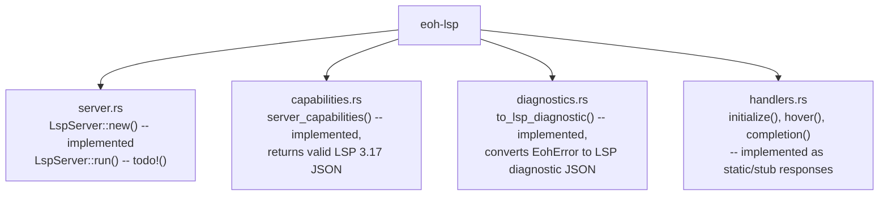

Every module in `eoh-lsp` compiles, and `capabilities`, `diagnostics`, and
the static portions of `handlers` are directly unit-testable and produce
correct LSP-shaped JSON today. What is genuinely missing is the **JSON-RPC
transport and event loop** — reading `Content-Length`-framed messages from
stdin, dispatching them to the appropriate handler, and writing responses
back to stdout. `LspServer::run()` is a `todo!()` precisely at this
integration point. This is a well-scoped, well-understood remaining task
(Roadmap Phase 3), not an open design question.

### 6. `editors/vscode/` in detail

Contains a minimal but complete TextMate-grammar-based syntax-highlighting
extension: `package.json` (extension manifest), `language-configuration.json`
(bracket matching, comment syntax), and
`syntaxes/eoh.tmLanguage.json` (the actual highlighting rules, covering
keywords, shape kinds, strings, numbers, booleans, and operators). This
extension is genuinely usable today for syntax highlighting via manual
installation (see the extension's own `README.md`), independent of the
LSP work in §5 — highlighting via TextMate grammar and language-server
features (hover, completion, diagnostics) are entirely separate mechanisms
in VS Code's extension model, so one being complete does not depend on the
other.

### 7. `examples/` — the runnable program corpus

Every `.eoh` file in this directory is verified, via CI (see §9), to pass
`eoh check` — this is a hard guarantee, not an aspiration: a broken example
program is treated as a build failure. As of this writing the corpus
includes a tetrahedron example (exercising `VERTEX`, `EDGE`, `SHAPE_TETRA`,
`PULSE_HIGGS`), a cube example (exercising `LET` and named shape
parameters), and a functions example (exercising `FN` declarations,
parsed but not yet executable per [Type System](Type-System) §6's control
flow caveat — note that this specific example does not use control flow,
only straight-line function bodies).

### 8. `book/` and `whitepaper/`

| Directory | Audience | Style |
|---|---|---|
| `book/` | Newcomers, tutorial-style learning | Narrative, example-driven, mirrors [Getting Started](Getting-Started) and [Language Concepts](Language-Concepts) but in extended long-form chapters |
| `whitepaper/` | Researchers, academic audience | Formal paper structure (abstract, related work, formal claims, open problems, reproducibility section) |

This wiki sits conceptually **between** these two: more systematic and
complete than the book's narrative chapters, more implementation-grounded
and cross-linked than the whitepaper's academic prose. All three should
stay consistent on factual claims (implementation status, formal
properties) even though they differ in style and audience.

### 9. `.github/` — automation and community process

| File | Purpose |
|---|---|
| `workflows/ci.yml` | Builds the workspace, runs the full test suite, checks formatting/lints (non-blocking initially), and runs `eoh check` against every file in `examples/` |
| `ISSUE_TEMPLATE/bug_report.md` | Structured bug-report template, requesting a minimal reproduction |
| `ISSUE_TEMPLATE/feature_request.md` | Structured feature-request template, pointing substantial design changes toward the RFC process |
| `ISSUE_TEMPLATE/config.yml` | Routes security reports away from public issues, toward private advisory reporting |

### 10. Root-level narrative documents, and how they relate to this wiki

| Document | Relationship to this wiki |
|---|---|
| `README.md` | Entry point; summarizes and links to everything, including this wiki |
| `VISION.md` | The research question and long-term aspiration — see [Home](Home) §2 for the wiki's restatement |
| `MANIFESTO.md` | Project values — informs the tone and honesty discipline followed throughout this wiki |
| `ROADMAP.md` | Phased plan — every "Future Improvements" section in this wiki cross-references relevant roadmap phases |
| `CONTRIBUTING.md` | Contributor workflow — elaborated at length in [Contributing](Contributing) |
| `rfcs/` | Individual design-decision records — referenced throughout this wiki wherever a design choice merits deeper justification (e.g. [Coordinate System](Coordinate-System) §6 references RFC 0001) |

### 11. Best Practices

- **When you can't find where a behavior lives, start from this page's
  crate table (§3), not from grepping blindly** — the crate-to-file
  mapping here is kept current and is the fastest orientation path for a
  newcomer.
- **Treat `spec/` as ground truth over any wiki page** (§4) when the two
  seem to disagree — and file a documentation-bug issue against the wiki
  page in that case.
- **Verify example-program claims (§7) by actually running `eoh check`**
  against the file in question rather than trusting a stale description —
  CI enforces this automatically, but local verification during
  development is faster feedback.

### 12. Implementation Notes

- The repository does not currently use a monorepo tool beyond Cargo's
  native workspace support (§3) — no Bazel, no Nx, no custom build
  orchestration. This is appropriate given the current single-language
  (Rust), single-toolchain scope; revisit only if a genuinely
  polyglot build requirement emerges (e.g., a non-Rust website build
  pipeline needing coordination with the Rust workspace).
- `website/` is a scaffold directory for a future documentation site,
  distinct from this wiki — its relationship to the wiki (mirror,
  supplement, or eventual replacement) has not yet been decided via RFC.

### 13. Future Improvements

- Wire the `eoh-lsp` event loop (§5), the single most-requested missing
  piece of tooling per informal roadmap prioritization.
- Package the VS Code extension (§6) for Marketplace publication, rather
  than requiring manual installation.
- Decide, via RFC, the long-term relationship between `website/` and this
  wiki — whether the website should auto-generate from wiki content, link
  to it, or serve an entirely distinct purpose (e.g., a public-facing
  landing page separate from technical reference material).
- Add a CI check that verifies every wiki cross-link (the `[Page Name](Page-Name)`
  links used throughout) resolves to an actual page file, preventing link
  rot as pages are renamed or reorganized.

---

## Chapter 16 — Design Principles

### 1. Purpose of this page

This page states the concrete engineering principles that govern day-to-day
decisions in this codebase — the operational counterpart to `VISION.md`'s
research framing and `MANIFESTO.md`'s values. Where those documents explain
*why* the project exists and what it cares about, this page explains *how*
that translates into specific, checkable engineering discipline. Every
principle below is stated with its enforcement mechanism, not left as
aspiration.

### 2. Principle: documentation status is never ambiguous

Every description of a feature, anywhere in this repository — this wiki,
`spec/`, the whitepaper, code comments — uses one of exactly four status
words, and only these four:

| Status word | Meaning | Enforcement |
|---|---|---|
| **Implemented** | Covered by passing automated tests in the reference implementation | Verifiable via `cargo test --workspace` and locating the relevant test |
| **Partial** | Some but not all of the described behavior is implemented and tested | The description explicitly states what subset works |
| **Planned** | Designed (possibly in an RFC) but not yet implemented | No corresponding code exists yet; roadmap phase cited where applicable |
| **Open question** | Genuinely undetermined — the project does not know the answer yet | Explicitly not claimed either way (e.g., Turing-completeness — see [Type System](Type-System) §6) |

This is why every wiki page in this document set includes an
"Implementation Notes" section distinct from "Future Improvements" —
the former describes *how the implemented behavior actually works
internally*, the latter describes *what does not exist yet*. Conflating
these two categories is treated as a documentation defect warranting a
correction, not a stylistic nitpick.

### 3. Principle: no `unsafe` code, anywhere, without exception

Every crate in the workspace declares `#![deny(unsafe_code)]` at the crate
root (see [Project Architecture](Project-Architecture) §2.3). This is not
a preference expressed in a style guide — it is a compiler-enforced hard
constraint. If a genuinely compelling case for `unsafe` ever arises (for
instance, a performance-critical inner loop identified through the
benchmarking process in [Performance](Performance)), the path to
introducing it runs through an RFC (see [Contributing](Contributing) §4),
not a direct pull request — the bar for lifting this constraint anywhere
in the codebase is deliberately high.

### 4. Principle: minimal core before speculative extension

The project's near-term engineering objective (stated in full in
`VISION.md` §3) is to keep the smallest possible executable core fully
specified, implemented, and tested before adding surface area. This
governs several concrete, observable decisions throughout the codebase:

- **The type checker performs structural checks only** ([Type System](Type-System) §2)
  rather than attempting full inference before the structural core is
  solid.
- **MIR and bytecode share a single representation** ([Intermediate Representation](Intermediate-Representation) §2)
  rather than introducing a distinct graph-based IR before an optimization
  pass actually needs one.
- **Standard library functions are implemented at the Rust level before
  being wired into the language** ([Standard Library](Standard-Library) §2)
  — correctness and API shape can be validated independently of the
  (larger, riskier) work of designing a built-in-function calling
  convention.
- **Directional pulses are fully implemented as a data type
  (`PulseVector`) but not yet exercised by pulse emission**
  ([Pulse Engine](Pulse-Engine) §6) — the underlying math is validated in
  isolation before being load-bearing in the execution model.

The common thread: **build and test the foundation in isolation, defer
integration until the foundation is trustworthy.** This is a direct
instance of the "independent testability" architectural goal in
[Project Architecture](Project-Architecture) §2.1, applied as a general
engineering discipline rather than only a crate-boundary concern.

### 5. Principle: no premature abstraction or extensibility

Related to but distinct from §4: the project resists adding
generalization mechanisms (plugin systems, configurable backends,
extensible type hierarchies) before a second concrete use case
demonstrates the generalization is actually needed. [Project Architecture](Project-Architecture) §5
documents a specific instance of this reasoning (declining a
separate bytecode-format crate until a second bytecode consumer exists),
and [Project Architecture](Project-Architecture) §8 explicitly lists "no
plugin architecture for new shape kinds" as an intentional current gap,
not an oversight.

**The test this principle applies:** when evaluating whether to generalize
something, the question is not "might this be useful someday" but "do we
have a second concrete, current use case that needs this generalization
today." Absent that second use case, the simpler, more specific
implementation is preferred, with the generalization path noted as a
Future Improvement rather than built preemptively.

### 6. Principle: errors are typed, not stringly-typed

Every error in the toolchain flows through `EohError`
(`eoh_core::error::EohError`), a `thiserror`-derived enum with a fixed set
of variants (`Geometry`, `Lex`, `Parse`, `Type`, `Runtime`, `Io`,
`NotImplemented`). This is what makes the diagnostic taxonomy in
[Compiler Architecture](Compiler-Architecture) §7 possible — a consumer
(the CLI today, the LSP eventually) can pattern-match on error *kind*, not
parse error *strings*, to determine what stage failed and how to present
it. New error conditions should extend this enum rather than introducing
`anyhow::anyhow!()` ad hoc string errors within library crates (the CLI's
own top-level error handling, by contrast, does use `anyhow` — that
boundary is deliberate: library code produces typed errors, application
code at the outermost layer is permitted looser error handling for
ergonomic reporting to the terminal).

### 7. Principle: specification and implementation move together

Grammar changes, bytecode-schema changes, and operational-semantics
changes are required (per [Contributing](Contributing) §2) to update the
corresponding `spec/` document in the same change that implements them.
This wiki's cross-referencing discipline (every technical page pointing
back to `spec/LANGUAGE_SPEC.md` or `spec/SEMANTICS.md` as the ultimate
authority — see [Repository Structure](Repository-Structure) §4) exists
specifically to make specification drift visible and correctable, rather
than allowing the specification to silently fall out of sync with what the
code actually does.

### 8. Principle: metaphor is not evidence

As stated directly on their respective pages,
[Pulse Engine](Pulse-Engine) §1 and [Memory Model](Memory-Model) §1 open
with explicit non-claims: the "Higgs pulse" name is a physics metaphor,
not a physics model; the phi-pi addressing scheme's use of the golden
ratio is an aesthetic and (unverified-but-plausible) locality choice, not
a cryptographic mechanism. This principle — that an evocative name or a
mathematically elegant constant is never, by itself, evidence of a
functional property — is treated as load-bearing enough to the project's
credibility that it is restated at the top of every page where the
metaphor in question could otherwise be over-read.

### 9. How these principles resolve disagreements

When a design discussion reaches an impasse, these principles provide a
tiebreaker, roughly in this order of appeal:

1. Does one option keep the executable core smaller and more fully tested
   (§4)? Prefer it.
2. Does one option avoid introducing generalization without a second
   concrete need (§5)? Prefer it.
3. Does one option keep specification and implementation more tightly
   coupled (§7)? Prefer it.
4. If genuinely undecided, open an RFC (see [Contributing](Contributing) §4)
   rather than resolving it through implementation-first fait accompli.

### 10. Best Practices

- **Before writing a design document or wiki page, check the four status
  words in §2** and use them consistently — inventing a fifth status word
  ("mostly done," "should work") reintroduces the ambiguity this
  discipline exists to prevent.
- **When reviewing a pull request, treat a missing "Implementation Notes
  vs. Future Improvements" distinction in accompanying documentation as a
  blocking review comment**, not a nitpick — per §2's rationale.
- **When tempted to add a configuration option, plugin hook, or extension
  point, first write down the second concrete use case that needs it**
  (§5) — if you cannot articulate one, the option should not be added yet.

### 11. Implementation Notes

- The `EohError` taxonomy (§6) is deliberately kept to seven variants as
  of this writing, rather than one variant per specific failure — this
  keeps pattern-matching consumers (CLI, future LSP) manageable, at the
  cost of the `String` payload inside each variant needing to carry
  enough detail for the message to be useful on its own.
- No automated tooling currently enforces §2's status-word discipline or
  §7's specification-implementation coupling — both are currently
  process/review disciplines, not CI-enforced checks. See
  [Repository Structure](Repository-Structure) §13 for a related Future
  Improvement (a CI check for wiki link integrity) that could be extended
  to check for stray, non-standard status language.

### 12. Future Improvements

- Consider a lightweight CI lint that flags non-standard status
  vocabulary (words other than the four in §2) in Markdown files under
  `spec/`, `whitepaper/`, and this wiki, closing the gap noted in §11.
- Formalize §9's tiebreaker ordering as part of the RFC template
  (`rfcs/0000-template.md`'s "Alternatives considered" section could
  explicitly reference these principles) to make design-discussion
  reasoning more consistent and auditable over time.

---

## Chapter 17 — Performance

### 1. Purpose of this page, and a direct statement of scope

This page states, plainly, what is and is not currently known about Eye of
Horus's performance characteristics. Consistent with
[Design Principles](Design-Principles) §2's status discipline, this page
makes **no comparative performance claims** against any other language or
runtime, because no such benchmark has been conducted. What follows is a
description of the implementation's current complexity characteristics
(where they are straightforward to state analytically), the project's
benchmarking methodology bar for any future claim, and the specific open
performance questions the project is aware of.

### 2. Why no benchmarks exist yet

Per [Vision](https://github.com/Ciprian-LocalPulse/Eye-of-Horus/blob/main/VISION.md) §4
and [Design Principles](Design-Principles) §4, the project's discipline is
to establish a correct, well-tested executable core before optimizing it.
Benchmarking a system whose instruction set, type system, and control-flow
support are still actively changing (see [Type System](Type-System) §6)
would produce numbers that are not meaningfully comparable across the
system's own future revisions, let alone against external systems. The
project's stated position is: **benchmark once the core stabilizes, not
before** — premature benchmarking risks anchoring expectations on numbers
that will be obsolete within a development cycle.

### 3. What "stabilizes" means as a benchmarking trigger

Concretely, the project considers benchmarking appropriate once:

- Control flow (`IF`/`LOOP`) is lowered to executable bytecode (Roadmap
  Phase 1), since a meaningful workload benchmark needs loops.
- The unbound-name fallback issue ([Memory Model](Memory-Model) §5) is
  resolved, since its presence makes multi-binding programs behave in
  ways that would confound a fair storage-performance comparison.
- At least one realistic, non-trivial example program exists that
  exercises the full pipeline meaningfully (beyond the current
  declaration-and-arithmetic-focused examples in
  [Repository Structure](Repository-Structure) §7).

### 4. Analytically known complexity characteristics

Some complexity properties can be stated directly from the implementation
without requiring wall-clock benchmarking, and are documented here for
transparency:

| Operation | Complexity | Source |
|---|---|---|
| `SpatialField::read`/`write` | `O(1)` amortized (backed by `HashMap`) | [Memory Model](Memory-Model) §3 |
| `ActivationField::is_active` | `O(p)` where `p` = number of live pulses | [Pulse Engine](Pulse-Engine) §10 |
| `nearest_vertex`, `vertices_within_radius` | `O(n)` where `n` = candidate count (linear scan, no spatial index) | [Standard Library](Standard-Library) §6 |
| `BytecodeImage::intern` | `O(k)` where `k` = current string pool size (linear scan for deduplication) | [Intermediate Representation](Intermediate-Representation) §9 |
| Constant folding pass | `O(m)` where `m` = instruction count (single forward scan with a fixed 3-instruction window) | [Compiler Architecture](Compiler-Architecture) §6 |
| VM dispatch loop | `O(1)` per instruction (excluding the operations above), bounded overall by `VmConfig::max_ticks` | [Spatial Execution Model](Spatial-Execution-Model) §9 |

None of these are surprising or novel complexity results — they follow
directly from the straightforward data-structure choices described
throughout this wiki (a `HashMap`-backed field, `Vec`-backed pulse lists,
linear-scan stdlib queries). They are tabulated here as a single
reference point rather than requiring a reader to reconstruct them from
each subsystem's own page.

### 5. Known future bottlenecks (identified, not yet measured)

Two specific concerns are flagged as **plausible** future bottlenecks,
explicitly distinguished from confirmed ones:

- **Linear-scan spatial queries** ([Standard Library](Standard-Library) §6):
  `nearest_vertex` and `vertices_within_radius` will degrade linearly with
  candidate-set size. For the small vertex counts typical of current
  example programs (single-digit to low-double-digit vertices), this is
  almost certainly immaterial; it would only become a genuine concern for
  programs with hundreds or thousands of vertices, a scale the language
  has not yet been exercised at.
- **String-pool linear deduplication scan** ([Intermediate Representation](Intermediate-Representation) §9):
  similarly immaterial at current typical string-literal counts per
  program, plausible to matter for string-heavy programs once the
  standard library is wired into the language (§9 of that page) and
  string manipulation becomes more common.

### 6. The locality benchmark this page is waiting on

The single most consequential open performance question in the entire
project, cross-referenced from [Memory Model](Memory-Model) §7 and
[Coordinate System](Coordinate-System) §6, is:

> **Does the phi-pi addressing scheme's φ-derived quantization constant
> provide any measurable storage-locality or lookup-performance benefit
> over a simpler quantization constant, for realistic Eye of Horus
> programs?**

This question is answerable, in principle, with a straightforward
experiment design: generate representative sets of `Coord3D` values
(clustered, uniformly random, and grid-aligned distributions), address them
under both the current `q = φ/π` quantum and a simple baseline (e.g.
`q = 1.0`), and measure resulting `HashMap` collision rates and/or cache
behavior under repeated access patterns. **This experiment has not yet
been run.** Until it is, no claim about the φ/π constant's practical
benefit — positive or negative — should be made anywhere in the project's
documentation; where such a claim currently appears (e.g. in the
whitepaper's discussion of the locality hypothesis), it is explicitly
hedged as speculative for exactly this reason.

### 7. The project's benchmarking methodology bar

Any future performance claim published under this project's name must
include, at minimum:

| Requirement | Rationale |
|---|---|
| Reproducible source code for the benchmark | A number without a way to reproduce it is not evidence |
| Hardware and OS description | Performance numbers are not portable across environments without this context |
| Rust toolchain version and build profile (`--release` flags) | Compiler optimization settings materially affect results |
| Statistical methodology (repeated runs, variance reporting) | A single wall-clock measurement is not a reliable performance claim |
| Explicit statement of what is and is not being compared | E.g., "phi-pi addressing vs. naive addressing, both within this VM" is a valid, scoped comparison; "Eye of Horus vs. Python" without qualifying what workload and what aspect is being compared is not |

This mirrors the reproducibility discipline stated in the project
whitepaper's §9 ("Reproducibility"), applied specifically to future
performance claims.

### 8. Best Practices

- **Do not cite this project's performance anywhere as "fast" or "slow"
  relative to anything else** — no such comparative claim currently has
  evidentiary support, per §1 and §6.
- **When you do have a performance concern about specific code**, prefer
  filing it as an issue with a concrete reproduction and, if possible, a
  `criterion`-style microbenchmark, over informal discussion — this keeps
  the eventual full benchmarking effort (§3) grounded in real, specific
  data points rather than starting from scratch.
- **Treat the release-profile settings already configured in the
  workspace `Cargo.toml`** (`lto = true`, `codegen-units = 1`,
  `strip = "symbols"` — see [Project Architecture](Project-Architecture) §7)
  **as a starting configuration, not a validated optimum** — these are
  standard, reasonable defaults for a Rust binary distribution, not the
  result of any profiling exercise specific to this project.

### 9. Implementation Notes

- No `criterion` or other benchmarking-harness dependency is currently
  present in the workspace `Cargo.toml` — adding one is a prerequisite for
  any of the future work described in §10.
- `VmConfig::max_ticks` (default 1,000,000 — see
  [Spatial Execution Model](Spatial-Execution-Model) §9) functions as a
  safety valve against runaway execution, not a performance-tuning
  parameter; it should not be conflated with any notion of expected
  execution time for well-behaved programs.

### 10. Future Improvements

- Add a `criterion`-based benchmarking harness to the workspace once the
  stabilization criteria in §3 are met.
- Run the locality benchmark described in §6, and publish the result —
  in either direction — updating the whitepaper's and this page's
  language accordingly rather than leaving the hypothesis open
  indefinitely once data exists.
- Establish continuous-benchmarking CI (tracking performance regressions
  across commits) once a baseline benchmark suite exists — explicitly
  sequenced *after*, not before, the one-time benchmarks above.
- Investigate spatial-indexing acceleration structures for
  `nearest_vertex`/`vertices_within_radius` (§5) if and when a concrete
  program demonstrates the linear scan is a genuine bottleneck at
  realistic scale.

---

## Chapter 18 — Contributing

### 1. Purpose of this page

This page is the wiki-native, expanded companion to the repository's
`CONTRIBUTING.md` — covering the same ground with more worked detail and
cross-links into the specific subsystem pages a contributor is likely to
need. If you only read one thing before your first pull request, read
`CONTRIBUTING.md` for the concise version; read this page for the fuller
picture, including realistic worked examples of the two contribution
paths (direct PR vs. RFC).

### 2. Before you start: environment setup

Follow [Getting Started](Getting-Started) §2–3 to build and test the
workspace locally. Confirm `cargo test --workspace` passes cleanly before
making any changes — this establishes a known-good baseline so that any
subsequent test failure is attributable to your change, not a pre-existing
issue.

### 3. Two contribution paths

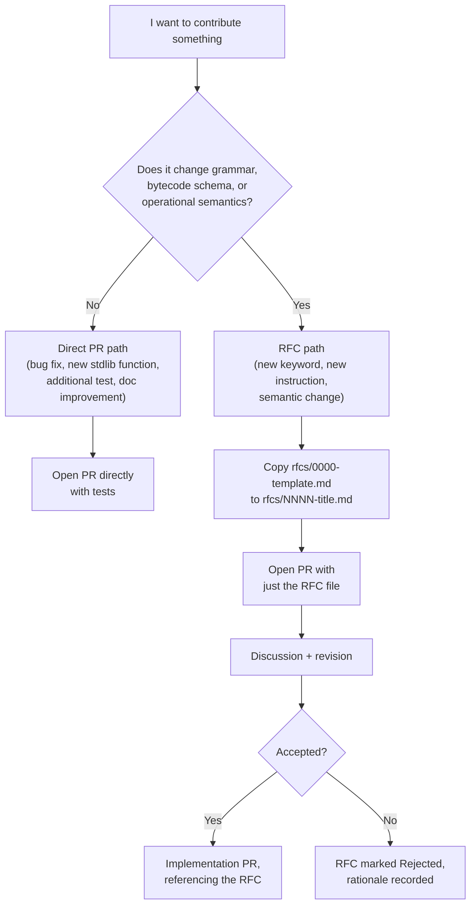

The dividing line in the decision diamond is deliberately the same
criterion stated in the root `CONTRIBUTING.md`: **grammar, bytecode
schema, and operational semantics changes require an RFC; everything else
can go straight to a pull request.**

### 4. The direct PR path, worked example

Suppose you want to add a `hypotenuse` function to
[Standard Library](Standard-Library)'s `geometry` module. This does not
touch grammar, bytecode, or semantics — it is a pure addition to a Rust
utility crate. The direct path:

1. Add the function to `eoh-stdlib/src/geometry.rs`, with a `///` doc
   comment (mandatory — see [Design Principles](Design-Principles) §3's
   sibling constraint, `#![deny(missing_docs)]`, enforced on every public
   item across the workspace).
2. Add at least one unit test in the same file's `#[cfg(test)] mod tests`
   block, following the existing style (see
   [Standard Library](Standard-Library) §4's table for the pattern other
   geometry functions follow).
3. Run `cargo test -p eoh-stdlib` to confirm the new test passes and
   nothing else regressed.
4. Open a PR describing what the function does and why it's useful,
   referencing [Standard Library](Standard-Library) if the change affects
   that page's documented function table (it does, in this example — the
   PR should update that table too, per §6 below).

### 5. The RFC path, worked example

Suppose you want to add directional pulse emission
(`PULSE_HIGGS origin, v=velocity, dir=(dx,dy,dz)`), the extension flagged
as a documented-but-unscheduled research direction in
[Pulse Engine](Pulse-Engine) §6. This changes the grammar (new optional
argument), the AST (`PulseDecl` needs a new field), the bytecode schema
(`EmitPulse` needs a direction field), and the operational semantics (the
activation predicate needs to account for directionality). This is
squarely an RFC-path change:

1. Copy `rfcs/0000-template.md` to, e.g.,
   `rfcs/0002-directional-pulses.md`.
2. Fill in **Motivation** (why isotropic-only pulses are limiting for some
   use case), **Detailed design** (the grammar diff, the AST/bytecode
   schema diff, and — critically — the small-step semantics diff, written
   in the same notation style as
   [Spatial Execution Model](Spatial-Execution-Model) §4), **Drawbacks**
   (e.g., added complexity to the activation predicate, potential
   confusion with the existing monotonicity property from
   [Pulse Engine](Pulse-Engine) §5), and **Alternatives considered** (e.g.,
   a separate `PULSE_CONE` construct instead of extending `PULSE_HIGGS`).
3. Open a PR with just the RFC file — no implementation yet.
4. Once discussion converges and the RFC is accepted, open a follow-up
   implementation PR that updates: the grammar in
   `spec/LANGUAGE_SPEC.md`, the AST in `eoh-ast`, the parser in
   `eoh-parser`, the bytecode schema in `eoh-compiler::bytecode`
   (bumping `BytecodeImage::CURRENT_VERSION` per
   [Intermediate Representation](Intermediate-Representation) §6), the VM
   dispatch in `eoh-vm`, the formal semantics in `spec/SEMANTICS.md`, and
   this wiki's [Pulse Engine](Pulse-Engine) page — all in one coherent
   change, referencing the accepted RFC.

### 6. Documentation obligations that travel with code changes

| If your PR changes... | ...you must also update |
|---|---|
| Grammar (new keyword, new syntax form) | `spec/LANGUAGE_SPEC.md`, [Parser Design](Parser-Design), [Abstract Spatial Syntax Tree](Abstract-Spatial-Syntax-Tree) |
| Bytecode instruction set | `spec/LANGUAGE_SPEC.md` §6, [Intermediate Representation](Intermediate-Representation), `BytecodeImage::CURRENT_VERSION` |
| Operational semantics (VM dispatch behavior) | `spec/SEMANTICS.md`, [Spatial Execution Model](Spatial-Execution-Model) |
| Standard library function surface | [Standard Library](Standard-Library) |
| Implementation-status of any feature | The status table in [Home](Home) §4, and `eoh status`'s output in `eoh-cli/src/main.rs` |

This table operationalizes [Design Principles](Design-Principles) §7's
principle that specification and implementation move together — a PR that
changes behavior described in one of the left-column categories without
the corresponding right-column update should be treated as incomplete in
review, not merged with a "docs follow-up later" deferral.

### 7. Code review expectations

Reviewers on this project are expected to check, in addition to ordinary
correctness review:

- **Status-word discipline** ([Design Principles](Design-Principles) §2):
  does new documentation use one of the four sanctioned status words, and
  use it accurately?
- **No `unsafe`, no missing docs**: these are compiler-enforced
  (`#![deny(...)]`), so review does not need to manually check for them,
  but a reviewer should understand *why* a build failure of this kind is
  not negotiable via `#[allow(...)]` — see
  [Design Principles](Design-Principles) §3.
- **Test coverage for new behavior**, in the module-local
  `#[cfg(test)]` style consistently used throughout this codebase (see
  any of [Coordinate System](Coordinate-System), [Pulse Engine](Pulse-Engine),
  or [Memory Model](Memory-Model)'s underlying source for the established
  pattern).
- **Honest labeling of partial work**: a PR that implements part of a
  feature should say so explicitly in its description and in any
  documentation it touches, rather than presenting partial work as
  complete.

### 8. Best Practices

- **Read the specific wiki page for the subsystem you're touching before
  writing code**, not just this page — e.g., before modifying the
  optimizer, read [Compiler Architecture](Compiler-Architecture) §6 in
  full, including its explicitly stated current limitations, so you don't
  duplicate already-understood constraints as if they were newly
  discovered bugs.
- **Keep PRs scoped to one logical change**, per the root
  `CONTRIBUTING.md`'s commit-convention guidance — a PR that both fixes a
  bug and adds an unrelated feature is harder to review and harder to
  revert cleanly if something goes wrong.
- **When in doubt about direct-PR vs. RFC path (§3), err toward RFC** —
  a small, focused RFC that turns out to have been unnecessary costs a
  short discussion thread; an unreviewed semantic change that turns out to
  need reverting costs considerably more.

### 9. Implementation Notes

- CI (`​.github/workflows/ci.yml`, described in
  [Repository Structure](Repository-Structure) §9) currently runs
  `cargo fmt --check` and `cargo clippy` with `continue-on-error: true` —
  meaning formatting and lint issues are surfaced but do not currently
  block merges. This is a deliberate, temporary leniency during the
  project's early, fast-moving stage; tightening these to blocking checks
  is listed as a Future Improvement.
- The example-program verification step in CI (running `eoh check`
  against every file in `examples/`) **does** block merges — this
  asymmetry (blocking for example-program correctness, non-blocking for
  style) reflects the project's priority ordering: correctness of
  documented, user-facing example behavior matters more, at this stage,
  than uniform code style.

### 10. Future Improvements

- Tighten `cargo fmt`/`cargo clippy` CI checks from advisory to blocking,
  once the codebase's style has had time to converge under the current
  advisory regime (§9).
- Add a CI check enforcing §6's documentation-obligation table
  automatically where feasible (e.g., flagging a PR that modifies
  `eoh-compiler::bytecode.rs` without a corresponding diff in
  `spec/LANGUAGE_SPEC.md`) — currently a manual review responsibility.
- Expand the RFC template (`rfcs/0000-template.md`) with an explicit
  checklist mirroring §6's table, making the documentation obligations of
  an eventual implementation PR clear from the RFC stage itself.

---

## Chapter 19 — FAQ

### 1. Purpose of this page

This page collects the questions newcomers, reviewers, and skeptical
readers most commonly ask, with direct, honest answers and links to the
pages containing full detail. Where a question touches an open research
question, the answer says so explicitly rather than defaulting to a
reassuring but unsupported claim.

### 2. "Is Eye of Horus Turing-complete?"

**Honest answer: this is currently an open question, not yet well-posed.**
The grammar includes conditional branching (`IF`/`ELSE`) and iteration
(`LOOP`/`BREAK`/`CONTINUE`), and these parse into valid AST nodes — but
neither is currently lowered into executable bytecode (see
[Type System](Type-System) §6 for the full technical account). Until that
lowering exists, the *executable* subset of the language is closer to a
straight-line arithmetic-and-declaration DSL than to a general-purpose
language, and asking whether it is Turing-complete does not yet have a
well-defined subject to evaluate. Once control flow is wired into
execution (Roadmap Phase 1), this becomes a genuine open research question
the project intends to investigate and report on honestly — in either
direction.

### 3. "Is the phi-pi addressing scheme a form of encryption or hashing security?"

**No.** This question comes up because the scheme involves the golden
ratio, a constant with (undeserved, in this context) mystique attached to
it in some corners of the internet. To be maximally direct: the phi-pi
address function is a **public, deterministic, easily invertible spatial
quantization formula** (see [Coordinate System](Coordinate-System) §4 for
the exact formula). It provides no confidentiality, no security-relevant
collision resistance, and no relationship to cryptographic hash functions.
It exists purely to organize the virtual machine's internal storage, the
same role a hash function plays for any ordinary `HashMap` — nothing more.
See [Memory Model](Memory-Model) §1 and
[Coordinate System](Coordinate-System) §3 for the full, repeated statement
of this non-claim.

### 4. "Does 'Higgs pulse' mean this language simulates particle physics?"

**No.** "Higgs pulse" is a naming metaphor — the Higgs field's role in the
Standard Model (a field that activates mass in other particles on
interaction) is an apt, memorable image for "a field that triggers
activation in other things on contact," which is exactly what the
language's pulse mechanism does computationally. The implementation is
ordinary Rust code implementing a geometric distance/radius comparison
(see [Pulse Engine](Pulse-Engine) §2–3) — there is no physics simulation,
no relation to quantum field theory, and no claim of physical
correspondence. See [Pulse Engine](Pulse-Engine) §1 for the fuller
statement.

### 5. "Is this related to the historical/religious Eye of Horus symbol?"

**No**, beyond using it as an evocative project name and visual motif. The
project makes no claim of continuity with, authority over, or special
insight into Egyptological, religious, or esoteric traditions associated
with the historical symbol. Readers interested in that history should
consult Egyptological scholarship; this project's use of the name is
unrelated to that literature except by borrowed name and imagery. See
`README.md`'s framing statement in the main repository for the canonical
phrasing of this non-claim.

### 6. "Is this ready for production use?"

**No — this is explicitly a pre-alpha research implementation.** See the
implementation-status table in [Home](Home) §4 for a live, itemized
breakdown of what is implemented, partial, and planned. The project's own
`README.md` states this directly in its "Honest scope and limitations"
section, and this wiki inherits that same discipline throughout (see
[Design Principles](Design-Principles) §2). If you are evaluating this
project for a use case with production requirements, the honest answer
today is: not yet, and the roadmap (`ROADMAP.md`) is the best source for
when specific gaps might close.

### 7. "Why does the type checker not catch [some obviously wrong program]?"

Most likely because the current type checker performs **structural**
validation only (vertex counts, pulse-origin existence), not full
expression-level type checking — see [Type System](Type-System) §2 for the
precise, current boundary of what is checked. This is a known, stated
scope limitation, not a bug in the conventional sense — though if you find
a case where even the *currently intended* structural checks fail to
catch a violation they are supposed to catch, that is a genuine bug worth
reporting.

### 8. "Why does `LET x = 5.0; LET y = 10.0` behave unexpectedly?"

This is very likely the unbound-name fallback issue documented explicitly
in [Memory Model](Memory-Model) §5 and
[Spatial Execution Model](Spatial-Execution-Model) §7: because neither `x`
nor `y` is associated with an explicitly declared vertex, both currently
resolve to the same origin-address storage cell, meaning they can
silently alias each other. This is a known, prioritized issue (Roadmap
Phase 1: "strict unbound-name faulting"), not intended behavior.

### 9. "Can I call standard library functions like `centroid()` from a `.eoh` program?"

**Not yet.** `eoh-stdlib`'s functions are fully implemented and tested at
the Rust level, but are not currently wired into the language's `Call`
instruction dispatch — see [Standard Library](Standard-Library) §2 for the
precise current boundary and what "wiring them in" would entail.

### 10. "What does 'geometry-native' actually mean, concretely?"

It means every value that participates in spatial computation is stored
at an address derived from an actual point in 3-D space (via the phi-pi
lattice — [Coordinate System](Coordinate-System)), and program execution
is driven by a spatial propagation mechanism (Higgs pulses —
[Pulse Engine](Pulse-Engine)) rather than solely by a linear program
counter. See [Language Concepts](Language-Concepts) §2 for the fullest
non-formal explanation, and
[Spatial Execution Model](Spatial-Execution-Model) for the formal
operational semantics.

### 11. "Why Rust, specifically?"

Rust's compile-time memory-safety guarantees make the project's
`#![deny(unsafe_code)]` discipline ([Design Principles](Design-Principles) §3)
straightforward to enforce and verify — memory-safety bugs are ruled out
by construction across the entire workspace, which matters for a project
whose central claims are about a novel execution model's *correctness*
properties (like the monotonicity proof in
[Spatial Execution Model](Spatial-Execution-Model) §3.1) — those claims
would be considerably less trustworthy if the implementation itself could
harbor memory-safety bugs. Rust's `serde` ecosystem also made the
"every AST/MIR/bytecode node is serializable" design goal
([Abstract Spatial Syntax Tree](Abstract-Spatial-Syntax-Tree) §2) simple to
achieve uniformly.

### 12. "How can I help?"

See [Contributing](Contributing) for the full guide. In short: bug fixes,
new tests, and standard-library additions can go straight to a pull
request; grammar, bytecode-schema, or semantics changes should start as an
RFC (`rfcs/0000-template.md`). Documentation corrections — including to
this wiki — are always welcome and follow the same review process as code.

### 13. "Where do I report a security issue?"

Via GitHub's private vulnerability reporting feature on the repository,
per `SECURITY.md` — not as a public issue. See
[Repository Structure](Repository-Structure) §9 for where this policy is
configured (`.github/ISSUE_TEMPLATE/config.yml` routes reporters there
automatically).

### 14. Implementation Notes

This FAQ is maintained as a living document: as questions recur in issues,
discussions, or pull-request review, they are candidates for addition
here, keeping the answer close to the authoritative technical pages it
links to rather than re-explaining technical detail inline.

### 15. Future Improvements

- Once control flow lands and the Turing-completeness investigation (§2)
  produces a result, update this entry with the actual finding rather than
  the current "open question" framing.
- Consider linking this FAQ directly from the repository's issue templates
  as a first-response resource for common questions, reducing duplicate
  issue traffic for already-answered questions.

---

## Chapter 20 — Glossary

### 1. Purpose of this page

This page defines every term of art used across this wiki in one place,
alphabetically, each entry cross-linked to the page(s) where the concept is
treated in full depth. Use this page as a quick lookup when a term appears
unfamiliar mid-read on another page, rather than as a page meant to be read
front to back.

### 2. Terms A–E

**Activation** — The event of a spatial point (and, by extension, any
shape containing it) coming within a pulse's expanding wavefront radius.
See [Language Concepts](Language-Concepts) §3.6, formalized in
[Spatial Execution Model](Spatial-Execution-Model) §3.

**Activation Field** (`ActivationField`) — The set of all live pulses in a
VM run; a point is active under the field if any member pulse activates
it (logical union, no interference modeling). See
[Pulse Engine](Pulse-Engine) §7.

**AST (Abstract Syntax Tree)** — See **Abstract Spatial Syntax Tree**
below; in Eye of Horus the two terms refer to the same structure, the
latter emphasizing its geometry-dominated node vocabulary.

**Abstract Spatial Syntax Tree** — The tree structure produced by parsing,
rooted at `Module`, defined in `eoh-ast`. Full treatment:
[Abstract Spatial Syntax Tree](Abstract-Spatial-Syntax-Tree).

**Bytecode Image** (`BytecodeImage`) — The final, versioned, serialized
output of compilation: an instruction sequence plus a string pool, source
path, and schema version. See
[Intermediate Representation](Intermediate-Representation) §4.

**Dead-code elimination (DCE)** — An optimizer pass (level ≥ 2) that
truncates instructions following an unconditional `Halt`/`Return`. See
[Compiler Architecture](Compiler-Architecture) §6.

**EBNF** — Extended Backus–Naur Form, the notation used for Eye of
Horus's formal grammar in `spec/LANGUAGE_SPEC.md`, elaborated informally
throughout [Parser Design](Parser-Design).

**Edge** (`EDGE`) — A directed, named connection between two vertices,
currently structural metadata rather than an execution-affecting
construct. See [Language Concepts](Language-Concepts) §3.3.

**`EohError`** — The unified error enum (`Geometry`, `Lex`, `Parse`,
`Type`, `Runtime`, `Io`, `NotImplemented`) used throughout the toolchain.
See [Design Principles](Design-Principles) §6,
[Compiler Architecture](Compiler-Architecture) §7.

### 3. Terms F–L

**Field** — Short for **Spatial Field**; see below.

**Higgs Pulse** — See **Pulse** below; "Higgs" is a physics-metaphor
qualifier, explicitly not a physical-modeling claim. See
[Pulse Engine](Pulse-Engine) §1.

**Lattice** — The discrete integer grid (`PhiPiAddress` space, `ℤ³`) that
continuous coordinates are quantized onto. See
[Coordinate System](Coordinate-System) §4–5.

**Lexer** — The tokenizer (`eoh-lexer`), converting source text into a
`Token` stream. See [Parser Design](Parser-Design) §2.

**LL(1)** — A parsing-theory term describing a grammar parseable with one
token of lookahead at every decision point; Eye of Horus's grammar is
designed to remain (almost entirely) LL(1) — see
[Parser Design](Parser-Design) §5 for the one documented exception.

### 4. Terms M–P

**MIR (Mid-level Intermediate Representation)** — The flat instruction
sequence produced by AST lowering, prior to bytecode emission; currently
structurally identical to the final bytecode instruction type. See
[Intermediate Representation](Intermediate-Representation) §2,
[Compiler Architecture](Compiler-Architecture) §5.

**Monotonicity (of activation)** — The proven property that once a point
is activated by a pulse, it remains activated for all later simulation
ticks (given non-negative pulse velocity). See
[Spatial Execution Model](Spatial-Execution-Model) §3.1,
[Pulse Engine](Pulse-Engine) §5.

**Operand Stack** — The VM's short-lived stack used only for evaluating
expressions mid-instruction; distinct from, and much smaller in role than,
the spatial field. See [Memory Model](Memory-Model) §2.

**Origin** (`ORIGIN`) — A module-level declaration establishing the
coordinate reference point. See [Language Concepts](Language-Concepts) §3.1.

**Phi-Pi Address** (`PhiPiAddress`) — A quantized, three-integer lattice
coordinate derived from a continuous `Coord3D` via the addressing function
`α`. See [Coordinate System](Coordinate-System) §2–4.

**Phi-Pi Addressing / Quantization** — The deterministic mapping from
continuous 3-D coordinates to discrete lattice addresses, using quantum
`q = φ/π`. Explicitly **not** a cryptographic scheme. See
[Coordinate System](Coordinate-System) §3–4,
[Memory Model](Memory-Model) §1.

**Precedence climbing** — The recursive-descent technique used to parse
arithmetic expressions with correct operator precedence and associativity.
See [Parser Design](Parser-Design) §3.2.

**Pulse** (`Pulse`, `PULSE_HIGGS`) — An expanding spherical activation
wavefront originating at a named vertex, propagating at a configured
velocity. See [Language Concepts](Language-Concepts) §3.5,
[Pulse Engine](Pulse-Engine).

**`PulseVector`** — A directional-bias data type for pulses; fully
implemented but not yet exercised by pulse emission (which is always
isotropic in the current VM). See [Pulse Engine](Pulse-Engine) §6.

### 5. Terms Q–S

**Quantum (addressing)** — The lattice cell size, `q = φ/π ≈ 0.515`,
determining phi-pi quantization granularity. See
[Coordinate System](Coordinate-System) §4.

**Radius function** — `radius(p,t) = max(0, t-birth) · velocity`, the
closed-form wavefront-size formula for a pulse at a given tick. See
[Pulse Engine](Pulse-Engine) §3, [Spatial Execution Model](Spatial-Execution-Model) §3.

**Resolver** — The compiler stage collecting declared names into scope
(currently structural, not full reference-checking). See
[Compiler Architecture](Compiler-Architecture) §3.

**RFC (Request for Comments)** — The project's process for
substantial design changes (grammar, bytecode schema, semantics). See
[Contributing](Contributing) §3–5, `rfcs/`.

**Shape** (`SHAPE_TETRA`, `SHAPE_CUBE`, `SHAPE_ICOSA`, `SHAPE_SPHERE`,
`SHAPE_POLY`) — A named geometric solid built from vertices, subject to
kind-specific vertex-count constraints. See
[Language Concepts](Language-Concepts) §3.4, [Type System](Type-System) §5.

**Small-step operational semantics** — The formal notation style
(`⟨IP,S,F,Φ,t⟩ → ⟨...⟩`) used to define precise VM behavior one
instruction at a time. See [Spatial Execution Model](Spatial-Execution-Model) §4.

**Spatial Field** (`SpatialField<V>`) — The VM's sole long-lived storage
mechanism, a `HashMap<PhiPiAddress, V>`. See [Memory Model](Memory-Model) §3.

**Span** (`Span`) — A byte-range-plus-file-id source-location marker
attached to every token and AST node, used for diagnostics. See
[Parser Design](Parser-Design) §2.2,
[Abstract Spatial Syntax Tree](Abstract-Spatial-Syntax-Tree) §6.

**Structural type checking** — The current type checker's approach:
validating vertex counts and pulse-origin existence, without full
expression-level type inference. See [Type System](Type-System) §2.

### 6. Terms T–Z

**Tick** (simulation tick) — The VM's discrete time counter, currently
advanced by exactly one per dispatched instruction. See
[Spatial Execution Model](Spatial-Execution-Model) §4, §7.

**Turing-completeness** — A computational-power property currently
**unresolved** for Eye of Horus's executable core, pending control-flow
lowering. See [Type System](Type-System) §6, [FAQ](FAQ) §2.

**Type Annotation** (`TypeAnnotation`) — A parsed but not-yet-enforced
type-name annotation attached to `LET`/`FN` declarations. See
[Type System](Type-System) §2, [Abstract Spatial Syntax Tree](Abstract-Spatial-Syntax-Tree) §4.

**Unbound-name fallback** — The current (flagged-as-problematic) VM
behavior of resolving `Load`/`Store` on an unrecognized name to the origin
address rather than raising an error. See [Memory Model](Memory-Model) §5,
[FAQ](FAQ) §8.

**Vertex** (`VERTEX`) — A named point in 3-D space, the atomic unit of
spatial reference in the language. See
[Language Concepts](Language-Concepts) §3.2.

**Vertex table** — The VM's auxiliary `HashMap<String, Coord3D>` bridging
named references to spatial addresses. See
[Spatial Execution Model](Spatial-Execution-Model) §6,
[Memory Model](Memory-Model) §4.

**`Value`** — The VM's runtime value domain: `Float`, `Bool`, `Str`,
`Coord`, `Unit`. See [Spatial Execution Model](Spatial-Execution-Model) §2,
[Type System](Type-System) §3.

**Wavefront** — The expanding spherical boundary of a pulse's activation
radius at a given tick. See [Pulse Engine](Pulse-Engine) §4.

### 7. Implementation Notes

Entries in this glossary are cross-linked bidirectionally in spirit —
every concept page that introduces a term of art also appears as this
glossary's citation for that term — but this page itself is maintained by
hand rather than auto-generated. If a new term of art is introduced on any
page, adding it here in the same pull request is expected, per
[Contributing](Contributing) §6's documentation-obligations discipline.

### 8. Future Improvements

- Consider auto-generating at least the cross-link portion of this
  glossary from structured metadata (e.g., a `<!-- glossary: term -->`
  comment convention on defining pages), reducing the manual-maintenance
  burden and risk of drift as the wiki grows.
- Add a reverse index (page → terms it defines) as a complementary view,
  useful for reviewers checking whether a new page's terminology has been
  properly glossed.

---

## Appendix — Document Provenance

This consolidated edition was compiled from the following source pages of
the Eye of Horus project wiki, in reading order:

| Chapter | Source page | Wiki position |
|---|---|---|
| 3 | Language Concepts | Page 3 of 20 |
| 4 | Project Architecture | Page 4 of 20 |
| 5 | Spatial Execution Model | Page 5 of 20 |
| 6 | Compiler Architecture | Page 6 of 20 |
| 7 | Parser Design | Page 7 of 20 |
| 8 | Abstract Spatial Syntax Tree | Page 8 of 20 |
| 9 | Intermediate Representation | Page 9 of 20 |
| 10 | Pulse Engine | Page 10 of 20 |
| 11 | Memory Model | Page 11 of 20 |
| 12 | Coordinate System | Page 12 of 20 |
| 13 | Type System | Page 13 of 20 |
| 14 | Standard Library | Page 14 of 20 |
| 15 | Repository Structure | Page 15 of 20 |
| 16 | Design Principles | Page 16 of 20 |
| 17 | Performance | Page 17 of 20 |
| 18 | Contributing | Page 18 of 20 |
| 19 | FAQ | Page 19 of 20 |
| 20 | Glossary | Page 20 of 20 |

Not reproduced in this edition: **Home** (Page 1 of 20) and
**Getting Started** (Page 2 of 20), which are interactive-wiki
orientation and installation material rather than technical reference
content. Readers should consult those two pages directly in the live
wiki, or the repository's `README.md`, before working through the
technical chapters above.

No content was summarized, paraphrased, or omitted from any reproduced
page — each chapter is the complete original page, with only its heading
levels adjusted to nest under this document's chapter structure.

## Citation

If citing this document, the project whitepaper (referenced throughout
the chapters above) remains the primary citable artifact:

> Plesca, C. S. (2026). *Eye of Horus: A Geometry-Native Programming
> Language and Pulse-Activation Computational Model.* Project
> whitepaper and technical wiki.
> https://github.com/Ciprian-LocalPulse/Eye-of-Horus

## License

Licensed under Apache-2.0, consistent with the reference implementation
and the source wiki. Corrections and expansions are welcome via the
process described in Chapter 18 (Contributing).

---

**Eye of Horus — Complete Technical Reference**
Consolidated single-document edition · 18 chapters
Maintained alongside the reference implementation at
[github.com/Ciprian-LocalPulse/Eye-of-Horus](https://github.com/Ciprian-LocalPulse/Eye-of-Horus).
