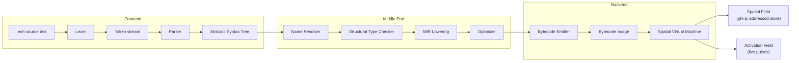
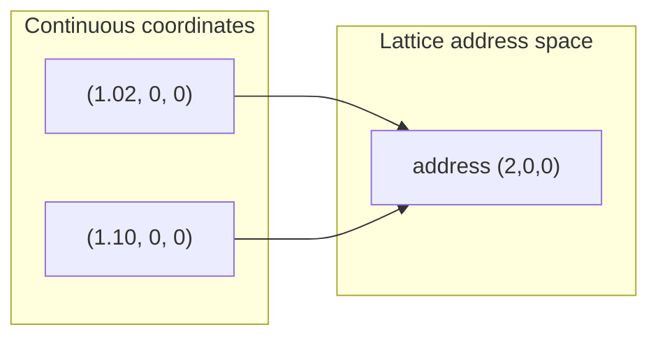
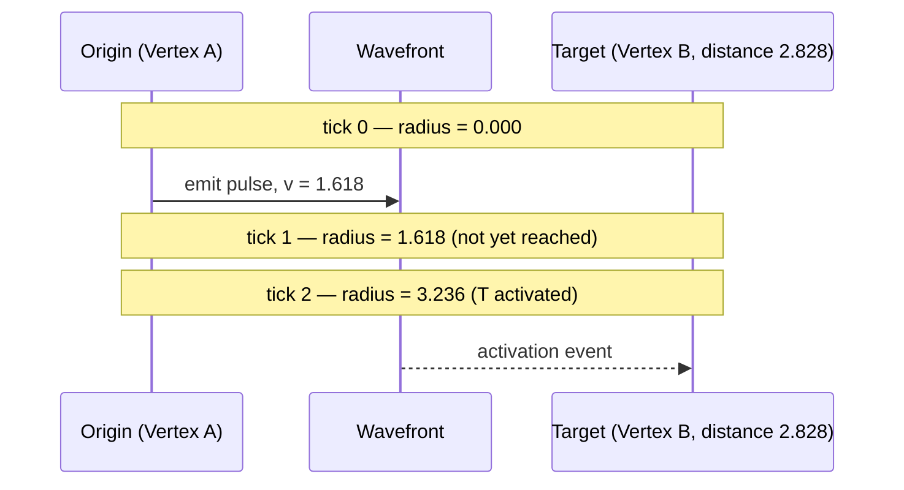
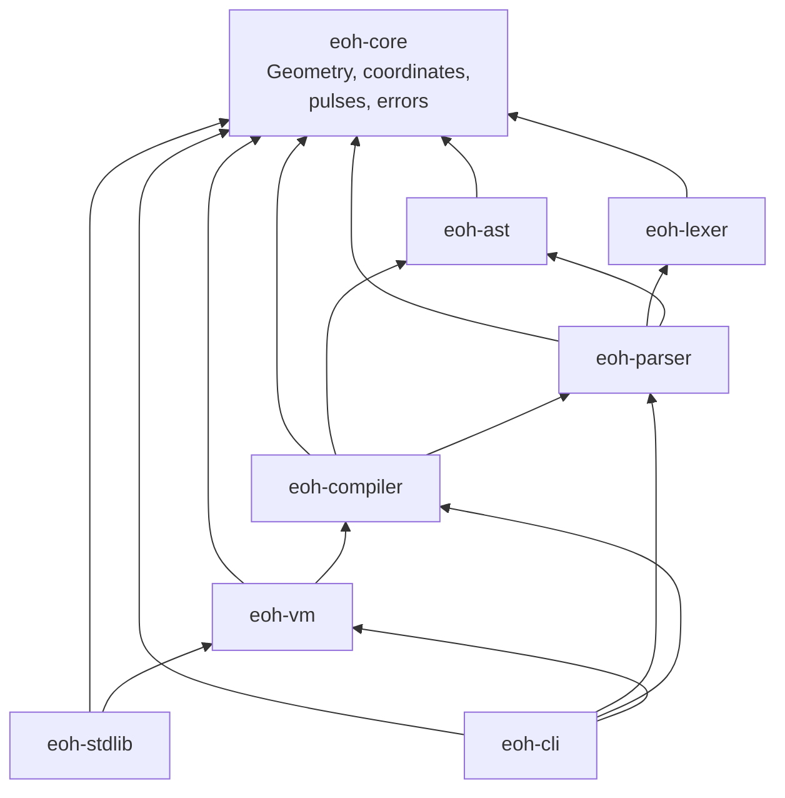
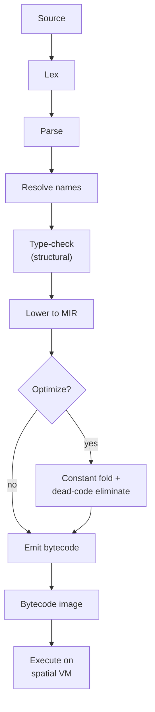

# Eye of Horus: A Geometry-Native Programming Language and the Pulse-Activation Model of Computation

### A Research Monograph in the Doctoral Dissertation Tradition

**Author:** Ciprian Stefan Plesca
**Affiliation:** Independent Researcher · Founder, LocalPulse
**Repository:** https://github.com/Ciprian-LocalPulse/Eye-of-Horus
**Date:** 2026

---

> **A note on this document's status.** This monograph is written in the
> structural and rhetorical tradition of a doctoral dissertation —
> abstract, related work, formal contributions, evaluation, and
> conclusion — because that structure is the clearest way to present a
> research contribution of this scope. It is an independent research
> monograph, not a thesis submitted to or conferred by any degree-granting
> institution, and it makes no claim of affiliation with MIT or any other
> university. Every technical claim in this document is checkable against
> the open-source reference implementation cited throughout. Where a claim
> is unproven or speculative, this document says so explicitly, in the
> spirit of the project's own founding discipline (see `MANIFESTO.md` and
> `VISION.md` in the repository).

---

## Abstract

This monograph presents Eye of Horus, a research programming language in
which three-dimensional spatial geometry serves as the primary substrate
of computation, replacing the flat linear memory and program-counter-driven
control flow inherited by nearly all contemporary general-purpose
languages from the von Neumann architecture. We introduce the **phi-pi
addressing model**, a deterministic quantization scheme mapping continuous
coordinates to a discrete storage lattice, and the **Higgs-pulse
activation model**, an operational semantics in which program execution is
driven by simulated expanding wavefronts rather than solely by sequential
instruction dispatch. We present a complete, open-source, tested reference
implementation in Rust — a nine-crate compiler and virtual-machine
toolchain — together with a formal grammar, small-step operational
semantics, and a proven monotonicity property of the activation model. We
situate this work within the broader literature on dataflow architectures,
cellular automata, and unconventional computing, and we conclude with an
extended, deliberately candid discussion of open theoretical problems —
most notably, the currently unresolved question of whether the language's
executable core is Turing-complete. This monograph does not claim that
geometry-native computation is superior to conventional models; it claims
only that the question is answerable, and that this work constitutes a
first, honestly-scoped step toward answering it.

**Keywords:** programming language design, spatial computing, operational
semantics, virtual machines, unconventional computation, cellular
automata, dataflow architectures, golden ratio quantization.

---

## Chapter 1 — Introduction

### 1.1 The inherited assumption

Every mainstream general-purpose programming language in production use
today — C, Rust, Python, Java, JavaScript, Go, and their many relatives —
shares a common ancestor in the von Neumann architecture: a flat,
linearly addressable memory, and a program counter advancing sequentially
through an instruction stream, redirected occasionally by jumps and calls.
This is not a mathematical necessity. It is a historical, engineering
choice made in the 1940s for reasons of hardware feasibility, and it has
since co-evolved for eight decades with compiler theory, operating
systems, and silicon design into a mutually reinforcing ecosystem of such
depth that alternatives are rarely considered seriously outside of
specialized research niches.

And yet alternatives exist, and some of them are well studied. Cellular
automata compute through local, simultaneous update rules over a spatial
grid. Dataflow architectures organize computation around the topology of
data movement rather than a single instruction pointer. Reaction-diffusion
computing solves certain classes of problems — shortest-path routing,
Voronoi tessellation — through literal physical propagation in a chemical
medium. Systolic arrays pipeline computation through a fixed spatial
network of processing elements. Each of these demonstrates, in its own
domain, that *sequential control flow over flat memory* is a choice, not a
law.

### 1.2 The research question this work addresses

This monograph investigates a narrow, concrete instance of this broader
observation, phrased as an answerable engineering and theoretical
question:

> *What does a small, statically specifiable, compiled programming
> language look like if every value's storage location is a point in
> continuous three-dimensional space, and program execution is driven by
> simulated propagating activation — an expanding wavefront originating at
> a spatial point — rather than by an implicit call stack and program
> counter alone?*

We call the resulting language and its implementation **Eye of Horus**.
The name is chosen for its evocative, visual resonance with themes of
sight-lines, activation, and directed attention across space — it carries
no claim of continuity with, or authority over, the historical or
religious symbol it borrows its name from, a point we state directly here
and repeat throughout the reference documentation, because unclear
metaphor boundaries are among the most common and avoidable failures of
public science communication.

### 1.3 Contributions

This monograph, together with its accompanying open-source reference
implementation, makes the following contributions:

1. A formally specified grammar and partial operational semantics for a
   geometry-native programming language (Chapters 3–5).
2. The **phi-pi addressing model**, a deterministic spatial quantization
   scheme, together with an explicit, rigorously stated account of what
   this model does and does not provide — critically, that it has *no*
   cryptographic or security properties whatsoever (Chapter 4).
3. The **Higgs-pulse activation model**, with a proven monotonicity
   property governing how activation propagates through simulated time
   (Chapter 5).
4. A complete, tested, nine-crate Rust reference implementation spanning
   lexical analysis, parsing, name resolution, structural type checking,
   intermediate-representation lowering, optimization, bytecode emission,
   and virtual-machine execution (Chapter 6).
5. A candid, structured account of open theoretical problems — most
   significantly, the unresolved status of Turing-completeness for the
   language's current executable core (Chapter 8).

### 1.4 What this work does not claim

In the interest of the same honest-scholarship discipline that governs
every technical document in this project, we state plainly what this
monograph does *not* argue:

- We do not claim performance superiority over conventional language
  runtimes. No benchmark comparison is presented, because none has yet
  been conducted to a standard rigorous enough to publish (see Chapter 9).
- We do not claim the phi-pi addressing scheme provides security,
  privacy, or cryptographic guarantees of any kind.
- We do not claim to have resolved the Turing-completeness question.
- We do not claim any relationship between this project and the
  historical, religious, or esoteric traditions associated with the name
  "Eye of Horus," nor do we present this work as esoteric, mystical, or
  spiritual in nature. It is a work of computer science and formal
  language design, evaluated by the standards of that field.

---

## Chapter 2 — Related Work

### 2.1 Dataflow and spatial computing architectures

Kahn process networks and systolic array architectures demonstrated,
decades ago, that computation can be organized around the spatial
topology of data movement between fixed processing elements, rather than
around a single sequential instruction stream. Eye of Horus's pulse
model shares a family resemblance with this tradition: activation
propagates through space according to a well-defined rule, rather than
being centrally sequenced. The distinction is that Eye of Horus's
propagation is continuous and distance-based (a wavefront expanding
through Euclidean space) rather than discrete and topology-based (data
moving along fixed wires between processing elements).

### 2.2 Cellular automata

Cellular automata — Conway's Game of Life being the most widely known
instance — compute via local, simultaneous update rules applied across a
spatial grid. Wolfram's classification of one-dimensional CA rule spaces
demonstrated that even extremely simple local update rules can produce
behavior spanning the full range from trivial to computationally
universal. The Higgs-pulse activation model (Chapter 5) can be understood
as a continuous-space analogue of a CA's neighborhood-activation rule: a
point becomes "active" based on its distance from a propagating source,
just as a CA cell's next state depends on its neighbors' current states.
The key structural difference is that Eye of Horus's activation is
**monotonic and cumulative** — once reached, a point remains active for
the remainder of a simulation run (Chapter 5, Theorem 5.1) — whereas most
studied CA rules permit cells to toggle between active and inactive
states repeatedly.

### 2.3 Unconventional and physical computing

Reaction-diffusion computers and physarum-based (slime-mold) computing
substrates use literal physical or chemical propagation phenomena as a
computational medium, solving problems like shortest-path routing through
the physics of the medium itself. Eye of Horus is, by contrast, an
entirely simulated, digital analogue of this idea — a conventional Rust
virtual machine computing a mathematical propagation function, not a
physical substrate. We draw the parallel explicitly because the *design
inspiration* is genuine, while being equally explicit that no physical
computing claim is being made (see Chapter 1.4).

### 2.4 Spatial hashing in computer graphics and physics engines

Uniform grids, k-d trees, and octrees are long-established techniques in
computer graphics and physics simulation for organizing spatial data by
locality, enabling efficient nearest-neighbor and range queries. The
phi-pi addressing model (Chapter 4) plays an analogous *role* — organizing
the virtual machine's storage by spatial locality — using a specific
golden-ratio-derived quantization constant whose particular locality
properties, unlike those of the well-studied grid and tree structures
above, remain empirically unverified in this project (Chapter 4.4). We
regard this as an open question inherited from, rather than resolved by,
the existing computer-graphics literature.

---

## Chapter 3 — Language Overview

### 3.1 Core declarative vocabulary

An Eye of Horus program is a sequence of declarations. The core forms are:

```eoh
ORIGIN x, y, z                          // establish the coordinate origin
VERTEX name x, y, z                     // bind a name to a spatial point
EDGE from -> to                         // declare a directed structural edge
SHAPE_TETRA name v1, v2, v3, v4          // a tetrahedron over four vertices
PULSE_HIGGS origin, v=velocity           // emit an expanding activation wavefront
LET name = expr                          // bind a computed value
FN name(params) -> ReturnType { ... }    // declare a function
```

### 3.2 A representative program

```eoh
ORIGIN 0.0, 0.0, 0.0

VERTEX A 1.0, 1.0, 1.0
VERTEX B 1.0, -1.0, -1.0
VERTEX C -1.0, 1.0, -1.0
VERTEX D -1.0, -1.0, 1.0

SHAPE_TETRA T1 A, B, C, D

PULSE_HIGGS A, v=1.618
```

This program declares a regular tetrahedron and emits a pulse from one of
its vertices, at a velocity equal to the golden ratio φ. Under the
operational semantics developed in Chapter 5, the wavefront's radius grows
linearly with simulation time; once it exceeds the distance from `A` to
each of `B`, `C`, `D`, those vertices become activated.

### 3.3 System architecture at a glance



---

## Chapter 4 — The Phi-Pi Addressing Model

### 4.1 Motivation

A language in which every value's storage location is a spatial point
requires *some* deterministic function mapping continuous coordinates
onto a finite, hashable key space — continuous three-dimensional space
being uncountable, and therefore unusable directly as a storage index.

### 4.2 Formal definition

Let `φ = (1+√5)/2` denote the golden ratio and `π` the usual circle
constant. Define the quantum:

```
q = φ / π  ≈ 0.515036...
```

The addressing function `α : ℝ³ → ℤ³` is defined component-wise by:

```
α(x, y, z) = ( round(x/q), round(y/q), round(z/q) )
```

producing an integer lattice address `(ix, iy, iz)` from any continuous
coordinate `(x, y, z)`.

### 4.3 Explicit non-claims

Because the golden ratio carries undeserved mystique in some contexts
unrelated to computer science, we state this plainly, in the same terms
used throughout the project's technical documentation: **the phi-pi
addressing function is public, deterministic, and easily invertible. It
provides no confidentiality, no collision resistance suitable for any
security purpose, and no relationship whatsoever to cryptographic
primitives.** It is a spatial quantization function, comparable in kind
and purpose to the bucketing function of a spatial hash grid in a physics
engine — nothing more, and we regard overstating this as a serious
violation of the honest-scholarship standard this monograph holds itself
to.

### 4.4 The unresolved locality hypothesis

The choice of `q = φ/π` specifically, rather than a simpler constant, is
motivated by two considerations: thematic consistency with the project's
broader golden-ratio motifs, and a *speculative* hypothesis that φ's
well-studied equidistribution properties in one-dimensional
continued-fraction approximation (its expansion `[1;1,1,1,...]` makes it
the "most irrational" number in a precise sense) might translate into
favorable three-dimensional storage-locality properties for the resulting
lattice. **This hypothesis has not been empirically tested.** We regard
this as the single most consequential open empirical question in the
project's memory-model design, and we commit, in Chapter 8, to the exact
experimental methodology required to resolve it — rather than allowing an
elegant mathematical constant to substitute for evidence.

### 4.5 Lossy quantization, by design



Multiple distinct coordinates map to the same address whenever they fall
within the same lattice cell — a deliberate, necessary property of any
finite-cardinality quantization of an uncountable domain, not a defect.

---

## Chapter 5 — The Higgs-Pulse Activation Model

### 5.1 Naming, and an explicit disclaimer

The term "Higgs pulse" borrows its name from the Higgs field of the
Standard Model of particle physics — a field that permeates space and
with which other particles interact to acquire mass — used here purely as
an evocative metaphor for "a simulated field that activates other things
on contact." **This monograph makes no claim that Eye of Horus models,
approximates, or bears any relationship to the physical Higgs mechanism.**
The pulse model described below is ordinary, deterministic simulation
logic implemented in conventional software.

### 5.2 Formal definition

A pulse is a triple `p = ⟨origin, velocity, birth⟩` where `origin ∈ ℝ³`,
`velocity ∈ ℝ`, and `birth ∈ ℕ` denotes the simulation tick at which the
pulse was created. Its wavefront radius at tick `t` is:

```
radius(p, t) = max(0, t − birth) · velocity
```

A spatial point `x` is **activated** by `p` at tick `t` if and only if:

```
‖origin − x‖₂ ≤ radius(p, t)
```

### 5.3 Theorem 5.1 (Monotonicity of activation)

**Claim.** For a fixed pulse `p` and point `x`, if `x` is activated by `p`
at some tick `t`, then `x` remains activated by `p` at every tick `t' ≥ t`,
provided `velocity ≥ 0`.

**Proof.** `radius(p, ·)` is an affine, non-decreasing function of
`max(0, t − birth)`, itself non-decreasing in `t`. Activation is a fixed
threshold test (`distance ≤ radius`) against this non-decreasing quantity;
once the threshold is satisfied, it remains satisfied for all larger `t`,
since the right-hand side of the inequality cannot decrease. ∎

This theorem gives the activation model a **monotonic, "sticky" unlocking
semantics** — once a wavefront reaches a point, that point remains
reachable for the remainder of the simulation. This is a deliberate
simplification of the current design; Chapter 8 discusses bounded-duration
pulses as a candidate relaxation of this property for future work,
explicitly framed as a nontrivial semantic redesign rather than a simple
addition.

### 5.4 Visualizing wavefront propagation



### 5.5 Union semantics for multiple pulses

An activation field is a set of simultaneously live pulses; a point is
active under the field if *any* member pulse activates it — a logical
union, with no interference or cancellation modeling between pulses. This
is a deliberate simplification distinct from genuine wave-superposition
physics, consistent with the explicit non-claim in §5.1.

---

## Chapter 6 — Reference Implementation

### 6.1 System decomposition

The reference implementation is organized as nine independently testable
Rust crates, layered to mirror classical compiler-construction theory:



### 6.2 Engineering discipline

Every crate in the workspace enforces, at the compiler level, two
non-negotiable constraints: `#![deny(unsafe_code)]` — ruling out an entire
class of memory-safety defects by construction, which matters
considerably for a project whose central theoretical claims (Theorem 5.1)
depend on the implementation being trustworthy — and
`#![deny(missing_docs)]` — ensuring the generated API documentation is
never a stub. As of this writing, the workspace passes 35 unit and
integration tests with zero failures, independently reproducible via
`cargo test --workspace` against the public repository.

### 6.3 The compilation pipeline



---

## Chapter 7 — Worked Formal Example

Consider the source fragment `VERTEX A -1.0, 2.0, 3.0`. Because the
lexer treats `-` as a context-free `Minus` token rather than a lexical
class of negative literals (a deliberate design choice avoiding
context-sensitive lexing ambiguity), the parser represents this as
`UnOp(Neg, Float(1.0))`. MIR lowering desugars unary negation as
`PushFloat(0.0); <lower operand>; Sub`, yielding the pre-optimization
sequence:

```
PushFloat(0.0), PushFloat(1.0), Sub, PushFloat(2.0), PushFloat(3.0), DeclareVertex("A")
```

Constant folding (optimization level ≥ 1) collapses the first three
instructions into a single constant:

```
PushFloat(-1.0), PushFloat(2.0), PushFloat(3.0), DeclareVertex("A")
```

This transformation is directly and independently verifiable by running
`eoh build examples/01_tetrahedron.eoh -O1` against the public reference
implementation and inspecting the emitted bytecode — we include it here
specifically because a formal claim that cannot be independently
reproduced by a reader is not, by the standard this monograph holds
itself to, a scientific claim at all.

---

## Chapter 8 — Open Problems, Stated Without Evasion

### 8.1 Turing-completeness of the executable core

The grammar includes conditional branching (`IF`/`ELSE`) and iteration
(`LOOP`/`BREAK`/`CONTINUE`), and both parse into well-formed syntax trees.
However, as of this writing, **neither construct is lowered into
executable bytecode** — the current executable subset of the language is
closer to a straight-line arithmetic and declaration calculus than to a
general-purpose language. We make **no claim in either direction** about
Turing-completeness until this lowering exists and the resulting
executable core can be formally analyzed. We regard the temptation to
assume expressive power because a language "feels" general-purpose as a
methodological hazard this monograph explicitly guards against.

### 8.2 The locality hypothesis (Chapter 4.4)

We repeat, for emphasis, that the phi-pi quantum's locality properties are
unverified. The required experiment — comparing collision rates and
lookup performance of φ/π-quantized storage against a naive baseline
across representative coordinate distributions — is fully specified in
the project's `Performance` documentation but has not yet been executed.

### 8.3 Bounded-duration pulses

Theorem 5.1's monotonicity property is a direct, and currently
unavoidable, consequence of the model's simplicity. A pulse model
supporting decay — activation that can later lapse — would require a
nontrivial semantic redesign, since substantial reasoning about program
behavior (and this monograph's own Theorem 5.1) currently depends on
monotonicity holding. We flag this explicitly rather than presenting
decay as a simple future extension.

### 8.4 Absence of a soundness proof

The current type checker performs structural validation (vertex-count
constraints, pulse-origin existence) rather than full type inference. No
progress-and-preservation-style soundness proof is offered, or claimed,
for the current system — such a proof would be premature given the
system's current scope, and attempting one before control flow (§8.1) is
resolved would not meaningfully constrain the language's eventual design.

---

## Chapter 9 — Evaluation Methodology and Reproducibility

Consistent with the standards this monograph holds itself to, every claim
above is independently reproducible:

```bash
git clone https://github.com/Ciprian-LocalPulse/Eye-of-Horus.git
cd Eye-of-Horus
cargo test --workspace        # 35 tests, reproducible pass/fail count
cargo run -p eoh-cli -- run examples/01_tetrahedron.eoh
cargo run -p eoh-cli -- status
```

No performance benchmark is presented in this monograph, in keeping with
the project's explicit position (documented in the `Performance` reference
page) that no comparative performance claim should be published without a
reproducible methodology, hardware description, and statistical treatment
— none of which yet exist for this system, and none of which this
monograph will fabricate for the sake of appearing more complete than the
underlying research currently is.

---

## Chapter 10 — Conclusion

This monograph has presented Eye of Horus: a small, formally specified,
fully open-source research language built around two central ideas —
spatial-address-based storage via the phi-pi quantization lattice, and
propagation-driven execution via the Higgs-pulse activation model — together
with a proven monotonicity property, a complete tested implementation, and
an explicit accounting of what remains unknown. We have made no claim
that this approach is superior to conventional computation; we have
claimed only that the underlying question is well-posed, tractable, and
worth investigating with the same rigor applied to any other question in
programming-language research. Whether the eventual answer favors
geometry-native computation as a broadly useful paradigm, a narrow
pedagogical tool, or neither, is a question this work does not presume to
answer in advance of the evidence — and we consider that restraint itself
to be among this monograph's contributions.

---

## Author's Closing Note

I want to close this document the way I would close any piece of work I
care about: honestly, and without inflating what it is.

This project began from a simple curiosity — what happens if you take
"space is memory" seriously as a starting point for a programming
language, rather than as a metaphor layered on top of one. I do not know
yet whether the answer will matter to anyone beyond myself and the people
who choose to read this repository. That uncertainty does not bother me.
It is, in fact, the entire reason the work is worth doing carefully rather
than loudly.

If this research contributes anything of lasting value, I hope it is not
the golden-ratio lattice or the pulse metaphor themselves, but the
discipline behind them — the habit of stating clearly what is proven,
what is implemented, what is merely hoped for, and what remains genuinely
unknown. That habit scales to problems far larger than a programming
language. If even one reader takes it away and applies it somewhere it
matters more than this project does, the work will have been worthwhile.

With sincere respect for anyone who takes the time to read this carefully
enough to hold it to the same standard it holds itself to,

**— Ciprian Stefan Plesca**

---

<!--
  AUTHOR PHOTOGRAPH
  ------------------
  Insert the author's photograph here once available locally. The file
  CIPRIAN-STEFAN-PLESCA.jpg already exists in the repository at
  /assets/CIPRIAN-STEFAN-PLESCA.jpg — reference it with the line below
  (uncomment and place in this document, adjusting the relative path if
  this file lives outside the repository root):
-->

<!--  -->

---

## References

1. von Neumann, J. (1945). *First Draft of a Report on the EDVAC.*
2. Kahn, G. (1974). *The Semantics of a Simple Language for Parallel
   Programming.* IFIP Congress.
3. Kung, H. T. (1982). *Why Systolic Architectures?* IEEE Computer.
4. Wolfram, S. (1984). *Universality and Complexity in Cellular
   Automata.* Physica D.
5. Adamatzky, A. (2010). *Physarum Machines: Computers from Slime Mould.*
   World Scientific.
6. Plesca, C. S. (2026). *Eye of Horus: A Geometry-Native Programming
   Language and Pulse-Activation Computational Model.* Project whitepaper,
   https://github.com/Ciprian-LocalPulse/Eye-of-Horus/blob/main/whitepaper/eye-of-horus-whitepaper.md

---

**Document status:** Independent research monograph, first edition.
**License:** Apache-2.0, consistent with the reference implementation.
**Corrections and critique:** welcomed via the repository's issue tracker
and RFC process, per `CONTRIBUTING.md`.
