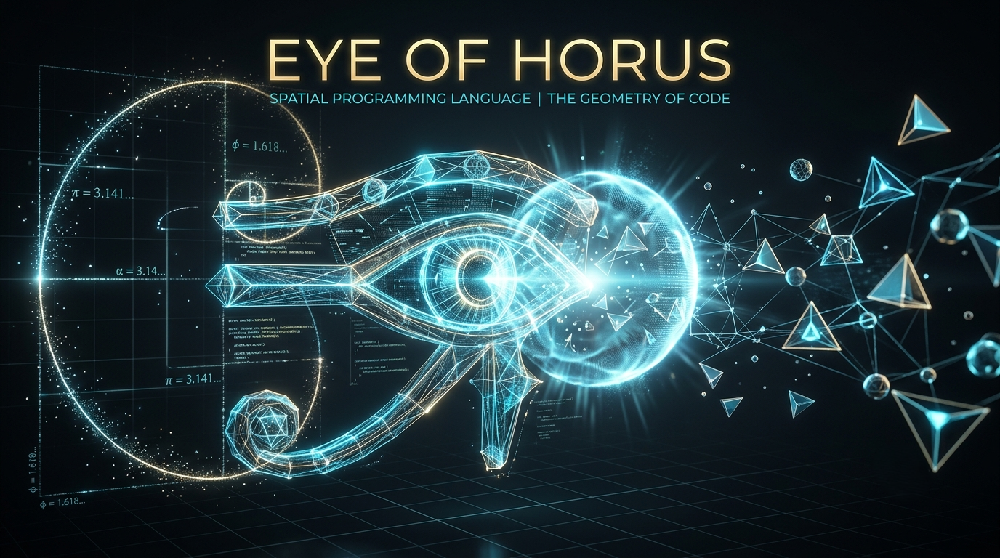

<p align="center">
  
</p>

# Eye of Horus

<p align="center">
  <strong>The Geometry of Code</strong>
</p>

<p align="center">
  <a href="LICENSE"></a>
  <a href="SECURITY.md"></a>
  <a href="ROADMAP.md"></a>
  <a href="https://agentflow-enterprise.com"></a>
  <a href="whitepaper/Eye_of_Horus_Whitepaper.md"></a>
</p>

Eye of Horus is an open-source research project exploring a geometry-native programming language: programs are described as spatial structures, execution is modeled as a field-triggered pulse, and future tooling is intended to make code visible as a three-dimensional artifact.

This repository is intentionally honest about its maturity. Eye of Horus is not a finished language, not a production compiler, and not a scientifically validated performance or security breakthrough. It is a public specification, research program, and early Rust implementation scaffold.

## Support the Project

Eye of Horus is community funded. Contributions support research, documentation, compiler development, tooling, translations, infrastructure, testing, CI/CD, website hosting, and long-term open source sustainability.

See [DONATE.md](DONATE.md) for the official donation methods currently published by the project owner.

## Project Vision

Most programming languages represent programs as ordered text. Eye of Horus asks what becomes possible when source code is treated as geometry: values as points, data flow as vectors, operations as solids, and execution as a pulse that discovers dormant structures in space.

The long-term vision is a language and toolchain where programmers can reason about computation through proportion, adjacency, intersection, activation, and spatial composition.

## Philosophy

- Code can be spatial without pretending that text no longer matters.
- Research claims must be separated from implementation facts.
- Geometry should clarify computation, not obscure it.
- The reference implementation should be small, readable, testable, and written in Rust.
- Community design should happen through RFCs before syntax or semantics become stable.

## Why Geometry-Native Programming

Geometry-native programming is the project term for languages where spatial relationships are first-class semantic material. Eye of Horus uses this idea to explore:

- spatial state and coordinate-bound values;
- field-triggered activation rather than a single linear instruction pointer;
- geometric primitives as operation carriers;
- visual debugging and educational tooling;
- research questions around determinism, concurrency, and spatial memory models.

## Current Project Status

| Area | Status |
|---|---|
| Language design | Research draft |
| Formal specification | Skeleton with TODO sections |
| Rust implementation | Minimal scaffold only |
| Parser | Planned |
| Runtime / VM | Planned |
| Standard library | Planned |
| VS Code extension | Placeholder structure |
| LSP | Placeholder structure |
| Website | Static documentation scaffold |

Implemented today: a Rust workspace with minimal core utilities and tests for early design constants. Planned work is tracked in [ROADMAP.md](ROADMAP.md).

## Repository Structure

```text
.
|-- crates/                  Rust implementation scaffold
|-- docs/                    Project and language documentation
|-- spec/                    Formal specification skeleton
|-- rfcs/                    RFC process and templates
|-- whitepaper/              Version 0.1 draft white paper
|-- book/                    Future book structure placeholders
|-- website/                 Documentation website scaffold
|-- examples/                Placeholder .eoh examples
|-- editors/vscode/          Future VS Code extension
|-- lsp/                     Future language server
|-- assets/                  Project artwork and repository media
|-- .github/                 Community, issue, PR, and workflow templates
```

## Quick Start

The language is not yet installable as a real compiler. You can build the current Rust scaffold:

```bash
cargo test
cargo run -p eoh-cli -- --status
```

Example `.eoh` files are placeholders for future parser work:

```bash
ls examples
```

## Installation

Installation packages do not exist yet. Future installation methods may include:

- `cargo install eye-of-horus`
- prebuilt binaries from GitHub Releases;
- package manager recipes after the CLI stabilizes.

## Example Syntax

```eoh
ORIGIN 0.0, 0.0, 0.0

VERTEX A 1.0, 0.0, 0.0
VERTEX B 0.0, 1.0, 0.0
VERTEX C 0.5, 0.5, 0.0

SHAPE_TETRA T1 A, B, C, ORIGIN
SHAPE_CUBE OUT C, size=0.2

PULSE_HIGGS ORIGIN, v=1.0
```

This syntax is illustrative and subject to RFC review. It is not yet parsed by a complete compiler.

## Roadmap

- Phase 0: repository, specification skeleton, governance, and research framing.
- Phase 1: parser, AST, diagnostics, spatial matrix model, and deterministic pulse simulation.
- Phase 2: executable examples, visualizer, early language tests, and RFC-backed semantics.
- Phase 3: editor tooling, LSP, standard library experiments, and educational material.

Read [ROADMAP.md](ROADMAP.md) for detail.

## White Paper

The white paper is published as a draft, not as a finished scientific claim:

- [White Paper](whitepaper/Eye_of_Horus_Whitepaper.md)
- [References](whitepaper/References.md)
- [Future Research](whitepaper/Future_Research.md)

## Documentation

Start with:

- [Vision](VISION.md)
- [Manifesto](MANIFESTO.md)
- [Architecture](ARCHITECTURE.md)
- [Language Specification](LANGUAGE_SPECIFICATION.md)
- [RFC Process](RFC_PROCESS.md)
- [FAQ](FAQ.md)

## Security

Eye of Horus is pre-alpha research software. Do not use it to process untrusted code in production. Read [SECURITY.md](SECURITY.md) and [SECURITY_MODEL.md](SECURITY_MODEL.md).

## Contributing

Contributions are welcome, especially in documentation, tests, language design critique, parser architecture, and formal semantics. Please read [CONTRIBUTING.md](CONTRIBUTING.md), [CODE_OF_CONDUCT.md](CODE_OF_CONDUCT.md), and [GOVERNANCE.md](GOVERNANCE.md).

## Governance

Eye of Horus begins as a founder-led research project and is designed to evolve toward RFC-governed community maintenance. See [GOVERNANCE.md](GOVERNANCE.md).

## FAQ

**Is Eye of Horus finished?** No.

**Is it a replacement for Rust, Python, Zig, or Go?** No.

**Does the phi-pi addressing model provide security?** No. It is deterministic and public. It may be useful as a research and teaching object, not as a security boundary.

**Is Turing-completeness proven?** No. Computational power is an open research question.

## Website

Project website: [https://agentflow-enterprise.com](https://agentflow-enterprise.com)


## License

Eye of Horus is licensed under the [Apache License 2.0](LICENSE).

## Research Disclaimer

This repository contains research ideas, planned implementation notes, and future RFC topics. Unless a feature is explicitly described as implemented and backed by source code or tests, it should be understood as a proposal.
